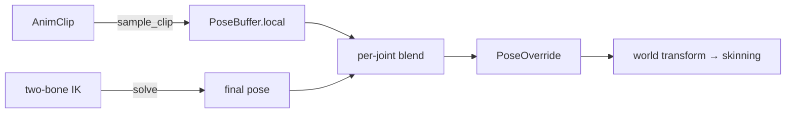

+++
title = 'Foot IK and physics-ahead'
weight = 5
math = true
+++

# Foot IK and physics-ahead

Foot IK is the first *external pose producer*: a step that bends a leg so the foot meets the ground
instead of clipping through it or floating above it. It exists to prove a structural claim — that
the blend layer from the [playback runtime](../playback-runtime/) admits a producer that did not
sample a clip — and to lay down the per-bone data and the pose-handoff seam a powered ragdoll needs.
The animation keeps playing; IK only nudges the joints that have to react.

The win is architectural, not locomotion. A walk cycle on a rig with leg chains keeps its feet
planted on a raised or lowered ground plane, and the sampling graph never learns that IK happened.

## The blend-layer producer model

A pose producer writes into the same final pose the clip sampler produced, never onto a bone's
`Transform`. The `PoseBuffer` carries `local` (the sampled animation), `override_` (where a producer
writes), and a per-bone `weight`. The evaluator's blend is one decision per joint:

$$\text{final}_i = \text{weight}_i = 0 \;?\; \text{local}_i : \texttt{blend\_joint}(\text{local}_i,\ \text{override}_i,\ \text{weight}_i)$$

Foot IK rewrites the chain's upper and mid joint rotations in the final pose directly (a planted
foot is fully driven by IK); everything else stays at `local`. This is the *one* sanctioned path to
a bone: writing a `Transform` directly would re-create the trap the layer exists to avoid — a
producer mutating authored data, with no clean way to blend it back out.

The same seam is where the ragdoll plugs in: `saffron-physics` reads each rig's previous-frame pose
and motors its constraints toward it, then ramps the simulated result back through the same
`PoseOverride` foot IK uses here — so the evaluator needs no new code path for it. That is the
load-bearing decision this phase validates.

## Two-bone analytic IK

`solve_two_bone_ik` is a pure function: given the chain's current world positions (root, mid, end),
a target, a pole vector, and the two segment lengths, it returns the world-space *delta* rotations
for the upper and lower joints as a `TwoBoneIkResult`. No scene, no state — it is unit-tested in the
crate (an in-range target is reached exactly; an over-reach clamps to a straight chain with no NaN).

The solve is the standard law of cosines (the same shape as ozz-animation's `IKTwoBoneJob` and
UE's Two Bone IK node):

1. **Clamp** the reach to $[\,|a-b|,\ a+b\,]$ so each $\arccos$ stays valid — an unreachable target
   straightens the chain toward it rather than producing garbage.
2. **Bend** the knee. With segment lengths $a$ and $b$, the interior angle at the mid joint for a
   reach $c$ is $\arccos\!\big(\tfrac{a^2+b^2-c^2}{2ab}\big)$. Rotating the lower bone about the
   bend axis by the change from the current angle to the target angle sets the chain's span to the
   clamped reach.
3. **Swing** the whole bent chain about the root so its root-to-end vector points at the target.
   Because the span already equals the (clamped) reach, the end lands on the target exactly.
4. **Twist** about the root-to-target axis so the knee lies in the plane spanned by the target
   direction and the pole vector — this fixes which way the knee points. The twist is a signed
   `atan2` about the reach axis, so it leaves the end position untouched.

The foot-IK producer (`apply_foot_ik`) resolves each chain's joint world positions by forward
kinematics from *this frame's* sampled pose (deliberately not the cached world transform, which is
last frame's post-IK output), builds a ground target (the foot's world position with its Y lifted up
to the ground height), solves, then converts each returned world delta back to a local rotation. That
conversion composes the delta onto the joint's current world rotation and strips the parent's world
rotation, $\,\text{local} = \text{parentWorld}^{-1}\cdot(\Delta\cdot\text{world})$, because the
override is a *local* pose the next frame's world composition re-derives.

## The v1 ground

"Ground" here is a single horizontal plane at a configurable `ground_height`. The target lifts a
foot up to the plane and never pulls it below, so a foot already above the plane swings freely. There
is no raycast, no terrain, no surface normal to tilt the foot to.

That limit is deliberate. True terrain following needs collision queries; this phase scopes to the
plane so the *producer plumbing* can be built and tested independently. `FootIk` is gated on an
`enabled` flag, so a rig without it — or with it off — runs the byte-identical animation path.

## Physics-ahead: the ragdoll on-ramp

The expensive part of a powered ragdoll is not the simulation, it is *authoring* the per-bone physics
setup. `BonePhysics` (held on the rig as a `BonePhysicsComponent` parallel array to `SkinnedMesh.bones`)
carries that schema:

- a collider (`shape_half_extents`) and `mass` for the body,
- a `joint` type (`Fixed` / `Hinge` / `SwingTwist` / `Free`) with `swing_twist_limits` in radians,
- PD motor gains (`drive_stiffness`, `drive_damping`, `drive_max_force`) for driving the ragdoll
  toward the animated pose.

The shape is kept close to UE's PhAT bodies and Jolt's `RagdollSettings`, so the mapping into
`saffron-physics` is mechanical rather than a redesign. A powered ragdoll reads these gains in its
drive-to-pose step — the analogue of UE's [Physical Animation Component](https://dev.epicgames.com/documentation/en-us/unreal-engine/physical-animation-in-unreal-engine)
and its **Physics Blend Weight**, which ramps a bone from animated to simulated. That ramp is the
same `PoseOverride`/blend path foot IK uses here, so the ragdoll is another producer into this path,
not a parallel system.

The evaluator also snapshots each rig's final pose into `last_pose` every tick. The host's play tick
reads it (`last_poses`) after `tick_animation` and before the physics step, so an active ragdoll's
motors drive toward this frame's animated pose and the handoff does not pop.

## In the code

| What | File | Symbols |
|---|---|---|
| Two-bone solver + unit tests | `engine/crates/animation/src/ik.rs` | `solve_two_bone_ik`, `rotation_between`, `TwoBoneIkResult` |
| Foot-IK producer (resolve → solve → world-to-local → blend) | `engine/crates/animation/src/runtime.rs` | `apply_foot_ik`, `tick_rig` |
| Previous-pose snapshot for the handoff | `engine/crates/animation/src/runtime.rs` | `AnimationRuntime` (`last_pose`, `last_poses`) |
| Foot-IK config + reserved physics metadata | `engine/crates/scene/src/component.rs` | `FootIk`, `FootChain`, `BonePhysics`, `BonePhysicsComponent`, `Joint` |
| Control toggle | `engine/crates/control/src/commands_animation.rs` | `set-foot-ik`, `get-foot-ik` |

## Related

- [Playback runtime](../playback-runtime/) — the evaluator and the blend layer this producer feeds
- [Animation data model](../animation-data-model/) — the `PoseBuffer` (`local` / `override_` / `weight`) it writes into
- [Transforms & matrices](../../scene-and-ecs/transform-and-matrices/) — the world composition the world-to-local conversion inverts
