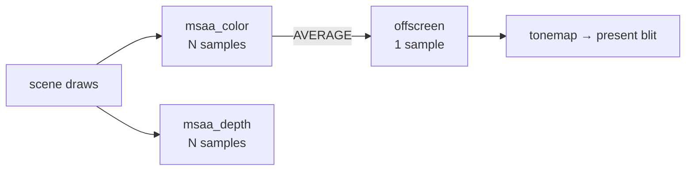

+++
title = 'MSAA'
weight = 1
+++

# MSAA

Multisample anti-aliasing (MSAA) rasterizes the scene at several coverage samples per pixel
and resolves them down to one. It runs at rasterization time rather than as a post-process,
so it smooths the case the post-process filters cannot: hard polygon edges against the
background. It does nothing for detail inside a triangle, which is where shading aliasing
lives.

The hardware tests coverage at each sample but shades once per pixel, so the cost is bounded:
edge quality scales with the sample count while the fragment shader still runs once per
covered pixel.

## How it works

With MSAA on, the scene renders into a multisampled color/depth pair rather than straight into
the offscreen. `ViewTarget::build_aa_targets` allocates `msaa_color` and `msaa_depth` at the
requested sample count (`Aa::sample_count`) and the offscreen's extent, and the frame-graph
build points the scene pass at them. At end-of-pass the multisampled color is resolved into the
single-sample offscreen, which is what tonemap reads and what the present blit samples.

The scene pass declares the resolve as part of its color attachment: the multisampled image is
the attachment, the offscreen (`scene_output`) is its `resolve` target, and the multisampled
samples are discarded afterward because only the resolved image is kept.

### Resolve in the graph

The [render graph](../../frame-and-render-graph/render-graph-overview/) treats an
`RgAttachment.resolve` as a second color write. It runs the resolve target through the same
`ColorWrite` usage info, so the barrier and layout for the offscreen come out the same
as any other attachment. When it builds the dynamic-rendering attachment info it sets the color
resolve mode to `AVERAGE`, which averages each pixel's N samples into one. The pass body is
unchanged: the same draw list records into a multisampled attachment, and the hardware
resolves at the end of rendering.

### Sample count baked into PSOs

A graphics pipeline declares how many samples it rasterizes against, and that count must match
the attachment. The mesh and depth-prepass PSOs read the renderer's chosen sample count
(`rasterization_samples`) when they are built. Because the count is baked in, changing the MSAA
level cannot just swap a target; every mesh PSO becomes stale. `Renderer::set_aa` clears the PSO
cache through `Pipelines::set_sample_count` so übershader pipelines rebuild on demand at the new
count, and rebuilds the depth-prepass pipeline immediately.

## In the code

| What | File | Symbols |
|---|---|---|
| Mode switch + clamp + PSO rebuild | `aa.rs`, `renderer.rs` | `Aa::set`, `Aa::max_sample_count`, `Renderer::set_aa` |
| Multisampled target pair | `view_target.rs` | `ViewTarget::build_aa_targets`, `msaa_color`, `msaa_depth` |
| Sample count in PSO | `pipelines.rs` | `Pipelines::set_sample_count`, `rasterization_samples` |
| Scene attachment + resolve wiring | `renderer.rs` | `record_scene_graph`, `scene_output`, `color_att.resolve` |
| Resolve in the graph | `render_graph.rs` | `RgAttachment.resolve`, `ResolveModeFlags::AVERAGE`, `ResolveModeFlags::SAMPLE_ZERO` |

> [!NOTE]
> Depth is multisampled too (geometry has to test against the right per-sample coverage) and
> resolves with `SAMPLE_ZERO` rather than averaging. Only the resolved offscreen color survives
> the pass as scene input.

## Related

- [AA modes](../aa-modes/) — the full mode table and how the three are switched
- [FXAA](../fxaa/) — the cheap post-process alternative
- [TAA](../../screen-space-and-post/taa/) — the temporal alternative
- [Render graph](../../frame-and-render-graph/render-graph-overview/) — derives the resolve
