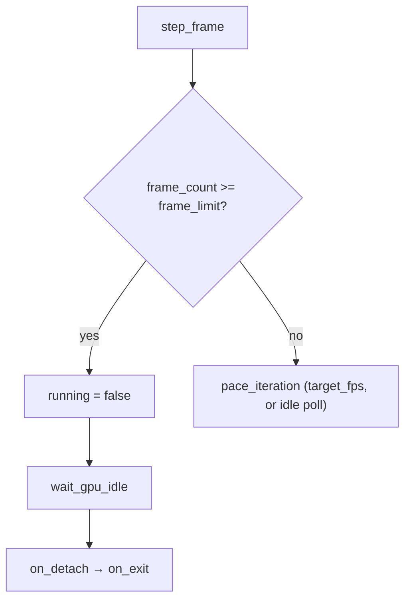

+++
title = 'Headless runs'
weight = 5
+++

# Headless runs

A headless run is an instance of the loop that terminates on its own, without a person at the
window, so a script can boot the engine, render a known number of frames, and exit. A normal
run continues until the window closes, which automated verification cannot wait for. One
environment variable bounds the loop (`SAFFRON_EXIT_AFTER_FRAMES`); the render *rate* is not an
env knob — the loop paces itself reactively (see [the main loop](../main-loop-and-run/)). Capture
of the result is a separate, control-plane concern.

## Two host modes

`run` already serves a windowless mode: when `SAFFRON_EDITOR_NATIVE_VIEWPORT` is set,
`HostMode::from_env` selects `Headless`, which builds a no-surface offscreen device
(`SurfaceSource::Offscreen`) with no window and drives the plain `while` loop (`drive`). That is
the mode the editor spawns the host in. The frame-bounding knobs below apply to either mode.

## Exit after N frames

`SAFFRON_EXIT_AFTER_FRAMES=N` makes the loop count its iterations and stop after `N`. The value
is parsed strictly by `frame_limit_from_env`: the whole string must be a base-10 `u64`, so a typo
like `10x` is logged and ignored rather than parsed as its leading digits. A limit of `0` (unset
or malformed) means run forever.

```rust
fn parse_strict_u64(text: &str) -> Option<u64> {
    text.parse::<u64>().ok()
}
```

When `frame_count` reaches the limit, `step_frame` sets `app.running = false` and the loop exits
through the normal teardown path: the same `wait_gpu_idle` → `on_detach` → `on_exit` ordering as
a manual close. A frame counts whether or not it rendered, so a minimized window (a zero viewport
axis) — or a reactive idle iteration that skipped its render — still advances the count, so a
headless run always terminates on schedule.

## Pace the loop

There is no FPS-cap env knob. The loop paces itself reactively in `pace_iteration`: a rendered
frame sleeps to the renderer's `target_fps` ([`FrameHost::pace_target_fps`], the perf-config field
the editor drives over the control plane), and an idle iteration — one the `RedrawController`
verdict skipped because the scene is static — sleeps one short poll interval so the loop keeps
draining the control socket without spinning a core or waking the GPU. See
[the main loop](../main-loop-and-run/) for the reactive verdict itself.



## Capturing the result

The loop itself writes no image. A capture is requested over the control plane: the `screenshot`
command grabs either the viewport (`Renderer::capture_viewport`, a synchronous offscreen
read-back to a PNG) or the window (`Renderer::request_window_capture`, deferred to the next
present). The headless pixel checks combine `SAFFRON_EXIT_AFTER_FRAMES` to bound the run with a
`screenshot` request to dump the frame. See
[screenshots and capture](../../tooling-and-control/screenshots-and-capture/) for the read-back
mechanics.

## In the code

| What | File | Symbols |
|---|---|---|
| Frame-limit parse | `app/src/lib.rs` | `frame_limit_from_env`, `parse_strict_u64` |
| Counting + exit | `app/src/lib.rs` | `step_frame` — `frame_count`, `frame_limit`, `LoopLimits` |
| Reactive pacing | `app/src/lib.rs` | `pace_iteration`, `RedrawController`, `FrameHost::pace_target_fps` |
| Headless mode | `app/src/lib.rs` | `HostMode::Headless`, `run_inner` |
| Viewport / window capture | `rendering/src/renderer.rs` | `capture_viewport`, `request_window_capture` |
| PNG encode | `rendering/src/thumbnail.rs` | `write_png_file`, `encode_to_png`, `format_pixel_bytes` |

> [!TIP]
> A minimized frame (a zero viewport axis) skips its render body but still counts toward
> `SAFFRON_EXIT_AFTER_FRAMES`, so a headless run always terminates on schedule even if the host
> never produces a visible frame.

## Related

- [Main loop](../main-loop-and-run/) — where both env knobs are read and applied
- [Screenshots and capture](../../tooling-and-control/screenshots-and-capture/) — the control-plane viewport/window grab
