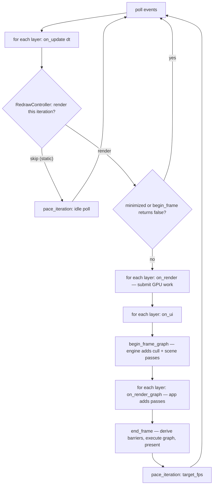

+++
title = 'Main loop'
weight = 1
+++

# Main loop

The main loop is the single function that owns a program's window and renderer, and runs
one fixed sequence of work every frame until the window closes. In Anima that function is
`run` (the `saffron_app` crate). A client fills an `AppConfig` and calls `run`; `run` drives
everything and calls back into the client's layers at fixed points.

The shape is a config and a call, not a base class. There is no application to subclass; the
loop calls back through the `Layer` trait the client attached.

```rust
pub struct AppConfig {
    pub window: WindowConfig,
    pub on_create: Box<dyn FnOnce(&mut App)>,  // runs once, after window + renderer exist
    pub on_exit: Box<dyn FnOnce(&mut App)>,    // runs during teardown
}

pub fn run(config: AppConfig) -> i32;          // returns a process exit code
```

## Two modes, one loop

`run` serves two hosts from one body. The **windowed** standalone host opens a winit window
and a surface-bound renderer that presents through a real swapchain. The **headless** editor
host runs windowless on a no-surface offscreen device and publishes frames to shared memory.
The mode is read from the environment (`HostMode::from_env`, keyed on
`SAFFRON_EDITOR_NATIVE_VIEWPORT`), not chosen by a second `run` function.

The two drivers differ only in who owns the loop. Headless uses a plain `while` loop
(`drive`). Windowed hands off to winit's `ApplicationHandler` (`run_windowed` /
`WindowedApp`), because winit 0.30 owns its own event loop and creates the window from inside
it. Both share the bring-up half (`start`), the per-frame body (`step_frame`), and the
teardown half (`finish`), so the hook order and shutdown ordering are identical across modes.

## Startup

`run_inner` builds the renderer for the selected mode and checks it with the
[error-handling](../../core-and-conventions/error-handling/) pattern: a typed `Error` returned
as a `Result`. A bring-up failure logs via `saffron-core` and returns exit code `1`.

`start` runs `on_create` next. That is where the client attaches its layers and wires window
signals. Every layer's `on_attach` fires after that, then `start` latches `app.running = true`.
In windowed mode the close path is wired through winit: `WindowedApp::window_event` flips
`app.running` to false on `WindowEvent::CloseRequested`.

## One iteration

The loop body (`step_frame`) is the contract every feature plugs into, and its order is fixed.
Input comes first, then logic, then the GPU frame. Inside the frame the `on_ui` phase runs
before the graph is built, so anything it records is ready when the frame executes.



`begin_frame` returns `false` when the swapchain image cannot be acquired (a resize or out-of-date
swapchain), and the loop skips rendering that iteration rather than erroring. A `viewport_size`
with a zero axis means the host is minimized, and the frame body is skipped too — but the frame
still counts toward the limit. `dt` is a wall-clock `TimeSpan` from `Instant`, passed to every
`on_update`.

## Reactive pacing

The loop does not render every iteration. After `on_update` (where the host sets the per-frame
activity), the `RedrawController` on `App` decides whether to render or skip. It renders while the
host reports *continuous* activity — a play sim, an edit smoothing, a clip advancing; a one-shot
`request_redraw` covers a mutating control command. After activity ceases it keeps rendering until
**both** a brief wall-clock keep-warm window has elapsed (anti-downclock-stutter + post-interaction
smoothness) **and** the temporal effects have *converged* — when the host reports TAA/SSGI
accumulating, a fixed frame-count window (`CONVERGE_FRAMES`) lets the history settle to its final
image, so the viewport idles **on the converged frame**, not a noisy mid-accumulation one. The
`converged()` signal is exported for the stats readout. When none of that holds, the iteration
**skips the render and holds the last published frame**, so a static viewport drops the GPU to idle
instead of re-rendering an identical image at full speed. `on_update` (and the control-socket drain) still runs every iteration, so a command
wakes the viewport within one idle poll. The renderer reports its `target_fps`
(`FrameHost::pace_target_fps`) and `pace_iteration` sleeps a rendered frame to that rate, an idle
one to a short poll interval. A layer-less app and the GPU-free test host default to *continuous*,
rendering every frame as before — only a host that opts in ever idles.

The editor reports its window visibility over the control plane (`set-viewport-power-state`
focused / unfocused / occluded); an **occluded** view suppresses rendering entirely, and an
**unfocused** (open but not focused) view still renders on demand but paces those frames down to a
low background cap (`UNFOCUSED_FPS_CAP`, ~6 fps) so an animating viewport stops pinning the GPU while
the user works elsewhere. The whole
otherwise-invisible loop state — `idle`, `converged`, the active `redrawReasons`, and the
`powerState` — surfaces in `render-stats`, so the CLI, the stats HUD, and the e2e suite can observe
when the GPU is quiet and why.

The two render seams are deliberately different. `on_render` is the immediate
[submit seam](../the-submit-and-rendergraph-seams/): it records commands into the current
frame. `on_render_graph` hands the layer the live `RenderGraph` so it can *add passes*, which is
how an app-authored post-process step slots in between the scene and the present. The engine's
cull and scene passes are already in the graph by the time layers see it.

## Shutdown order

When the loop ends, `finish` calls `wait_gpu_idle` **before** anything is torn down. This is the
resource-lifetime contract. `on_detach` and `on_exit` are where the client drops its GPU
resources, and those resources must not be freed while a command buffer still references them.
Idling the GPU first guarantees nothing in flight outlives the allocator; the reverse order
frees a buffer the GPU is still reading. `App`'s field order also encodes teardown — the frame
host (renderer) drops before the window.

```rust
app.frame_host.wait_gpu_idle();           // finish all in-flight GPU work first
run_hook(app, |layer, app| layer.on_detach(app));
on_exit(app);
```

## Headless runs

`SAFFRON_EXIT_AFTER_FRAMES=N` makes `run` scriptable for verification: it counts iterations and
exits cleanly after `N`, parsed strictly so a malformed value logs and is ignored. The render rate
is not an env knob — it comes from the reactive pacing above. See
[headless runs](../headless-and-capture/).

## In the code

| What | File | Symbols |
|---|---|---|
| Config + types | `app/src/lib.rs` | `AppConfig`, `App`, `Layer`, `attach_layer` |
| The loop | `app/src/lib.rs` | `run`, `run_inner`, `drive`, `run_windowed`, `start`, `step_frame`, `finish` |
| Frame host trait | `app/src/lib.rs` | `FrameHost`, `begin_frame`, `begin_frame_graph`, `end_frame`, `wait_gpu_idle`, `pace_target_fps` |
| Reactive pacing | `app/src/lib.rs` | `RedrawController`, `pace_iteration` |
| Mode selection | `app/src/lib.rs` | `HostMode`, `HostMode::from_env` |
| Frame knobs | `app/src/lib.rs` | `frame_limit_from_env`, `LoopLimits` |

## Related

- [Layers as a trait of hooks](../layer-system/)
- [Render seams](../the-submit-and-rendergraph-seams/)
- [Render graph](../../frame-and-render-graph/render-graph-overview/) — what `begin_frame_graph`/`end_frame` drive
