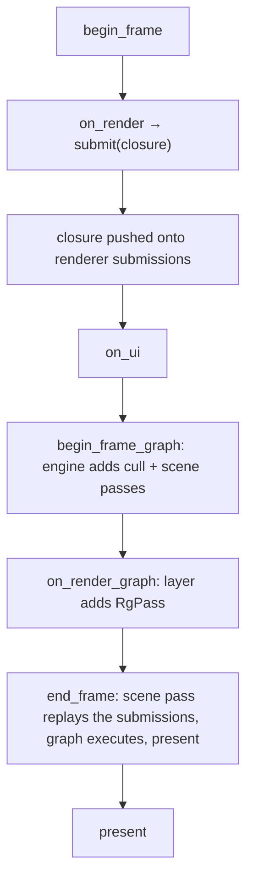

+++
title = 'Render seams'
weight = 3
+++

# Render seams

A render seam is a hook through which a layer contributes GPU work to a frame. There are two,
and they serve different intents. `on_render` records commands into a pass the engine has
already opened; `on_render_graph` adds new passes to the frame graph between the engine's stages
and the present.

The two are not interchangeable. The dividing line is whether a layer *draws into* the world or
*inserts a stage* of its own. A mesh, debug line, or gizmo goes through `on_render`. A full-screen
effect, an extra render target, or a compute step with its own synchronization is a pass of its
own and goes through `on_render_graph`.

## Submit seam: recording into the frame

`on_render` runs inside the frame, after `begin_frame`. From it a layer reaches the renderer and
calls `submit`, which stashes a record closure replayed inside the scene pass:

```rust
pub fn submit(&mut self, body: impl FnOnce(vk::CommandBuffer) + 'static) {
    self.submissions.push(Box::new(body));
}
```

The closure takes the frame's `vk::CommandBuffer` (the Vulkan bindings come from `ash`) and is
replayed later, after the batched draw list, when the renderer runs the scene pass. The layer
never opens a rendering scope or writes a barrier — it records draw calls into a scope the
renderer owns. The editor gizmo and native overlay use this seam; the overlay also has the
dedicated `submit_overlay` entry point that the host's `on_ui` feeds depth-tested and on-top
vertices into.

## Render-graph seam: adding passes

`on_render_graph` is handed the live `RenderGraph` after the engine has already added its own
passes for the frame:

```rust
let mut graph = RenderGraph::new();
app.frame_host.begin_frame_graph(&mut graph);   // engine adds cull + scene passes
run_hook(app, |layer, app| layer.on_render_graph(app, &mut graph));
app.frame_host.end_frame(graph);                // derive barriers, execute, present
```

A layer adds a pass by building an `RgPass` — declaring what it reads and writes through
`RgPass::access` with an `RgUsage`, attaching its color/depth targets, and supplying the body —
then calling `RenderGraph::add_pass`. The graph derives the barriers and layout transitions from
those declarations; the layer writes none. An app-authored post-process slots in this way: it
declares the offscreen as a read-modify-write storage image (`RgUsage::StorageImageRwCompute`),
the graph inserts the layout moves around it, and it runs between the scene pass and the present
blit. See [the render graph](../../frame-and-render-graph/render-graph-overview/) for how a pass
is declared and how the barriers fall out.

## Two seams, one frame



## In the code

| What | File | Symbols |
|---|---|---|
| The two layer hooks | `app/src/lib.rs` | `Layer::on_render`, `Layer::on_render_graph`, `run_frame` |
| Submit seam | `rendering/src/renderer.rs` | `Renderer::submit`, `Renderer::submit_overlay`, `submissions` |
| Graph access | `app/src/lib.rs` | `FrameHost::begin_frame_graph`, `FrameHost::end_frame` |
| Pass declaration | `rendering/src/render_graph.rs` | `RenderGraph::add_pass`, `RgPass`, `RgUsage`, `RgAttachment` |

> [!TIP]
> A closure submitted from `on_render` does not run when you call `submit`. It is queued and
> replayed when the renderer executes the scene pass. So capture by value (or keep the data
> alive); the closure is `'static`, and anything it references must still be valid at the end
> of the frame, not just at submit time.

## Related

- [Layers as a trait of hooks](../layer-system/) — where `on_render`/`on_render_graph` come from
- [Main loop](../main-loop-and-run/) — the order the seams fire in
- [Render graph](../../frame-and-render-graph/render-graph-overview/) — what `on_render_graph` adds passes to
