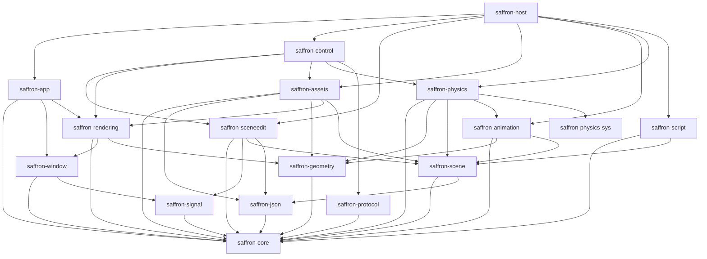

+++
title = 'The crate DAG'
weight = 4
+++

# The crate DAG

The crate DAG is the dependency structure in which each crate depends only on crates below it, with
no cycle on any path. Cargo enforces the acyclic constraint mechanically — a dependency cycle
between workspace members does not compile — so the DAG is not a convention but a property the build
guarantees.

The shape carries information. A crate's position fixes where a piece of code belongs and what it
may reach, and it explains why some glue must live in a crate of its own. The edges are the `path`
dependencies in each crate's `Cargo.toml`; reading them is reading the architecture.

## The graph

`saffron-core` is the root (the `Result`/`Error` model, `Uuid`, `Ref = Arc`, logging); everything
depends on it directly or transitively. Read top to bottom — an arrow means "depends on":



(Edges to `saffron-core` from the upper crates are omitted for readability — every crate reaches it
transitively.) `saffron-protocol` is the wire-contract crate the editor's typed client is generated
from; `saffron-physics-sys` is the vendored-Jolt FFI sys crate `saffron-physics` builds on.

## Why host is its own crate

The host glue — the [`Layer`](../../app-lifecycle-and-window/main-loop-and-run/) callbacks, the
thumbnail cache, import routing, the shm publish, the control plane wiring — calls into
`saffron-app`, `saffron-sceneedit`, `saffron-control`, `saffron-assets`, and the rest at once. It
cannot live in `saffron-sceneedit`: `saffron-control` already depends on `saffron-sceneedit`, so
glue inside `saffron-sceneedit` reaching back into `saffron-control` would form a cycle, which Cargo
rejects. It sits in `saffron-host`, a crate above everything, instead:

```rust
// crates/host/src/lib.rs
pub fn run_host(title: impl Into<String>, width: u32, height: u32) -> i32 {
    // build the editor host, attach HostLayer, drive saffron_app::run
}
```

`saffron-host` is both a library (`saffron_host`, the `run_host` apex plus the single `HostLayer`
that implements `Layer`) and a binary (`saffron-host`, whose `main.rs` is a thin stub that calls
`run_host` and exits with its code).

> [!NOTE]
> `saffron-host` exists only because `saffron-control → saffron-sceneedit` already holds. The host
> glue needs both, so it lives in a crate above both rather than inside `saffron-sceneedit`, which
> would cycle.

## In the code

| What | File | Symbols |
|---|---|---|
| Workspace members | `engine/Cargo.toml` | `[workspace] members = ["crates/*", "xtask"]` |
| The edges of one crate | `crates/control/Cargo.toml` | the `path = "../..."` dependency block |
| Root crate | `crates/core/src/lib.rs` | `Error`, `Result`, `Ref`, `Uuid` |
| Top-of-graph glue | `crates/host/src/lib.rs` | `run_host`, `HostLayer` |
| Thin binary entry point | `crates/host/src/main.rs` | `saffron_host::run_host` |

## Related
- [How a crate organizes its modules](../module-partitions/) — files inside one crate
- [The Cargo workspace and crate model](../cargo-workspace/) — the workspace mechanism itself
- [Main loop](../../app-lifecycle-and-window/main-loop-and-run/) — what `saffron-app` exposes
