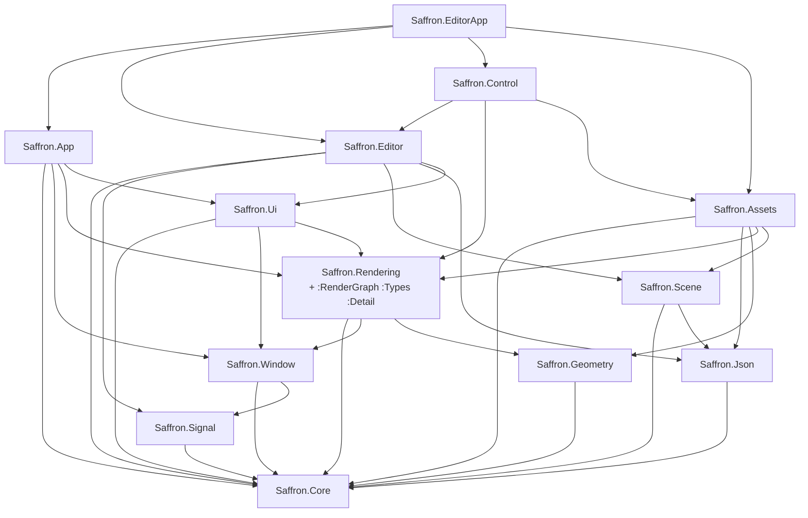

+++
title = 'Module DAG'
weight = 4
+++

# Module DAG

The engine modules form a directed acyclic graph of real imports, not a single chain. Knowing
which module sits above which tells you where code belongs, and why some glue lives in its own
module.

## The graph

Each area imports only what it needs. `Core` is the root (aliases, `Result`, logging); everything
depends on it directly or transitively. Read top to bottom:



`Saffron.Rendering` is itself split (see [module partitions](../module-partitions/)): the primary
re-exports the `:RenderGraph` and `:Types` partitions, so a consumer importing `Saffron.Rendering`
gets the render-graph and renderer types in one import.

## Why EditorApp is its own module

The editor application glue — the `Layer` callbacks, thumbnail cache, import routing, the
`onCreate`/`onExit` closures — calls into `App`, `Editor`, `Control`, `Assets`, and the rest at
once. It cannot live in `Saffron.Editor`, because `Control` already imports `Editor`
(`Control → Editor`); glue inside `Editor` reaching back into `Control` would form a cycle. So it
sits in a separate module above everything:

```cpp
export module Saffron.EditorApp;

import Saffron.App;
import Saffron.Editor;
import Saffron.Control;
import Saffron.Assets;
// ...
export auto runEditor(const char* title, int w, int h) -> int;
```

That keeps the graph acyclic. The editor executable's `main.cpp` is then a six-line stub that
imports `Saffron.EditorApp` and calls `runEditor`.

> [!NOTE]
> `Saffron.EditorApp` exists only because `Control → Editor` already holds. The editor-app glue
> needs both, so it lives in a module above both rather than inside `Editor`, which would cycle.

## In the code

| What | File | Symbols |
|---|---|---|
| Module list + order | `engine/CMakeLists.txt` | `FILE_SET CXX_MODULES FILES` |
| Root module | `core.cppm` | `export module Saffron.Core;` |
| Re-exported partitions | `renderer.cppm` | `export import :RenderGraph;`, `export import :Types;` |
| Top-of-graph glue | `editor_app.cppm` | `export module Saffron.EditorApp;`, `runEditor` |
| Thin entry point | `editor/source/main.cpp` | `import Saffron.EditorApp;`, `se::runEditor` |

## Related
- [Module partitions](../module-partitions/) — how `Saffron.Rendering` is split internally
- [C++26 modules](../cxx26-modules/) — the module mechanism itself
- [Main loop](../../app-lifecycle-and-window/main-loop-and-run/) — what `Saffron.App` exposes to `EditorApp`
