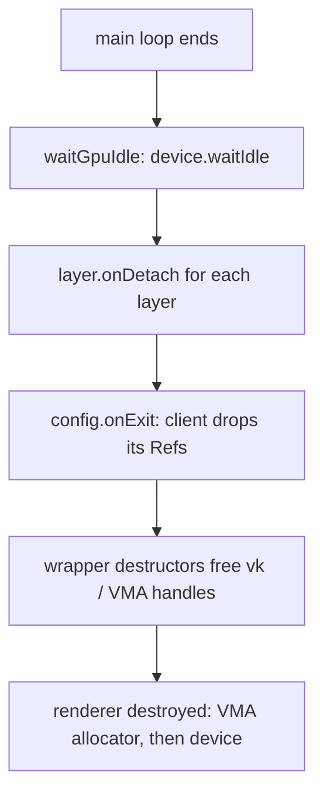

+++
title = 'Ownership'
weight = 4
+++

# Ownership

Ownership is the question of which value is responsible for freeing a resource, and when. In
Saffron a GPU resource is a small struct that owns its Vulkan handles, frees them in its
destructor, and is shared through a reference-counted pointer. The last reference to drop
runs the destructor.

There are no opaque handles and no GPU resource base class. The scheme rests on one type
alias in `Saffron.Core` and one ordering rule at shutdown.

## How it works

A logical resource — a pipeline, a mesh, a texture — is passed around as a `Ref<T>`, which
is an alias for a shared pointer:

```cpp
template <typename T>
using Ref = std::shared_ptr<T>;
```

The `Ref` is the ownership: no integer handle into a manager, no base class, no registry
indirection. Each resource type is a move-only struct holding a borrowed `vk::Device` (and a
borrowed `VmaAllocator` where it allocates), the owned handles, and a destructor that frees
them. `Pipeline` is the simplest:

```cpp
struct Pipeline
{
    vk::Device device;  // borrowed
    vk::Pipeline pipeline;
    vk::PipelineLayout layout;

    Pipeline(const Pipeline&) = delete;
    Pipeline(Pipeline&& other) noexcept;
    ~Pipeline() { reset(); }

    void reset();  // destroys pipeline + layout if device is set
};
```

Copy is deleted; move steals the handles and nulls the source, so a moved-from object's
destructor is a no-op. `reset()` checks `device` is non-null before destroying, so a
default-constructed or moved-from wrapper frees nothing. `Image`, `Buffer`, `GpuMesh`,
`GpuTexture`, `Image3D`, and `AccelerationStructure` follow the same pattern.

## Fallible factories

These types are not constructed directly. A factory builds the resource, and because that
can fail, it returns `Result<Ref<T>>`:

```cpp
auto uploadMesh(Renderer& renderer, const Mesh& mesh) -> Result<Ref<GpuMesh>>;
auto newMeshPipeline(Renderer& renderer, std::string_view shaderName, bool unlit)
    -> Result<Ref<Pipeline>>;
```

The [error model](../error-handling/) and the ownership model meet at the call site: check
the `Result`, then hold the `Ref`. The renderer keeps its own `Ref`s in caches and vectors;
a layer or the asset server holds others. The resource lives until every one of them drops.

## Teardown rule

A GPU resource cannot be freed while an in-flight command buffer still references it, and it
must not outlive the VMA allocator or the device. Those two constraints define the shutdown
order, which `run` enforces. `waitGpuIdle` blocks on `device.waitIdle()` first, then the
layers detach and `onExit` runs — where the client drops the `Ref`s it held. Those
destructors are safe because the GPU is idle. The renderer, which holds the allocator and
device, is destroyed last, after every resource it could have outlived is gone.



## Move-only as a convention exception

Move-only resource wrappers are the one place the codebase defines operator overloads. The
[conventions](../go-flavored-design/) permit this as resource management, distinct from the
operator overloading the style otherwise bans.

## In the code

| What | File | Symbols |
|---|---|---|
| The alias | `core.cppm` | `Ref` |
| Move-only wrappers | `renderer_types.cppm` | `Pipeline`, `Image`, `Buffer`, `GpuMesh`, `GpuTexture` |
| Fallible factories | `renderer_types.cppm` | `uploadMesh`, `uploadTexture`, `newMeshPipeline` |
| The idle barrier | `renderer.cppm` | `waitGpuIdle` |
| The teardown order | `app.cppm` | `run` — `waitGpuIdle` before `onDetach`/`onExit` |

> [!NOTE]
> A `Ref` you stash outside the engine (a layer field, a closure capture) keeps the
> resource alive. If you don't release it in `onDetach`/`onExit`, it can outlive the
> device. Drop client-held `Ref`s at shutdown; `run` already did the `waitGpuIdle` for you.

## Related

- [Go-flavored design](../go-flavored-design/) — why move-only wrappers are allowed operator overloads
- [Error handling](../error-handling/) — factories return `Result<Ref<T>>`
- [Type aliases](../type-aliases-and-primitives/) — `Ref` lives alongside the number aliases
