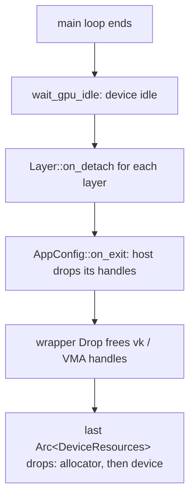

+++
title = 'Ownership'
weight = 4
+++

# Ownership

Ownership is the question of which value is responsible for freeing a resource, and when. Rust
answers it with the borrow checker: every value has one owner, and when the owner goes out of
scope its `Drop` runs. A GPU resource in Anima is a small struct that owns its Vulkan handles
and frees them in `Drop`; when several places need to read the same resource, it is shared
through an `Arc<T>` and the last clone to drop runs the destructor.

There are no opaque integer handles into a manager and no GPU-resource base class. The scheme
rests on `Drop` for cleanup, `Arc` for sharing, and one ordering rule at shutdown that the borrow
checker enforces for free.

## Drop frees the handle

A logical resource — a pipeline, a mesh, a texture — is a move-only struct that holds its Vulkan
handles and frees them in `Drop`. `Pipeline` is the simplest:

```rust
pub struct Pipeline {
    resources: Arc<DeviceResources>,
    pipeline: vk::Pipeline,
    layout: vk::PipelineLayout,
}

impl Drop for Pipeline {
    fn drop(&mut self) {
        unsafe {
            self.resources.device().destroy_pipeline(self.pipeline, None);
            self.resources.device().destroy_pipeline_layout(self.layout, None);
        }
    }
}
```

The struct is not `Clone`: ownership of the handle is unique, and a move transfers it. There is no
"freed twice" hazard and no moved-from cleanup to write — Rust does not run `Drop` on a moved-from
value. `Buffer`, `Image`, `Image3D`, `GpuMesh`, `GpuTexture`, and `AccelerationStructure` all
follow this shape.

## The device outlives every resource

Each wrapper holds an `Arc<DeviceResources>` — the reference-counted bundle of the `ash::Device`
and the VMA allocator. Holding that clone is the lifetime guarantee: a resource cannot free its
handle through a dead allocator, because keeping the resource alive keeps the bundle alive. The
allocator and device are torn down only when the last `Arc<DeviceResources>` drops, which is after
every resource that referenced them is already gone.

## Arc<T> is the shared-read default

When a resource only needs to be *read* through many handles — a loaded mesh, a cached PSO,
a material — it is shared as `Arc<T>`. `saffron-core` names this the `Ref` policy alias:

```rust
/// A shared, read-only reference to a logical resource.
pub type Ref<T> = Arc<T>;
```

`Ref<T>` is a *readability* alias only: it marks "value built once, then read through every clone".
A shared-*mutable* site does not use `Ref` — it spells `Arc<Mutex<T>>` (or `Arc<RwLock<T>>`)
explicitly at its declaration, so the exception is visible where it occurs. The bindless free list
in `saffron-rendering` is one such site (`Arc<Mutex<Vec<u32>>>`). The renderer caches PSOs as
`Arc<Pipeline>` and clones the `Arc` across the upload and render threads; the resource lives until
the last clone drops.

## Teardown rule

A GPU resource cannot be freed while an in-flight command buffer still references it, and it must
not outlive the allocator or device. Those constraints define the shutdown order, which `run`
enforces: `wait_gpu_idle` blocks on the device first, then `on_detach` runs and `on_exit` lets a
host drop the handles it held — safe, because the GPU is idle. The `Arc<DeviceResources>` bundle,
the last owner of the allocator and device, drops only once every resource referencing it is gone.



## In the code

| What | File | Symbols |
|---|---|---|
| The `Ref` policy alias | `engine/crates/core/src/lib.rs` | `Ref` |
| The shared device bundle | `engine/crates/rendering/src/resources.rs` | `DeviceResources` |
| Drop-based wrappers | `engine/crates/rendering/src/resources.rs` | `Pipeline`, `Buffer`, `Image`, `GpuMesh`, `GpuTexture` |
| A shared-mutable site | `engine/crates/rendering/src/resources.rs` | `BindlessFreeList` (`Arc<Mutex<…>>`) |
| The idle barrier | `engine/crates/app/src/lib.rs` | `FrameHost::wait_gpu_idle` |
| The teardown order | `engine/crates/app/src/lib.rs` | `run` — `wait_gpu_idle` before `on_detach` / `on_exit` |

> [!NOTE]
> An `Arc` clone you stash outside the engine (a layer field, a closure capture) keeps the
> resource alive. If you don't drop it in `on_detach` / `on_exit`, it can outlive the device.
> Release host-held clones at shutdown; `run` already did the `wait_gpu_idle` for you.

## Related

- [Rust house style](../go-flavored-design/) — Drop-based wrappers in the wider style
- [Error handling](../error-handling/) — fallible factories return `Result<…>`
- [Type aliases](../type-aliases-and-primitives/) — `Ref` lives alongside the primitive newtypes
