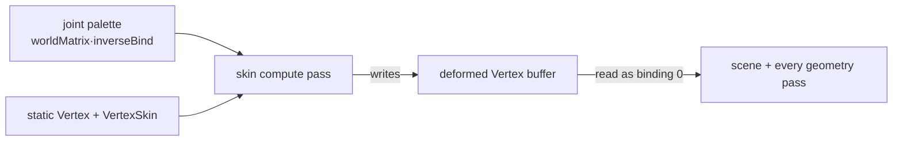

+++
title = 'Compute skinning'
weight = 10
+++

# Compute skinning

A skinned mesh deforms its vertices by a per-joint matrix palette. The naive place to do that is the
graphics vertex shader: a skinned variant reads the joint palette and blends four bone matrices per
vertex. The cost of that choice is hidden — skinning in the vertex shader means **every geometry
pass needs a skinned pipeline permutation** (depth pre-pass, each shadow map, the SSAO G-buffer,
motion vectors, …), and a ray-traced BLAS built from the static bind pose never sees the animated
shape at all. Skipping skinned meshes in those passes is worse still: animated characters would cast
no shadows, take no AO, ghost under TAA, and not deform in any ray-traced effect.

Compute skinning deforms **once, up front**, into a buffer laid out exactly like a static mesh. Every
later pass then reads that buffer as ordinary geometry — no skinned permutation, no special case. It
collapses the skinned pipeline variants to zero and is the foundation every later pass (and the BLAS)
builds on.

## The flow

`skin.slang`'s `computeMain` runs one thread per vertex: it reads the static `Vertex`
(position/normal/uv) and the skin stream (four joint indices + weights), builds
`skinMatrix = Σ wᵢ·palette[jointOffset + jointᵢ]`, and writes a deformed `Vertex` — the skin matrix
applied to the bind pose, **without** the instance model matrix. The graphics passes still apply
`model` / `normalMatrix`, exactly as for a static mesh, so a skinned mesh and a static mesh shade
through one path.

## The deformed buffer

The deformed vertices live in a per-frame, grow-only device buffer that `Skinning` owns (one per
frame-in-flight), carrying both `STORAGE` (compute writes it) and `VERTEX` (the scene pass binds it)
usage. It is sized to the sum of skinned-instance vertex counts; each skinned mesh-instance gets a
base offset into it (`SkinBucket::deformed_offset`), mirroring the joint-palette's grow-only
allocation. Because each instance carries a distinct pose, skinned draws are **not instanced** —
each is one indexed draw whose vertex offset points at that instance's region of the deformed buffer.

## The compute dispatch

Per skinned mesh-instance, the draw-list build records a `SkinDispatch` and allocates a descriptor
set (from a per-frame pool, reset wholesale each frame) binding the instance's static vertex stream,
its skin stream, the joint palette, and the deformed buffer. A push constant carries
`{vertex_count, joint_offset, deformed_offset}`. The `skin` compute `RgPass` — placed right after
light-cull, before any pass that reads the deformed buffer — dispatches `ceil(vertex_count / 64)`
groups per instance.

## Every geometry pass reads it

Because the deformed buffer is laid out like a static mesh, **every** geometry pass binds it for
skinned batches the same way — through one `bind_batch_vertices` helper that picks the deformed buffer
over the static stream. The depth pre-pass, the directional/spot/point shadow passes, and the SSAO
G-buffer pre-pass all draw skinned geometry, so an animated character gets early-Z, casts and receives
shadows, and shows AO. The deform happened once; every pass is just a read. The ray-traced
acceleration structure reads the very same buffer (see [Ray tracing](#ray-tracing) below), so it is
the last consumer to fall in line.

## Motion vectors

TAA needs a per-pixel velocity for every surface, and a skinned mesh moves two ways at once: the
whole entity can translate/rotate (**object motion**) and a bone can bend between frames
(**deformation motion**). The motion pass reprojects both — `prevClip = prevViewProj · prevModel ·
prevPosition` against `curClip = curViewProj · model · position` — so it needs last frame's model
matrix *and* last frame's deformed position for every vertex.

Object motion is one matrix: `InstanceData` carries a `prev_model` (last frame's world matrix, cached
per entity in `Skinning`'s `prev_model_by_entity`; a brand-new instance sets `prev_model = model` so
it emits zero velocity instead of a garbage flash). Deformation motion reuses the deform-once
architecture rather than skinning twice in a shader: the `skin` compute pass runs a **second**
dispatch per skinned instance with **last frame's joint palette** (`prev_palette_by_entity`) into a
**previous** deformed buffer. `motion.slang`'s `vertexMain` then binds the current deformed buffer on
binding 0 and the previous one on binding 1 and just *reads* `prevPosition` — no skinning math in the
vertex shader. For a static mesh both bindings point at the same static stream, so
`prevPosition == position` and only object motion contributes; the one shader handles both cases, so
animated characters do not ghost under TAA.

## Ray tracing

A ray query traces against an acceleration structure, not the rasterized vertex stream — so making a
skinned character cast a ray-traced shadow, occlude DDGI, or block a ReSTIR visibility ray means its
**BLAS** must follow the pose, not the bind shape. A static mesh builds its BLAS once at upload from
the object-space bind-pose vertices, and the TLAS instance carries `model`. That is wrong for a
skinned mesh twice over: the bind pose is frozen, and the deformed vertices are **already in world
space** (the palette is `worldBone · inverseBind` and `skin.slang` omits the model matrix), so any
instance transform would double-apply the placement.

So each skinned instance gets its **own** BLAS, refit every frame from its slice of the deformed
buffer, and the TLAS references it with an **identity** transform. Topology never changes — only
positions move — so the first frame for an entity is a full `BUILD` (with `ALLOW_UPDATE`) and every
later frame is an in-place `UPDATE` (refit, `src == dst`), which is far cheaper than a rebuild. The
refit BLAS is **per frame-in-flight, keyed by entity**: it reads the current frame's deformed buffer,
and a per-slot fence wait keeps frame *N+1* from refitting an AS frame *N* may still be tracing. The
refits record into the same command buffer as the TLAS build, immediately before it.

This is the one place an app pass writes barriers by hand — the accepted exception, the same one the
TLAS build already takes. The refits emit an AS-build → AS-build barrier so the TLAS build sees the
finished BLASes, and a scratch-reuse barrier between consecutive refits (they share one scratch
region). The skin-compute-write → AS-build-read dependency on the deformed buffer is still
graph-derived: the TLAS pass declares it `AccelStructBuildRead`. The whole path is gated on a
ray-tracing consumer being on **and** skinned instances existing, so non-RT or static scenes allocate
nothing and dispatch nothing.

## Barriers

The skin pass runs **before every geometry pass** and declares the deformed buffer as
`StorageWriteCompute`; each consumer (shadows, depth pre-pass, G-buffer, scene) declares it as
`VertexInputRead`, and the TLAS/BLAS pass declares it `AccelStructBuildRead`. The
[render graph](usage-and-barrier-derivation/) derives the single compute-write → consumer barrier from
those usages — no hand-written `cmd_pipeline_barrier2`, and the later reads are read-after-read (no
extra barrier). (The static/skin/palette reads need none: the mesh streams are uploaded long before,
and the palette's host write is visible at submit.) The acceleration-structure builds are the sole
exception — they self-manage their AS-build barriers, documented above.

## In the code

| What | File | Symbols |
|---|---|---|
| Compute kernel | `skin.slang` | `computeMain` |
| State + grow-only buffers | `skinning.rs` | `Skinning`, `SkinBucket`, `SKIN_MAX_SETS_PER_FRAME` |
| Dispatch records | `draw_list.rs` | `SkinDispatch`, `SkinnedRtInstance` |
| The compute pass | `renderer.rs` | `Renderer::record_scene_graph` (the `skin` `RgPass`, `do_skin`) |
| Scene-pass read | `scene_pass.rs` | `record_scene_draw_list`, `bind_batch_vertices`, `record_batch_submeshes` |
| Compute→vertex / AS-build barrier | `render_graph.rs` | `RgUsage::VertexInputRead`, `RgUsage::AccelStructBuildRead` |
| Skinned motion vectors | `motion.slang`, `gpu_types.rs`, `skinning.rs` | `vertexMain`, `InstanceData::prev_model`, `Skinning::prev_deformed_buffer`, `prev_palette_by_entity` |
| Skinned BLAS refit | `rt.rs` | `Rt::prepare_tlas_build`, `plan_skinned_blas_refits`, `SkinnedBlas`, `record_tlas_build_plan` |

> [!NOTE]
> The scene, depth pre-pass, shadow, SSAO G-buffer, and motion-vector passes all read the deformed
> buffer; the motion pass also reads a second deformed buffer skinned with last frame's palette; and
> the per-frame BLAS refit reads it as acceleration-structure build input. Every consumer reads the
> one deformed buffer, so skinned characters are correct in raster, TAA, and ray tracing alike.

## Related

- [Barrier derivation](usage-and-barrier-derivation/) — how the compute→vertex barrier is derived
- [Animation playback](../animation/playback-runtime/) — where the pose (and thus the palette) comes from
- [GPU mesh upload](../geometry-and-assets/gpu-mesh-upload/) — the static `Vertex` / `VertexSkin` streams
