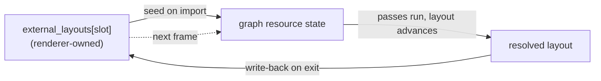

+++
title = 'Cross-frame layouts'
weight = 4
+++

# Cross-frame layouts

A cross-frame layout is the resting Vulkan image layout an image holds at the end of one frame and
relies on at the start of the next, carried across the frame boundary by an external-layout slot.

Some images live longer than a frame. The offscreen is left shader-read-only by the tonemap pass at
the end of one frame (the present blit then reads it) and written as a color attachment at the start
of the next. The graph is rebuilt from scratch every
frame, which is cheap and keeps per-frame state simple. A rebuilt graph holds no memory of an
image's prior layout, so on the first touch it would emit a transition that is already satisfied.
The external-layout slot preserves that layout so the next frame derives the correct barrier instead.

## Imported, not allocated

The graph never allocates a resource. Every target is an existing renderer-owned Vulkan handle
registered with `import_image` (or `import_buffer`), which returns an `RgResource` index.

```rust
pub fn import_image(
    &mut self,
    image: vk::Image,
    view: vk::ImageView,
    aspect: vk::ImageAspectFlags,
    initial_layout: vk::ImageLayout,
    external: Option<usize>,
) -> RgResource;
```

Most imports pass `initial_layout = UNDEFINED` and `external = None` — images the graph
fully owns within the frame (depth buffer, MSAA color, G-buffer targets, swapchain image). They
start undefined, get written, and their final layout does not matter. The long-lived imports pass a
real external slot key.

## The external-layout slot

The graph owns a `Vec<vk::ImageLayout>` of cross-frame slots. A caller reserves one with
`alloc_external_layout(initial)`, which returns a `usize` key, and reads it back with
`external_layout(slot)`. Passing `Some(slot)` to `import_image` does two things. On import it seeds
the resource's entry layout from the slot's value, ignoring the `initial_layout` argument. At the
very end of `execute`, after every pass has run, it writes the resolved layout back into the slot:

```rust
for r in &self.resources {
    if let Some(slot) = r.external_layout {
        self.external_layouts[slot] = r.layout;
    }
}
```

The slot is an index, not a raw pointer, so the write-back carries the layout across frames safely.
The renderer reserves one slot per long-lived target (the offscreen, the shadow maps, the TAA
history, the DDGI proxy) and re-imports against it each frame: the slot both seeds the graph this
frame and receives the resolved layout for next frame.



This keeps the [tonemap](../../screen-space-and-post/tonemap-and-exposure/) and the present blit from
conflicting with the next frame's scene write. The offscreen rests in `ShaderReadOnlyOptimal` after
the tonemap pass; that value is written back; the next frame's import seeds the entry layout from
it, and the first scene `ColorWrite` derives a single correct transition.

## Seeding the source scope

The entry layout alone is not enough. To order the first barrier against an imported image, the
graph also needs the source stage and access — what last touched it. A freshly imported resource
has no prior pass this frame to read that from, so `seed_image_state` reconstructs it from the entry
layout:

```rust
fn seed_image_state(r: &mut RgResourceState) {
    if r.layout == vk::ImageLayout::SHADER_READ_ONLY_OPTIMAL {
        r.last_stage = vk::PipelineStageFlags2::FRAGMENT_SHADER;
        r.last_access = vk::AccessFlags2::SHADER_SAMPLED_READ;
    } else {
        r.last_stage = vk::PipelineStageFlags2::TOP_OF_PIPE;
        r.last_access = vk::AccessFlags2::empty();
    }
}
```

An image that comes in as `SHADER_READ_ONLY_OPTIMAL` was last read by a fragment shader (a sampling
pass, for instance), so the next write must wait on `FRAGMENT_SHADER` / `SHADER_SAMPLED_READ`,
the write-after-read source scope. Any other entry layout has no in-frame predecessor worth waiting
on, so the source defaults to `TOP_OF_PIPE` / empty, ordering against nothing. An incorrect source
scope either over-synchronizes or races the next frame's write against the previous frame's read.

## Which images carry across

| Image | external slot | Why |
|---|---|---|
| Offscreen color | yes | left shader-read-only by tonemap (read by the present blit) at end of frame, written at start of next |
| Shadow / spot-shadow map | yes | written by the depth pass, sampled by the scene pass |
| TAA history images | yes | one frame's write is next frame's read |
| DDGI voxel proxy | yes | accumulated across frames |
| Depth, MSAA color, G-buffer | no | produced and consumed within one frame |
| Swapchain image | no | fresh acquire each frame; starts undefined, ends in present layout |

An image gets an external slot when its contents (or just its layout) must mean something next
frame. A scratch image imports with `external = None` (entry `UNDEFINED`) and the graph clears it on
first write.

> [!NOTE]
> `seed_image_state` only special-cases `SHADER_READ_ONLY_OPTIMAL`. It assumes anything else with no
> in-frame predecessor was last touched at `TOP_OF_PIPE`. That holds because the only images the
> engine carries across frames in another resting layout (the `GENERAL` history images) are always
> *written* first next frame, where the destination scope dominates and the loose source is
> harmless.

## In the code

| What | File | Symbols |
|---|---|---|
| Reserve + read a cross-frame slot | `render_graph.rs` | `RenderGraph::alloc_external_layout`, `external_layout` |
| Import + seed entry layout | `render_graph.rs` | `RenderGraph::import_image`, `RgResourceState::external_layout` |
| Reconstruct the source scope | `render_graph.rs` | `seed_image_state` |
| Write the resolved layout back | `render_graph.rs` | `RenderGraph::execute_profiled` (the write-back loop) |
| Persistent layouts in practice | `renderer.rs` | `Renderer::record_scene_graph` (the shadow-map / offscreen imports) |

## Related

- [Render graph](../render-graph-overview/) — why the graph is rebuilt every frame
- [Barrier derivation](../usage-and-barrier-derivation/) — how the seeded source scope feeds the first barrier
- [Passes](../passes-and-attachments/) — the attachments these imported images back
- [Tonemapping and exposure](../../screen-space-and-post/tonemap-and-exposure/) — the pass that leaves the offscreen in ShaderReadOnly
