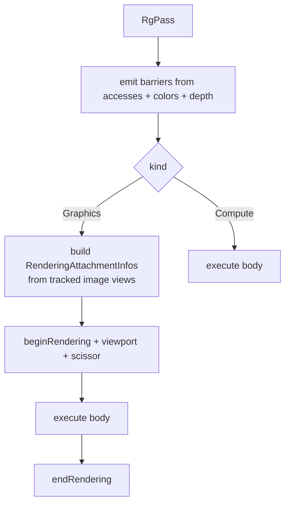

+++
title = 'Passes'
weight = 2
+++

# Passes

A pass is the unit a render graph schedules: a name, a kind, the resources it reads and writes, the
attachments it renders into, and a closure that records the draws or dispatch. It is plain data. The
pass states what it does, and the graph derives the synchronization from that.

```rust
pub struct RgPass {
    pub name: String,
    pub kind: RgPassKind,                            // Graphics or Compute
    pub accesses: Vec<RgAccess>,                     // non-attachment reads/writes
    pub colors: Vec<RgAttachment>,                   // MRT: index 0 == location 0
    pub depth: Option<RgAttachment>,
    pub render_area: vk::Extent2D,
    pub execute: Option<Box<dyn FnOnce(vk::CommandBuffer)>>, // the body
}
```

A pass is built with chained constructors: `RgPass::graphics(name, render_area)` or
`RgPass::compute(name)`, then `.access(resource, usage)`, `.color(att)`, `.depth_attachment(att)`,
and `.body(closure)`. The body is `FnOnce` — it runs exactly once on the render thread while the
command buffer records.

## How a pass runs

The `kind` decides what the graph wraps around the body. A `Graphics` pass gets a dynamic-rendering
scope plus a full-area viewport and scissor; a `Compute` pass gets only its barriers. Both then run
the same way: emit the barriers the body needs, then call `execute(cmd)`. The closure does ordinary
recording — bind a pipeline and descriptor sets, push constants, draw or dispatch. It never writes a
barrier or transitions a layout.



The image views bound by the rendering scope come from the graph's tracked resource state, not from
the attachment struct. The attachment names only an `RgResource` handle; the graph holds the
`vk::ImageView` the resource was imported with. The pass declaration carries no Vulkan handles past
the import.

## Accesses versus attachments

A pass declares its resource use in two places, and the split is deliberate.

`accesses` lists the non-attachment reads and writes: a storage buffer a compute shader writes, a
map the scene fragment shader samples, an image read and written in place. Each is an `RgAccess` — a
resource handle plus one `RgUsage` that says what the pass does with it.

`colors` and `depth` are the render targets of a graphics pass. They are not in `accesses` because
their usage is implied: every entry in `colors` is a `ColorWrite`, and `depth` is a `DepthWrite`. The
graph applies those itself, so a pass author never repeats them.

```rust
pub struct RgAttachment {
    pub resource: RgResource,
    pub load_op: vk::AttachmentLoadOp,
    pub store_op: vk::AttachmentStoreOp,
    pub clear_value: vk::ClearValue,
    pub resolve: Option<RgResource>,
}
```

The common case has a constructor: `RgAttachment::clear_store(resource)` builds a `CLEAR`-then-`STORE`
attachment with a zero clear value and no resolve. An attachment therefore declares only its load,
store, and clear. Whether it needs a barrier, which layout it transitions to, and how it orders
against the previous pass are all derived from the implied usage.

> [!NOTE]
> A color attachment is *not* an `RgAccess`. Listing it in both places would double-apply
> `ColorWrite` and emit a spurious second barrier. Put render targets in `colors`/`depth` and
> only non-attachment reads/writes in `accesses`.

## Multiple render targets

`colors` is a vector, so a pass can write more than one color attachment. The G-buffer pass uses
this: it writes a view-normal target and lays down depth in one pass for the screen-space effects to
read. Index order matters — `colors[0]` is shader output location 0, `colors[1]` is location 1 — and
the graph builds one `vk::RenderingAttachmentInfo` per entry. Most passes have a single color (the
offscreen); the G-buffer is the case that justifies the vector.

## Load, store, clear

The three attachment ops control data flow into and out of the pass:

- **load_op** — `CLEAR` starts from `clear_value`; `LOAD` keeps what is there. The scene pass clears
  depth normally, but when a depth pre-pass already ran it loads that depth (`LOAD`) and shades only
  the front-most fragments.
- **store_op** — `STORE` writes the result back; `DONT_CARE` discards it. With MSAA the scene color
  uses `DONT_CARE` because the multisampled samples are thrown away after they resolve.
- **clear_value** — what `CLEAR` writes. Depth clears to `1.0`, the scene color to the frame's clear
  color.

## The resolve target

An `RgAttachment` can carry an optional `resolve` resource, which is the MSAA path. The pass renders
into a multisampled color attachment, and at end-of-pass the hardware resolves it into the
single-sample `resolve` image. The graph treats the resolve target as a second color write: it runs
`apply_access` on it with `ColorWrite` so it gets its own barrier and transition, then wires it in
with `ResolveModeFlags::AVERAGE` (color) or `SAMPLE_ZERO` (depth). The MSAA scene pass sets
`store_op = DONT_CARE` on the multisampled color and points `resolve` at the offscreen; the clean
image lands there, and the graph derives both transitions.

## In the code

| What | File | Symbols |
|---|---|---|
| Pass shape | `render_graph.rs` | `RgPass`, `RgPassKind`, `RgPass::graphics`, `RgPass::compute` |
| Attachment shape | `render_graph.rs` | `RgAttachment`, `RgAttachment::clear_store` |
| Non-attachment access | `render_graph.rs` | `RgAccess`, `RgUsage`, `RgPass::access` |
| Recording a pass | `render_graph.rs` | `RenderGraph::execute_profiled`, `record_graphics` |
| MRT + resolve in practice | `renderer.rs` | `Renderer::record_scene_graph` (the scene `RgPass`, its `resolve`) |

## Related

- [Render graph](../render-graph-overview/) — the model these passes live in
- [Barrier derivation](../usage-and-barrier-derivation/) — how `ColorWrite` becomes a barrier
- [Adding passes](../who-can-add-passes/) — where these passes get built each frame
- [Anti-aliasing](../../screen-space-and-post/) — the MSAA resolve the `resolve` target serves
