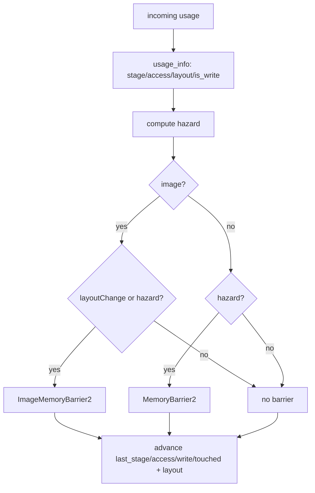

+++
title = 'Barrier derivation'
weight = 3
+++

# Barrier derivation

Barrier derivation is the process that turns one `RgUsage` value on a resource into a correct
Vulkan barrier. It is the core job of the render graph, and it rests on two small functions.
`usage_info` maps a usage to its synchronization scope; `apply_access` compares that scope against
what last touched the resource and emits a barrier only when one is required.

## Usage is the single source of truth

A pass states its intent as one `RgUsage`. `usage_info` expands the enum case into the four facts
a barrier needs — `{ stage, access, layout, is_write }`. That `match` is the only place these
correspondences live.

| `RgUsage` | Stage | Access | Layout | Write? |
|---|---|---|---|---|
| `ColorWrite` | ColorAttachmentOutput | ColorAttachmentWrite | ColorAttachmentOptimal | yes |
| `DepthWrite` | Early + LateFragmentTests | DepthStencilAttachmentWrite | DepthAttachmentOptimal | yes |
| `SampledRead` | FragmentShader | ShaderSampledRead | ShaderReadOnlyOptimal | no |
| `StorageWriteCompute` | ComputeShader | ShaderStorageWrite | (buffer) | yes |
| `StorageReadCompute` | ComputeShader | ShaderStorageRead | (buffer) | no |
| `StorageReadFragment` | FragmentShader | ShaderStorageRead | (buffer) | no |
| `StorageImageRwCompute` | ComputeShader | StorageRead + StorageWrite | General | yes |
| `SampledReadCompute` | ComputeShader | ShaderSampledRead | ShaderReadOnlyOptimal | no |
| `VertexInputRead` | VertexAttributeInput | VertexAttributeRead | (buffer) | no |
| `AccelStructBuildRead` | AccelerationStructureBuild | ShaderRead | (buffer) | no |

Several choices follow from the table. `DepthWrite` spans both fragment-test stages because depth
is touched in both. `StorageImageRwCompute` is a write in `GENERAL`, the in-place
read-modify-write layout the tonemap and FXAA passes use. The buffer usages carry `UNDEFINED` for
layout because buffers have none, and the barrier logic relies on that.

## The hazard line

`apply_access` receives the incoming usage's info and the resource's current tracked state. The
dependency decision is one boolean:

```rust
let hazard = (target.is_write && r.touched) || (!target.is_write && r.last_was_write);
```

A write that follows any prior touch is a hazard. `target.is_write && r.touched` covers
write-after-write and write-after-read, both of which need the prior access to finish first. A
read that follows a write is the classic read-after-write. Read-after-read is absent from this
line: two reads do not conflict, so `hazard` stays false and no barrier is emitted. That is the
one case the graph deliberately skips.

## Images get a second trigger

A buffer barriers only on a hazard. An image has a second reason — a layout change. Even with no
data hazard, a resource that sits in one layout while the incoming usage requires another must
transition.

```rust
if r.is_image {
    let layout_change =
        target.layout != vk::ImageLayout::UNDEFINED && r.layout != target.layout;
    if layout_change || hazard { /* ImageMemoryBarrier2 */ }
} else if hazard { /* MemoryBarrier2 (no layout) */ }
```

The image path emits a `vk::ImageMemoryBarrier2`. Its source scope is whatever last touched the
resource (`r.last_stage`, `r.last_access`); its destination scope is the incoming usage's stage and
access. `old_layout` is always the current layout, and `new_layout` differs only on a layout change.
A barrier emitted purely to order a hazard therefore has matching layouts, does no transition, and
still installs the execution and memory dependency.

The buffer path emits a `vk::MemoryBarrier2`, which has no layout fields. The `target.layout !=
UNDEFINED` guard keeps a buffer, whose usages all carry `UNDEFINED`, from ever triggering the
layout path.

## Advancing the state

After deciding and possibly emitting, `apply_access` rolls the tracked state forward so the next
pass sees the new reality: `last_stage`, `last_access`, `last_was_write`, `touched`, and, for images
on a layout change, `layout`. This makes the next pass's checks correct without any global
analysis. The state is a running summary of what last happened to a resource, updated one access
at a time as the passes are walked in order.



> [!NOTE]
> The hazard line treats a write after any prior touch as conflicting, including write-after-read.
> That is conservative but correct: it never misses a hazard. It also never coalesces or reorders
> — each access emits at most one barrier, walked strictly in pass order, so the cost is one
> barrier per real transition and nothing for read-after-read.

## In the code

| What | File | Symbols |
|---|---|---|
| Usage → scope mapping | `render_graph.rs` | `usage_info`, `RgUsageInfo` |
| The hazard decision | `render_graph.rs` | `apply_access`, `DerivedBarriers` |
| Tracked state | `render_graph.rs` | `RgResourceState` |
| Where barriers are collected | `render_graph.rs` | `RenderGraph::derive_pass_barriers`, `execute_profiled` |

## Related

- [Render graph](../render-graph-overview/) — the model this derivation serves
- [Passes](../passes-and-attachments/) — where `ColorWrite`/`DepthWrite` come from implicitly
- [Cross-frame layouts](../cross-frame-layouts/) — how the entry layout seeds the first barrier
- [Synchronization2](../../vulkan-foundation/) — the barrier primitives this emits
