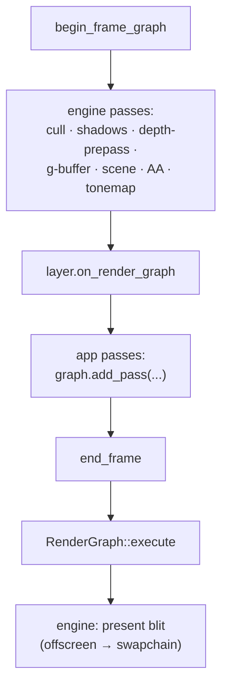

+++
title = 'Adding passes'
weight = 5
+++

# Adding passes

A frame graph is assembled in three ordered windows of a single main-loop iteration: the engine
lays down its own passes, app layers add theirs, and the engine closes by executing the graph and
blitting the offscreen to the swapchain. The order lets an app insert a pass — a post-process, a
compute effect — at a defined point in the frame without touching engine code.

## The three windows

The loop in `run` does this per frame, after the `on_ui` phase: it makes a fresh `RenderGraph`,
calls the host's `begin_frame_graph` to lay down the engine passes, hands the graph to each
layer's `on_render_graph`, then moves it into `end_frame` to execute and present.

```rust
let mut graph = RenderGraph::new();
host.begin_frame_graph(&mut graph);                 // 1. engine: cull → scene → AA → tonemap
for layer in &mut layers {
    layer.on_render_graph(app, &mut graph);         // 2. app passes
}
host.end_frame(graph)?;                             // 3. engine: execute, then blit to swapchain
```

1. **`begin_frame_graph`** adds every engine-internal pass: light culling, shadow depth passes, the
   optional depth pre-pass, the G-buffer and screen-space effects, the scene pass, the FXAA/TAA
   resolve, and the mandatory tonemap. By the time it returns, the offscreen holds the finished,
   tonemapped scene. The host implements it on `Renderer::record_scene_graph` and the post passes.
2. **`on_render_graph`** is the layer hook. Each attached layer that overrides it is handed the live
   `&mut RenderGraph` and can call `add_pass` to insert its work. This runs after the scene and
   tonemap, before the graph executes.
3. **`end_frame`** takes the graph by value, calls `RenderGraph::execute` to derive every barrier
   and record the whole thing, then blits the finished offscreen to the swapchain with
   `Renderer::present_active_view_to_swapchain`.

The present blit is last, so anything a layer adds in window 2 is recorded before the offscreen is
read out. An app post-process sees the engine's finished image and modifies it before it
reaches the screen.



## What a layer gets

The layer receives `&mut RenderGraph` and adds to it with the same `add_pass` the engine uses. The
offscreen color is the `RgResource` the renderer tracks for the active view, so an in-place compute
post-process imports nothing new: it declares `StorageImageRwCompute` on the offscreen handle, binds
its pipeline, and dispatches.

A layer pass and an engine pass are identical to the graph. The layer's pass goes through
`apply_access` the same way, and its read-modify-write transition (`Color → General →
ShaderReadOnly`) is derived, not coded. The engine's own tonemap uses the same machinery from
inside `record_scene_graph`.

## Engine passes are conditional

`record_scene_graph` is not a fixed pipeline. Almost every engine pass is gated on a flag and the
presence of its pipeline and target — a `do_cull` / `do_shadow` / `do_depth_prepass` / `do_skin`
boolean built from a pending request plus the compiled pipeline. The graph for a given frame
contains only the passes that frame needs. With shadows off, the shadow pass is not added; the
scene pass declares a `SampledRead` on the shadow map only when the shadow ran, so no barrier
references a resource that was never imported. Conditional construction keeps the declared usage and
the imported resources in lockstep.

## The submit() seam

App geometry reaches the GPU two coexisting ways. The `on_render_graph` hook adds whole passes. The
`Renderer::submit(closure)` seam pushes a closure *replayed inside* the scene pass body — the
editor gizmo / native-overlay seam. The scene pass's body records the batched draw list, then
replays each stashed `RenderFn` against the same command buffer:

```rust
record_scene_draw_list(/* … */);
for body in submissions {
    body(cmd);
}
```

A layer that draws more geometry into the scene uses `submit`; a layer that needs its own
synchronized pass — a compute effect, a separate target — uses `on_render_graph`. The first rides
inside the engine's barriers; the second gets its own, derived.

> [!NOTE]
> The tonemap is added inside `record_scene_graph`, so it runs before `on_render_graph`. A layer
> post-process therefore operates on already-tonemapped, display-referred color, not linear HDR.
> A layer that needs linear radiance must insert its pass another way; the engine's own linear-HDR
> consumers (SSGI history capture) are added before the tonemap.

## In the code

| What | File | Symbols |
|---|---|---|
| The three-window order | `app/src/lib.rs` | `run`, the per-frame render/ui/graph hook pass |
| The host hook + the layer hook | `app/src/lib.rs` | `begin_frame_graph`, `end_frame`, `Layer::on_render_graph` |
| Engine passes | `renderer.rs` | `Renderer::record_scene_graph` (the `do_*` gates + `add_pass`) |
| Execute + present blit | `renderer.rs` | `RenderGraph::execute`, `Renderer::present_active_view_to_swapchain` |
| Replay-into-pass seam | `renderer.rs` | `Renderer::submit`, `RenderFn`, `submissions` |

## Related

- [Render graph](../render-graph-overview/) — the model the passes are added to
- [Passes](../passes-and-attachments/) — what `add_pass` takes
- [Limits](../limits-and-seams/) — what app passes still can't do
- [Compute post-process](../../screen-space-and-post/) — the RMW shape a layer pass follows
