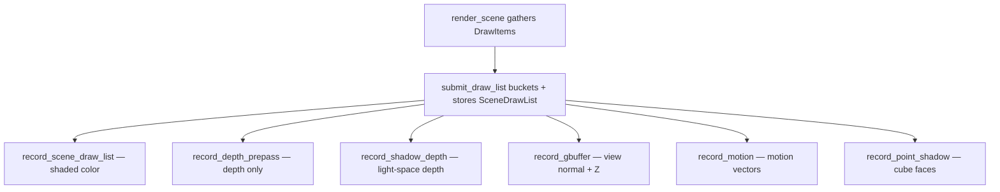

+++
title = 'Draw list'
weight = 8
math = true
+++

# Draw list

A draw list is a flat snapshot of everything the scene wants drawn this frame, gathered once
from the ECS into plain data and then replayed by every geometry pass. It sits between the
scene description and the Vulkan commands: the scene is walked one time into a list of items,
and the [render graph](../../frame-and-render-graph/render-graph-overview/) passes consume
that list rather than the live scene.

Decoupling the gather from the record keeps the scene traversal in one place. A frame draws
the same geometry several times — shaded color, depth, shadows, G-buffer, motion — and each
pass reads from the same prepared list instead of querying the world again.

## Gather: ECS into DrawItem

`render_scene` iterates the `hecs` world for every entity with a `Transform` and a `Mesh`
component, resolves the mesh through [`load_mesh_asset`](../asset-server-and-catalog/),
resolves its materials via `resolve_entity_materials`, and pushes one `DrawItem`:

```rust
pub struct SubmeshMaterial {       // textures + PBR factors for one submesh
    pub albedo_texture: Option<Arc<GpuTexture>>,   // None => default white slot
    pub metallic_roughness_texture: Option<Arc<GpuTexture>>,
    // normal / occlusion / emissive / height textures ...
    pub base_color: Vec4,
    pub metallic: f32,
    pub roughness: f32,
    pub emissive: Vec3,
    pub emissive_strength: f32,
    // uv tiling/offset, normal/height strength, alpha clip ...
}

pub struct DrawItem {
    pub mesh: Arc<GpuMesh>,
    pub model: Mat4,
    pub normal_matrix: Mat4,
    pub submesh_materials: Vec<SubmeshMaterial>,  // one per submesh (clamped)
    pub material: Material,        // selects the PSO permutation (e.g. unlit)
    pub skinned: bool,             // deformed once by the skin compute pass when set
    // joint_offset / joint_count / entity ...
}
```

`resolve_entity_materials` builds a `ResolvedMaterials` whose `submeshes` are sized to the
mesh's submeshes: a `MaterialSet` component is indexed by each submesh's `material_slot`; a
plain `Material` (or a `MaterialAsset`) applies to every submesh; a missing component falls
back to the engine default. A single entry is reused for all submeshes.

The same loop also accumulates the world-space scene bounds: it transforms each mesh's local
AABB by its model matrix, and those bounds fit the
[directional shadow](../../shadows-and-culling/directional-shadows/) frustum and the DDGI
probe volume. The draw list and the scene extents are gathered in one pass. `render_scene`
also collects lights, sets the shadow/cluster/SSAO camera state, and finally calls the
renderer's `submit_draw_list` (a `SceneRenderer` trait method) with the view-projection, the
items, and the concatenated joint palette.

## Bucket: DrawItem into instanced batches

`Instancing::submit_draw_list` groups items into batches keyed on `(pipeline, mesh)`. The key
omits the texture. Albedo is [bindless](../../materials-and-pipelines/bindless-textures/) — a
per-instance index into one global texture array, carried in the instance data — so two items
that differ only by texture still batch together.

Because each submesh can carry a different material, an item expands to one `InstanceData`
per submesh (model matrix, normal matrix, base color, bindless texture indices,
metallic/roughness, emissive — packed to the 256-byte std430 row the shader reads). The
buckets flatten **submesh-major**: for a batch of $N$ instances over a mesh with $S$
submeshes, the array holds submesh 0's $N$ rows, then submesh 1's $N$ rows, and so on.
Drawing submesh $s$ then offsets `first_instance` by $s \times N$
(`base_instance + s * instance_count` in `record_batch_submeshes`), so the
[shader](../../materials-and-pipelines/ubershader-and-specialization/) reads each instance's
per-submesh material straight from the instance buffer with no shader or PSO change.

The result is stored on the frame as a `SceneDrawList`:

```rust
pub struct SceneDrawList {
    pub view_proj: Mat4,
    pub batches: Vec<DrawBatch>,
    pub skin_dispatches: Vec<SkinDispatch>,          // compute-skinning work
    pub live_textures: Vec<Arc<GpuTexture>>,         // pins indexed textures for the frame
    pub valid: bool,
    // prev-skin dispatches + RT refit instances ...
}
```

`live_textures` holds an `Arc` to every texture an instance indexed, so a texture cannot be
freed mid-frame while a bindless slot still points at it. A skinned `DrawItem` is deformed
once by the `skin` compute pass into its slice of the frame's deformed-vertex buffer, then
drawn as a static instance reading that slice.

## Replay: one list, many passes

A single `SceneDrawList` feeds every geometry pass in the frame, each recording the same
batches with a different pipeline and push constant:



The shaded pass `record_scene_draw_list` binds the bindless, light, instance, IBL, and
screen-space sets once, pushes the camera `view_proj`, then per batch binds its pipeline and
mesh buffers. The shared `record_batch_submeshes` helper issues one `cmd_draw_indexed` per
submesh with the batch's `instance_count` and a `first_instance` offset by `s * instance_count`
(the submesh-major layout above). The depth, shadow, G-buffer, and motion passes are
vertex-only variants of the same loop: they bind only the instance set, push a different
matrix, and skip the material binds. All go through `record_batch_submeshes`.

## Stats

`submit_draw_list` fills `RenderStats` while flattening: draw calls (one `cmd_draw_indexed`
per submesh per batch), batch count, and total instances. These are inspectable through the
control plane, which verifies instanced batching live — two textured cubes collapsing to one
batch show up as `batches = 1`.

## In the code

| What | File | Symbols |
|---|---|---|
| Gather ECS → items | `assets/src/render_scene.rs` | `render_scene` |
| Resolve materials | `assets/src/render_material.rs` | `resolve_entity_materials`, `ResolvedMaterials`, `build_submesh_material` |
| Item + material types | `rendering/src/draw_list.rs` | `DrawItem`, `SubmeshMaterial` |
| Bucket + store | `rendering/src/instancing.rs` | `Instancing::submit_draw_list`, `compute_stats` |
| Batch + frame list | `rendering/src/draw_list.rs` | `DrawBatch`, `SceneDrawList`, `RenderStats` |
| Per-instance row | `rendering/src/gpu_types.rs` | `InstanceData` |
| Shaded + vertex-only replays | `rendering/src/scene_pass.rs`; `rendering/src/aa.rs` | `record_scene_draw_list`, `record_batch_submeshes`, `record_depth_prepass`, `record_shadow_depth`, `record_gbuffer`, `record_point_shadow`, `record_motion` |

> [!NOTE]
> The PSO (the `Material` permutation, e.g. unlit) is chosen per batch from the entity, so a
> single mesh that mixes unlit and lit submeshes is not supported. Imported models are always
> lit, and base color / albedo / metallic / roughness / emissive still vary freely per submesh.

## Related

- [Asset catalog](../asset-server-and-catalog/) — resolves each item's mesh + textures
- [Bindless textures](../../materials-and-pipelines/bindless-textures/) — why texture isn't a batch key
- [Material and PSO selection](../../materials-and-pipelines/material-and-pso-selection/) — the per-item PSO
- [Render graph](../../frame-and-render-graph/render-graph-overview/) — the passes that replay the list
- [Render commands](../../tooling-and-control/render-commands/) — reading the batch/draw stats live
