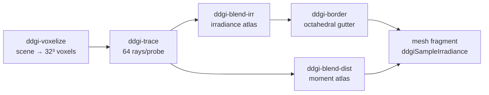

+++
title = 'DDGI overview'
weight = 1
+++

# DDGI overview

Dynamic Diffuse Global Illumination is a real-time technique that computes multi-bounce diffuse
indirect light from a grid of irradiance probes re-traced every frame. Each probe gathers radiance
by tracing rays against a coarse voxel copy of the scene; a shaded surface then samples the nearest
probes for its diffuse indirect term.

The probe volume tracks moving geometry, so indirect light updates as the scene changes. The trace
is software, so DDGI runs on any GPU including the llvmpipe dev device.

## The per-frame pipeline

DDGI is an all-compute prelude before the scene pass. Five passes rebuild the probe state each
frame, then the mesh fragment reads it. The grid is fixed at 8×4×8 probes (`DDGI_PROBES_X/Y/Z`),
each tracing 64 rays (`DDGI_RAYS_PER_PROBE`).

1. **Voxelize** rasterizes each draw's world-space AABB into a 32³ `rgba16f` 3D image — the
   geometry the rays march against ([voxel proxy](../voxel-scene-proxy/)).
2. **Trace** marches 64 Fibonacci-sphere rays from each probe through the voxels, returning
   radiance and hit distance per ray ([software trace](../software-ray-trace/)).
3. **Blend irradiance** and **blend distance** integrate those rays into two octahedral atlases
   — directional irradiance and Chebyshev distance moments — with temporal hysteresis.
4. **Border** copies each probe tile's octahedral gutter so bilinear sampling wraps correctly.
   These three live in [the atlases](../irradiance-and-moment-atlases/).

The mesh fragment then calls `ddgiSampleIrradiance(worldPos, n)`, which blends the eight probes
around the surface using trilinear, backface, and Chebyshev weights
([probe sampling](../probe-volume-and-sampling/)) and adds the result to the diffuse ambient
term (gated on `screenFlags.z`).

## Why probes over screen-space

Screen-space GI is bounded by the framebuffer. Light from off-screen or back-facing geometry
contributes nothing, and the term flickers as the camera turns.
[Image-based lighting](../../image-based-lighting/ibl-overview/) gives only a static ambient, and
[screen-space GI](../../screen-space-and-post/) can bounce only what is on screen. DDGI stores
irradiance in world space, so a surface lit by a wall behind the camera stays lit. The cost is a
fixed per-frame budget (five compute passes regardless of view) and coarse spatial resolution — one
probe every couple of meters. DDGI is therefore the *diffuse* indirect term only; specular still
comes from IBL and screen-space reflections.

## Multi-bounce convergence

The trace samples last frame's irradiance atlas at each ray hit and folds it back in. A ray that
hits a lit wall picks up that wall's bounce, which was itself fed by the bounce before it. Each
frame adds one bounce, and the temporal blend converges to many bounces over a fraction of a second
with no extra rays. That feedback is why the volume is re-traced rather than baked.

## A self-fitting volume

The probe cage is not authored. `set_ddgi_scene` runs from `render_scene` each frame with the
scene's world AABB, and the volume fits to it, padded slightly so probes sit just outside the
geometry. Moving or resizing the scene moves the cage with it, which keeps DDGI dynamic.

## In the code

| What | File | Symbols |
|---|---|---|
| Five-pass per-frame pipeline | `rendering/src/renderer.rs` | `Renderer::add_ddgi_passes` (the `ddgi-voxelize` … `ddgi-border` passes) |
| Probe / grid constants | `rendering/src/ddgi.rs` | `DDGI_PROBES_X/Y/Z`, `DDGI_RAYS_PER_PROBE`, `DDGI_VOXEL_RES` |
| Volume fit + box upload | `rendering/src/renderer.rs` | `Renderer::set_ddgi_scene`; `assets/src/render_scene.rs` · `render_scene` |
| Sampling into shading | `lighting.slang` | `ddgiSampleIrradiance`, the `screenFlags.z` branch |
| State + toggle | `rendering/src/ddgi.rs` | `Ddgi`, `Ddgi::wants_ddgi`; `renderer.rs` · `Renderer::set_ddgi`, `ddgi_enabled` |

> [!NOTE]
> DDGI adds five compute passes every frame whether or not the scene changed, so it's off by
> default (`Ddgi::enabled`). Enabling it (or resizing) sets the history-reset flag
> (`Ddgi::reset_history`), which zeroes the temporal blend for one frame so the probes re-converge
> instead of ghosting in from stale data.

## Related

- [Voxel proxy](../voxel-scene-proxy/) — the geometry the rays march against
- [Software ray trace](../software-ray-trace/) — how each probe gathers radiance
- [Cook-Torrance BRDF](../../lighting-and-brdf/cook-torrance-brdf/) — the shading the irradiance feeds
- [Image-based lighting](../../image-based-lighting/ibl-overview/) — the static-ambient term DDGI augments
