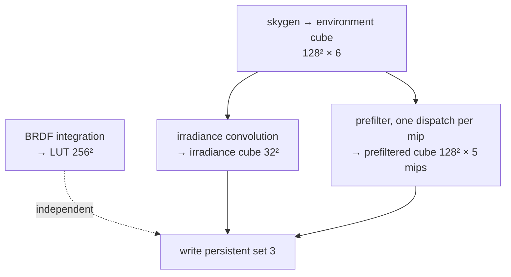

+++
title = 'Baking'
weight = 7
+++

# Baking

Baking is the precomputation of an environment's lighting into a fixed set of textures, run once so that runtime lighting reduces to a few texture fetches.

The IBL compute shaders run inside one method, `Ibl::bake`, called at startup, and produce the persistent set 3 the mesh shader samples every frame after. The bake is synchronous one-time work: its own command pool, its own transient descriptors, and a `wait_idle` at the end. It sits outside the [per-frame render graph](../../frame-and-render-graph/render-graph-overview/).

## Why bake once, not per frame

The convolutions are heavy. The irradiance integral takes a thousand environment samples per texel, and the prefilter and LUT each importance-sample 64 to 512 directions per texel. None of this changes once the environment is fixed, so computing it per frame would spend the whole budget on a result identical to the last frame's. Amortized to startup, the runtime cost collapses to three texture fetches in the [ambient block](../ibl-overview/).

## The stages

The bake runs the shaders in dependency order, since the environment cube must exist before it can be convolved. The BRDF LUT is independent and runs last. When the atmosphere source is active, the `atmos_*` LUT chain runs first to fill the environment cube ([procedural atmosphere](../procedural-atmosphere/)).

Each stage transitions its target to `GENERAL`, dispatches, then transitions to `SHADER_READ_ONLY_OPTIMAL`. The environment is the exception: after skygen writes it, it transitions to `SHADER_READ_ONLY_OPTIMAL` so the irradiance and prefilter passes can *sample* it. The barriers are written by hand here, outside the render graph, one sync2 `cube_barrier` per transition. The dispatch grid is `(size + 7) / 8` groups in X and Y (the `group` helper) to match the shaders' `[numthreads(8,8,1)]`, and 6 in Z, one per cube face.

## Transient resources, freed at the end

The bake builds a private `BakeScratch`: a command pool + buffer + fence, a descriptor pool, the set layouts (storage-only for skygen and the LUT, sampler-plus-storage for the convolutions, two-sampler for the atmosphere chain), the compute pipelines, and the per-mip 2D-array storage views described in [cubemaps and mips](../cubemaps-and-mips/). All of this exists only for the bake; `BakeScratch`'s `Drop` releases every handle on the way out, success or error.

The four images — environment, irradiance, prefiltered, LUT (plus the three atmosphere LUTs) — persist, owned by `Ibl` as `IblCube`/`IblImage` Drop wrappers. The environment cube outlives the bake even though only the convolutions read it, kept as the source for a re-bake.

## Writing the persistent set

On the first bake, `Ibl::write_mesh_set` writes the three samplers the mesh fragment binds as set 3 (bindings 0-2: irradiance, prefiltered, BRDF LUT), then sets `ready = true`. The set layout and the empty set are allocated in `Ibl::new` against the shared descriptor pool, so the mesh pipeline layout can reference set 3 before the bake fills it. The shared IBL sampler (`create_ibl_sampler`) is a linear/trilinear clamp-to-edge sampler with `LOD_CLAMP_NONE`, so the prefiltered mip chain filters across all levels.

## The runtime gate

The mesh shader samples set 3 only when `globals.counts.z != 0`, which is `use_ibl && Ibl::ready` — both the toggle and the bake-completed flag, folded into the light UBO by `Lighting::set_frame_ibl`. IBL contributes the moment the bake finishes, and `sa set-ibl 0` returns to the flat scalar ambient without touching the baked textures.

## Re-baking on demand

`Ibl::request_env_bake` arms `rebake_pending` when the sky inputs change — the sun moves, the panorama swaps, or any atmosphere field differs — gated by an exact `!=` over POD params (`should_rebake`), so an unchanged frame never re-bakes. The renderer consumes the flag at a GPU-idle frame start (`render_scene_offscreen`) via `Ibl::fire_rebake`, which re-bakes in place and commits the new params. A re-bake reuses the same images and views, so set 3 stays valid throughout.

## In the code

| What | File | Symbols |
|---|---|---|
| The whole bake | `engine/crates/rendering/src/ibl.rs` | `Ibl::bake`, `BakeScratch`, `cube_barrier`, `group` |
| Re-bake gate + fire | `engine/crates/rendering/src/ibl.rs` | `request_env_bake`, `should_rebake`, `rebake_pending`, `fire_rebake` |
| Persistent set + sampler | `engine/crates/rendering/src/ibl.rs` | `write_mesh_set`, `create_ibl_sampler`, `ready` |
| Runtime gate | `engine/crates/rendering/src/lighting.rs` | `set_frame_ibl`, `frame_ibl_flag` → `counts` |
| Source select driver | `engine/crates/assets/src/render_scene.rs` | `drive_env_bake` |
| Toggle command | `engine/crates/control/src/commands_render.rs` | `set-ibl` |

> [!NOTE]
> The bake submits on the graphics queue and waits idle to finish before returning. Fine at startup, but it would stall a running frame — it is deliberately a one-time init / editor-time event, fired only at a GPU-idle frame start, not a render-graph pass. `Ibl::bake` is one of the few legitimate mid-session `wait_idle` sites.

## Related

- [IBL overview](../ibl-overview/) — what set 3 feeds at runtime
- [Cubemaps and mips](../cubemaps-and-mips/) — the image + transient-view setup the bake uses
- [Procedural sky](../procedural-sky/) — stage one of the bake
- [Render graph overview](../../frame-and-render-graph/render-graph-overview/) — the per-frame system this bake sits outside of
