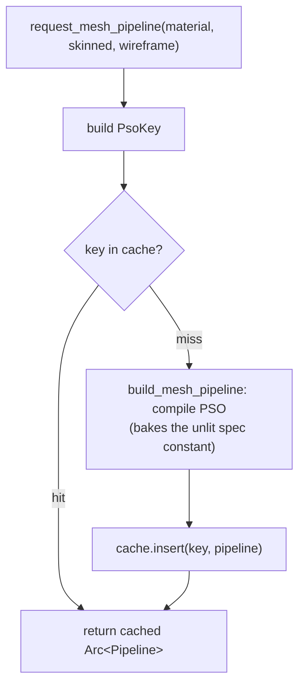

+++
title = 'Materials & PSOs'
weight = 1
+++

# Materials & PSOs

A material is a small, declarative description of how a surface draws: a shader name and a variant flag. A pipeline state object (PSO) is the compiled Vulkan object that renders with it. PSO selection is the step that maps one to the other.

The two are separated because they have different costs and different cardinalities. Many materials describe one surface each; few distinct pipelines exist. Building a PSO is expensive, so the renderer constructs each one lazily and caches it, keyed by the properties that affect the pipeline rather than by material instance. A thousand entities with a thousand base colors then resolve to one PSO, which lets the draw-list batcher group them.

## How selection works

A material names a shader and a variant. The renderer derives a cache key from those plus the skinned/wireframe permutation, looks it up, and returns the cached pipeline or builds one and inserts it. The caller never constructs a pipeline directly; it holds a `Material` and asks the `Pipelines` cache for the matching `Arc<Pipeline>`, which many draws share.

## The material

```rust
pub struct Material {
    pub shader: String,  // "shaders/mesh.spv" by default, or a codegen'd material .spv
    pub unlit: bool,     // selects the unlit übershader permutation (a distinct PSO)
}
```

That is the whole type. The per-instance albedo index and base color live in the per-instance data, not the material; the material only decides which pipeline a renderable draws with. There is one übershader (`mesh.slang`), so almost everything resolves to the same PSO and the `unlit` flag picks a second one. See [the übershader](../ubershader-and-specialization/).

## Build on miss

`request_mesh_pipeline` is the entry point. It builds a `PsoKey` from the material and the skinned/wireframe flags, looks it up, and either returns the cached `Arc<Pipeline>` or builds one and inserts it. The cache is a `HashMap<PsoKey, Arc<Pipeline>>` on `Pipelines`; the key is a typed struct (shader, unlit, skinned, wireframe, sample count), not a stringly-typed concat.



Two materials that name the same shader and permutation get the *same* `Arc<Pipeline>`, because the übershader makes them interchangeable. A build failure logs and returns `None` rather than panicking. The draw-list path skips a batch whose pipeline came back `None`, so one bad shader cannot bring down the frame. Wireframe is gated on the `fill_mode_non_solid` capability: an unsupported device folds the wireframe key back to fill, so the key never names a permutation the device cannot make.

## What a PSO bakes in

`build_mesh_pipeline` is the only place a mesh pipeline is constructed. Beyond the shader stages it bakes in everything that has to match the frame's targets:

- the MSAA sample count (`PsoKey::sample_count`);
- the `R16G16B16A16_SFLOAT` offscreen color format and `D32_SFLOAT` depth format for dynamic rendering;
- a `LESS_OR_EQUAL` depth compare, so a depth pre-pass's values pass;
- the full set-layout list — sets 0–5 always, 6–7 only when ray tracing is enabled.

Because the sample count is baked into the key, `set_sample_count` clears the cache when the AA mode changes targets, and the next request rebuilds.

`pipeline_count` returns the live cache size, reported by `sa render-stats`. It is a direct check that übershader reuse is happening, and the number should stay small. `pipelines_created` counts builds (a non-zero count on a steady-state frame is a PSO-compile hitch).

## In the code

| What | File | Symbols |
|---|---|---|
| Material type | `gpu_types.rs` | `Material` |
| Cache + key + counters | `pipelines.rs` | `Pipelines::cache`, `PsoKey`, `pipeline_count`, `pipelines_created` |
| Lookup / build-on-miss | `pipelines.rs` | `request_mesh_pipeline` |
| PSO construction | `pipelines.rs` | `build_mesh_pipeline`, `set_sample_count` |

## Related

- [Übershader](../ubershader-and-specialization/) — why N materials share one PSO
- [Descriptor sets](../descriptor-sets/) — the set-layout list every mesh PSO bakes in
- [Render graph](../../frame-and-render-graph/render-graph-overview/) — where the resolved pipeline is bound
