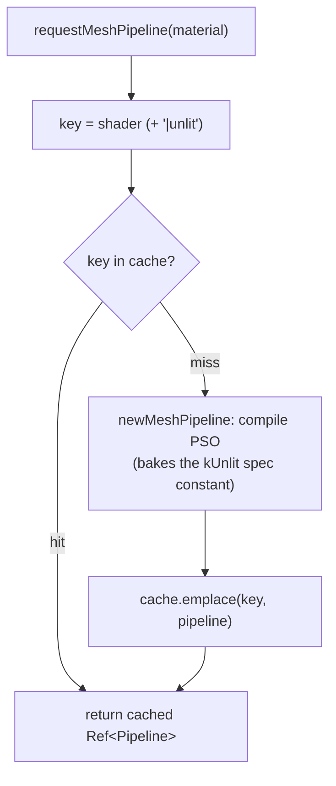

+++
title = 'Materials & PSOs'
weight = 1
+++

# Materials & PSOs

A `Material` is small: a shader name and one variant flag. The client never builds a pipeline. The renderer turns a material into a Vulkan pipeline state object lazily, through a keyed cache, and hands back a `Ref<Pipeline>` that many draws share.

The reason for the cache is simple. Pipeline creation is expensive and the set of distinct pipelines is tiny. Keying by variant rather than by material instance means a thousand entities with a thousand base colors still share one PSO, so the draw-list batcher can group them.

## The material

```cpp
struct Material
{
    std::string shader = "shaders/mesh.spv";
    bool unlit = false;  // selects the unlit übershader permutation (a distinct PSO)
};
```

That is the whole type. The per-instance albedo texture and base color live on the `DrawItem`, not the material — the material only decides which pipeline a renderable draws with. For v1 there is one übershader (`mesh.slang`), so almost everything resolves to the same PSO and the `unlit` flag picks a second one. See [the übershader](../ubershader-and-specialization/).

## Build on miss

`requestMeshPipeline` is the front door. It builds a cache key from the material, looks it up, and either returns the cached pipeline or builds one and inserts it. The cache is an `unordered_map<std::string, Ref<Pipeline>>` on the renderer; the key is the shader name with `|unlit` appended for the unlit variant.



Two materials that name the same shader and variant get the *same* `Ref<Pipeline>` — the übershader makes that true. A build failure logs and returns null rather than aborting; the draw-list path skips a batch whose pipeline came back null, so one bad shader can't take down the frame.

## What a PSO bakes in

`newMeshPipeline` is the only place a mesh pipeline is constructed. Beyond the shader stages it bakes in everything that has to match the frame's targets: the MSAA sample count, the `rgba16f` offscreen color format and `D32` depth format for dynamic rendering, an `eLessOrEqual` depth compare (so a depth pre-pass's values pass), and the full set-layout list (sets 0–5 always, 6–7 only when ray tracing is enabled). Because sample count is baked in, the cache rebuilds when the AA mode changes targets.

`pipelineCount` returns the live cache size, which `se render-stats` reports — a direct check that übershader reuse is happening. The number should stay small.

## In the code

| What | File | Symbols |
|---|---|---|
| Material type | `renderer_types.cppm` | `Material` |
| Cache + counters | `renderer_types.cppm` | `Pipelines::cache`, `pipelineCount` |
| Lookup / build-on-miss | `renderer_pipelines.cpp` | `requestMeshPipeline` |
| PSO construction | `renderer_pipelines.cpp` | `newMeshPipeline` |

## Related

- [Übershader](../ubershader-and-specialization/) — why N materials share one PSO
- [Descriptor sets](../descriptor-sets/) — the set-layout list every mesh PSO bakes in
- [Render graph](../../frame-and-render-graph/render-graph-overview/) — where the resolved pipeline is bound
