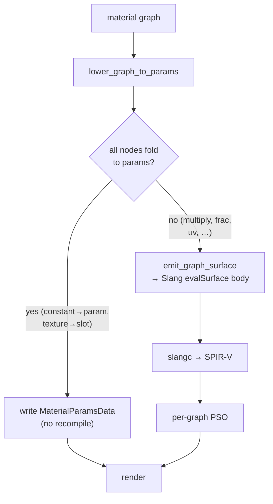

+++
title = 'Node-graph codegen'
weight = 6
+++

# Node-graph codegen

A material can be authored as a node graph — constants, texture samples, and math wired into a surface — the way Unreal's material editor works. The graph is stored on the [material asset](../native-materials/) and turned into a shader two different ways depending on what it contains. This is the engine's endgame for material authoring: arbitrary procedural surface math, without hand-writing Slang and without exploding the pipeline count.

## The data model

A graph is plain JSON on the `.smat`:

```jsonc
{
  "nodes": [
    { "id": "c",   "type": "constant",   "props": { "value": [1,0,0,1] } },
    { "id": "t",   "type": "textureSlot","props": { "slot": "albedo" } },
    { "id": "mul", "type": "multiply" },
    { "id": "out", "type": "materialOutput" }
  ],
  "edges": [
    { "from": ["c","rgba"],   "to": ["mul","a"] },
    { "from": ["t","rgba"],   "to": ["mul","b"] },
    { "from": ["mul","rgba"], "to": ["out","baseColor"] }
  ]
}
```

Node `type` strings match the emitter's match arm in `graph.rs` and the editor palette in `materials/graph.ts` — the two are kept in sync by hand. Editor-only data (a node's canvas position) rides in the node `props`, which the engine ignores.

## Fold or codegen

The key decision is whether a graph needs a *new shader* at all.



A graph that is just a constant feeding `baseColor`, or a texture feeding a slot, **folds**:
`lower_graph_to_params` collapses its values into the flat `MaterialAsset` factors and it draws on the
shared übershader — no compile. A graph with procedural math (`multiply`, `lerp`, `frac`, `uv`, …)
**cannot** fold; `lower_graph_to_params` returns `false` and the graph is lowered to a Slang
`evalSurface` body and compiled.

This is the cost model: editing a *constant* is a buffer write; changing graph *topology* is a recompile. The editor folds first and only pays slangc when the graph genuinely needs it.

## Emitting and compiling

`emit_graph_surface` walks the nodes in array order (inputs precede consumers), emitting one typed
Slang statement per node — `float4 n_<id> = …` — then assigns the `materialOutput` channels. The
supported set is the [node library](#the-node-library).
`compile_material_graph` / `compile_material_preview_shader` splice that body into a self-contained
shader (the preview variant matches `PreviewPush` and the sphere vertex layout), then shell out to
`slangc` (`find_slangc` locates it via `SAFFRON_SLANGC`, the prebuilt slang cache under `HOME`, or
`PATH`). The result is a per-graph `.spv`.

Two render targets are wired end to end:

- **Preview.** `preview-render` detects a non-foldable graph, codegens a self-contained preview
  shader, builds a per-call pipeline (`render_material_preview` takes the compiled `.spv` path), and
  renders the procedural surface on the sphere.
- **Scene.** The emitter also targets the real übershader (`emit_graph_surface(graph, mesh=true)` uses
  `mat`/`albedoTextures`/world normal). `compile_material_mesh_shader` splices that body between
  `mesh.slang`'s `// @graph-begin`/`// @graph-end` markers and compiles a per-material übershader
  variant; `material-set-graph` builds it, `resolve_entity_materials` points `Material.shader` at the
  compiled `.spv` (falling back to the shared übershader if absent). So a codegen material renders on
  actual entities with full PBR lighting — not just the preview.

Both produce validation-clean images — the full `graph → Slang → slangc → PSO → pixels` pipeline.

A scene variant does **not** recompile the whole übershader. `mesh.slang` imports a shared `lighting`
Slang **module** (the bindings + the lighting half, `evalLighting` / `makeMaterialInput` /
`transformVertex`) and a thin consumer (`import lighting;` + `evalSurface` + the entry points). The
module is precompiled once to `lighting.slang-module` by the `xtask` shader step; `compile_material_mesh_shader`
compiles only the variant's `evalSurface` + entry points and **links** the precompiled module
(`-I <shaders dir>` resolves `import lighting`). So editing lighting rebuilds only the module (+
variants relink) and editing a material recompiles only its `evalSurface` — linear PSO/compile cost,
not "recompile the world."

> [!NOTE]
> Runtime `slangc` is an **editor** capability. `material-cook` bakes every codegen variant's spv to disk;
> a shipping asset-bundle that the runtime loads without `slangc` is the remaining packaging step.

## The node library

Math/utility nodes operate on `float4` values, wired by pin name (`a`/`b`/`t`): `multiply`, `add`,
`subtract`, `divide`, `lerp`, `saturate`, `oneMinus`, `dot`, `step`, `smoothstep`. Procedural nodes —
`uv`, `sin`, `cos`, `frac` — read the surface UV, so a `frac(uv * 8)` graph renders a repeating
pattern. Leaf nodes are `constant` and `textureSlot`; the sink is `materialOutput` (`baseColor`,
`metallic`, `roughness`, `normal`, `emissive`). An unknown node emits a safe `float4(0)`.

## The editor

The React Flow view (`MaterialGraphEditor`) is a full-screen canvas over the live preview: a categorized palette adds nodes, drag wires pins, and edits **auto-apply** (debounced) through `material-set-graph` → `preview-render` so the sphere morphs as you work. A *Compile* button forces codegen (`material-compile-graph`). `material-get` returns the stored graph, so reopening a material loads its canvas.

## In the code

| What | File | Symbols |
|---|---|---|
| Fold vs codegen | `graph.rs` | `lower_graph_to_params` |
| Slang emitter | `graph.rs` | `emit_graph_surface` |
| Compile + locate slangc | `codegen.rs` | `compile_material_graph`, `compile_material_preview_shader`, `find_slangc` |
| Scene-path splice + PSO | `codegen.rs`; `mesh.slang` | `compile_material_mesh_shader`; `// @graph-begin` / `// @graph-end` |
| Entity material resolve | `render_material.rs` | `resolve_entity_materials` |
| Shared lighting module | `lighting.slang`; `shaders.rs` | `module lighting`, `evalLighting`, `transformVertex`; `lighting.slang-module` |
| Preview render-wiring | `thumbnail_render.rs` | `render_material_preview` |
| Control commands | `commands_asset.rs` | `material-set-graph`, `material-compile-graph`, `material-cook`, `preview-render` |
| Editor model + palette | `editor/src/materials/graph.ts` | `NODE_SPECS`, `graphToFlow`, `flowToGraph` |
| Editor canvas | `editor/src/panels/MaterialGraphEditor.tsx` | `MaterialGraphEditor`, `SaffronNode` |

## Related

- [Native materials](../native-materials/) — the asset the graph lives on, and the params it folds into
- [Übershader](../ubershader-and-specialization/) — the shared shader foldable graphs draw on
- [Materials & PSOs](../material-and-pso-selection/) — why a per-graph shader still means few pipelines
