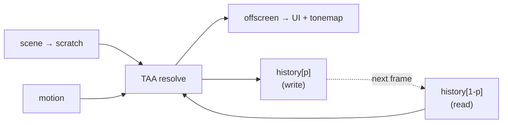

+++
title = 'TAA'
weight = 6
math = true
+++

# TAA

Temporal anti-aliasing (TAA) smooths edges and noise by blending each frame with the accumulated
result of the frames before it. Spread over time, the blend averages out aliasing and sampling noise
without the cost of supersampling a single frame.

The naive form of this blend smears moving content into ghost trails, because last frame's color no
longer belongs to the surface now under the pixel. TAA solves this with two corrections: reprojection
follows the [motion vector](../motion-vectors/) backward to the history pixel that holds the same
surface, and a clamp confines that history to the colors actually present around the current pixel, so
a stale sample cannot survive.

## How it works

The scene renders its 1x result into a scratch image, shared with FXAA. A single compute resolve pass
reads the current frame, the history, and the motion buffer, then produces the blended result in three
steps.

**Reproject.** The motion vector for the pixel is added to its UV to find where the same surface sat
last frame, and the history is sampled there (`histUv = uv + mv`).

**Clamp.** A 3×3 neighborhood of the current frame gives a min/max color box, and the reprojected
history is clamped into it:

$$
\text{hist}' = \operatorname{clamp}\big(\text{hist},\ \min_{3\times 3} \text{cur},\ \max_{3\times 3} \text{cur}\big)
$$

The motion vector is imperfect. It tracks camera reprojection only, and disocclusion exposes surfaces
with no valid history. When the reprojected sample disagrees with everything around it, the clamp drags
it back into the plausible range, rejecting ghosting at the cost of weakening accumulation where
history is unreliable.

**Blend.** The clamped history mixes with the current frame by an exponential weight:

$$
\text{result} = \operatorname{lerp}(\text{cur},\ \text{hist}',\ w)
$$

The weight is the history weight from the push constant (`TAA_HISTORY_WEIGHT`, carried in `TaaPush`). It
is forced to zero — taking the current frame whole — in two cases: the first frame, when no valid
history exists yet (`params.y < 0.5`), and when the reprojected UV lands off-screen, a disocclusion.
Both are cases with no trustworthy history to blend.

The result is written to both the offscreen image (read by the UI and tonemap) and the next frame's
history. The blend feeds itself: this frame's resolved color becomes next frame's history, so each
frame's contribution decays geometrically.

### History ping-pong

Two history images exist. The resolve reads one and writes the other, flipping parity each frame:

Each view tracks `history_index` and `history_valid`, flipping the index (`flip_history`) and marking
history valid after each resolve. Reading and writing distinct images keeps the resolve well-defined; a
single in-place history would be a read-write hazard on its own data.

## In the code

| What | File | Symbols |
|---|---|---|
| Reproject + clamp + blend | `taa.slang` | `computeMain`, the 3×3 min/max, `histUv`, `lerp` |
| Validity gate | `taa.slang` | `params.y`, the off-screen `histUv` check |
| Push + weight | `aa.rs` | `TaaPush`, `TAA_HISTORY_WEIGHT` |
| Pass + ping-pong | `renderer.rs`, `view_target.rs` | the `taa` pass, `history_index`, `history_valid`, `flip_history` |

> [!NOTE]
> The resolve reads and writes linear HDR, not display color. It runs before the
> [tonemap](../tonemap-and-exposure/), so the history accumulates in the same linear space the scene was
> rendered in. Blending tonemapped values would accumulate in the wrong color space and shift as
> exposure changes.

## Related

- [Motion vectors](../motion-vectors/) — the reprojection velocity TAA follows
- [Tonemapping](../tonemap-and-exposure/) — the next step, after the resolve
- [Compute post-process](../compute-post-process-pattern/) — the dispatch + RMW shape it shares
