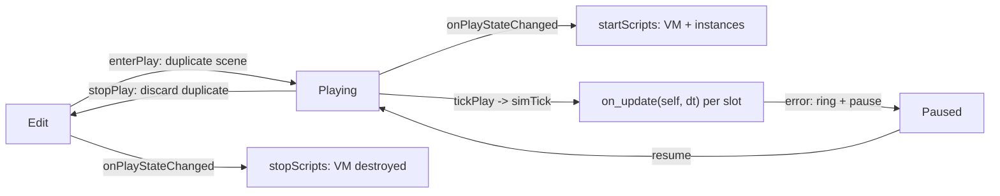

+++
title = 'Script components and the play runtime'
weight = 2
+++

# Script components and the play runtime

An entity runs gameplay logic by carrying a `ScriptComponent`: an ordered list of script slots,
each naming a `.lua` file under the project's `src/`. The component is plain data — a path and a
JSON overrides blob per slot — so it serializes like any other component and rides into the play
duplicate for free. All Lua execution lives in the `Saffron.Script` runtime, which exists only
while play is active.

## How it works

A script file returns a class table with an `on_update(self, dt)` method (`on_create`,
`on_destroy`, and the physics/message callbacks below run if present). On Play, the runtime creates
one VM for the session and, for every slot of every scripted entity, instantiates
`self = setmetatable({ entity = <handle> }, { __index = Class })` — classes are loaded once per
path and shared. Methods are authored colon-style (`function Class:on_update(dt)`, with `self`
implicit); the dot form (`function Class.on_update(self, dt)`) binds the identical field, so the two
are interchangeable and the scaffold uses colons. Within an entity, instances run in slot order
every tick; across entities the order is unspecified. `self.entity` is an opaque handle (the full
method set is in the [API reference](#api-reference) below); it reaches the scene only while a
script callback is on the stack, so a handle smuggled past its session degrades to a logged no-op.

Beyond `on_update`, a class may define `on_create()`, `on_destroy()`, the physics callbacks
`on_trigger_enter(other)` / `on_trigger_exit(other)` / `on_contact(other, point, normal)`, and any
number of message handlers it names itself (see [messaging](#messaging) below).

The lifecycle rides the existing play seams. `enterPlay` duplicates the authored scene by serde,
so scripts always mutate the throwaway duplicate and Stop discards everything; the Host subscribes
to `onPlayStateChanged` to create the VM on Edit→Playing and destroy it on →Edit (pause keeps it),
and points the context's `simTick` hook at the runtime so `tickPlay` drives `on_update` with the
clamped, fixed-step-aware dt.

Errors are contained per instance: every callback runs under `lua_pcall` with a traceback handler.
The first failing instance halts that tick, the error lands in a bounded ring on the edit context
(drained over the control plane), and play flips to Paused one frame later — never from inside the
tick, and never by crashing the host. A slot whose file is missing or fails to load is a logged
skip. The VM survives an error, so Resume retries with state intact.

## Value types

`se.vec3(x, y, z)` builds an `se.Vec3` — a real userdata value, not a `{x,y,z}` table. It carries
`.x`/`.y`/`.z`, the operators `+`, `-`, unary `-`, and `*` by a scalar (either order), and the
methods `:length()`, `:normalized()`, `:dot(o)`, `:cross(o)`, `:lerp(o, t)`. Every vector the API
returns (positions, velocities, mouse deltas) is an `se.Vec3`, and every vector it accepts wants
one. This is the only vector form scripts use — a plain 3-number table is no longer accepted as a
`properties` default and is skipped as uninferable.

## API reference

Module functions, available as `se.*` inside every script.

**Logging and vectors**

| Function | Returns | Notes |
|---|---|---|
| `se.log(message)` | — | writes to the engine log under the `script` subsystem |
| `se.vec3(x, y, z)` | `se.Vec3` | construct a vector value |
| `se.lerp(a, b, t)` | `se.Vec3` | linear blend of two vectors |
| `se.look_at(eye, target, up)` | `se.Vec3` | Euler XYZ radians aiming `eye` at `target` (default up `+Y`); feed straight to `:set_rotation` |

**Input** (edges are derived per tick from the editor-reported held set)

| Function | Returns | Notes |
|---|---|---|
| `se.is_key_pressed(key)` | boolean | true while the normalized key is held, such as `"w"`, `"space"`, `"arrowup"` |
| `se.just_pressed(key)` | boolean | true the one tick after the key transitions to held |
| `se.just_released(key)` | boolean | true the one tick after the key transitions to released |
| `se.mouse_position()` | `se.Vec3` | cursor in viewport pixels in `x`,`y` (`z` is 0) |
| `se.mouse_delta()` | `se.Vec3` | cursor movement since last tick in `x`,`y` |
| `se.mouse_button(n)` | boolean | true while mouse button `"left"`/`"right"`/`"middle"` is held |
| `se.mouse_scroll()` | number | wheel delta this tick |

**Scene queries and spawning**

| Function | Returns | Notes |
|---|---|---|
| `se.get_entity_by_name(name)` | entity | first match in iteration order — names are not unique; invalid when absent, so check `:valid()` |
| `se.find_all_by_name(name)` | entity array | every match (1-indexed); the multi-match `get_entity_by_name` cannot give |
| `se.find_by_uuid(uuid)` | entity | resolve a decimal-string uuid (matching `:uuid()`); invalid when absent |
| `se.primary_camera()` | entity | the first primary `CameraComponent` entity; moving its transform is "move camera". Invalid when the scene has none (the viewport falls back to the fly-cam) |
| `se.spawn(name)` | entity | create a new entity (a clean root with a `RelationshipComponent`); takes effect immediately |

**Physics queries** (no-ops returning a miss when no play-time physics world exists)

| Function | Returns | Notes |
|---|---|---|
| `se.raycast(ox, oy, oz, dx, dy, dz, maxDist)` | `se.RayHit` | closest ray hit: `.hit`, `.distance`, `.point`, `.normal`, `.entity` |
| `se.spherecast(ox, oy, oz, dx, dy, dz, radius, maxDist)` | `se.RayHit` | swept-sphere variant of the above |

**Messaging and timers** — see [messaging](#messaging) and [timers](#timers-and-coroutines).

Entity handle methods (`self.entity` and anything the queries above return):

**Identity and components**

| Method | Returns | Notes |
|---|---|---|
| `:valid()` | boolean | false for a missed lookup or a destroyed entity |
| `:name()` | string | the `NameComponent`; `""` when absent |
| `:uuid()` | string | the stable `IdComponent` id as a decimal string |
| `:get_component(name)` | table or nil | a read-only snapshot of any registered component in its serialized wire shape (vectors as `{x, y, z}` tables — **not** `se.Vec3` — ids as decimal strings); nil when absent or the name is unknown. Mutating the returned table writes nothing back — use `:set_component` |
| `:set_component(name, table)` | boolean | write any registered component from a wire-shape table; true on success. Refused for structural components (transform-graph, mesh/skinning, physics-body) — those have dedicated methods or are editor-only |
| `:add_component(name)` | boolean | add a default-constructed component; same structural gate |
| `:remove_component(name)` | boolean | remove a component; same structural gate |
| `:has_component(name)` | boolean | whether the component is present |

`name` is a registered component name — `"Transform"`, `"Camera"`, `"DirectionalLight"`,
`"AnimationPlayer"`, `"Script"`, and so on. In `library/se.lua` it is typed as the string-literal union
`se.ComponentName`, so the editor autocompletes and validates the spelling; the runtime resolves it by
string and a typo is a logged miss (`nil` / `false`). `get_component`/`has_component` accept every
registered name; `set_component`/`add_component`/`remove_component` reject the structural ones.

`get_component` is further typed **per component** via a `---@overload` per name, so the editor knows the
*shape* of what comes back: `get_component("DirectionalLight")` is an `se.DirectionalLight` with
`.color`/`.intensity`/`.ambient`, and `local m = get_component("Mesh"); m.` autocompletes the Mesh
fields. These `se.<Component>` classes are **generated** from the same component wire-shape catalog the
TypeScript protocol uses (`emitScriptComponentDefs` in `gen.ts`), so they never drift from the serde, and
the tripwire fails the build if a registered component is missing a type.

**Transform**

| Method | Returns | Notes |
|---|---|---|
| `:get_position()` | `se.Vec3` | local `TransformComponent.translation` |
| `:get_rotation()` | `se.Vec3` | local Euler XYZ, radians |
| `:get_scale()` | `se.Vec3` | local scale |
| `:get_world_position()` | `se.Vec3` | translation of the composed world matrix |
| `:get_world_rotation()` | `se.Vec3` | Euler XYZ radians of the world matrix |
| `:set_position(v)` | — | write the local translation from an `se.Vec3` |
| `:set_rotation(v)` | — | write local Euler XYZ radians |
| `:set_scale(v)` | — | write the local scale |

Transforms are local only: a snapshot read after a same-tick setter sees the written local value,
but world matrices refresh at render, after the tick. A setter on an entity without a transform —
or any access outside a script callback — is a logged no-op, never a crash.

**Hierarchy and lifecycle**

| Method | Returns | Notes |
|---|---|---|
| `:parent()` | entity | the `RelationshipComponent` parent; invalid for a root |
| `:children()` | entity array | the direct children (1-indexed) |
| `:set_parent(other)` | boolean | reparent under `other`; false (and unchanged) on a self-parent or a cycle. Takes effect immediately and relinks the hierarchy |
| `:destroy()` | — | mark for removal; the entity and its subtree are deleted after the tick, so the rest of this tick still sees it |

**Physics** (Dynamic-rigidbody methods are no-ops off a body; `move_character` drives a `CharacterVirtual`)

| Method | Returns | Notes |
|---|---|---|
| `:apply_impulse(v)` | — | add an instantaneous impulse to a Dynamic rigidbody |
| `:add_force(v)` | — | accumulate a force on a Dynamic rigidbody for the step |
| `:set_velocity(v)` | — | set the linear velocity of a Dynamic rigidbody |
| `:get_velocity()` | `se.Vec3` | the linear velocity (zero off a body) |
| `:move_character(velocity, jump)` | — | request movement on a character controller; `jump` is an optional boolean |
| `:enable_ragdoll()` | boolean | start a motor-driven ragdoll blend on a skinned entity |
| `:disable_ragdoll()` | — | end the ragdoll blend |
| `:set_ragdoll_blend(active, weight)` | — | tune the active flag and body-follow weight of an ongoing blend |
| `:ragdoll_state()` | table | `{ present, active, bodyWeight, bones }` for inspection |

**Messaging** — `:send(handler, payload)` queues a call, see [below](#messaging).

### Messaging

`self.entity:send("on_hit", payload)` and `se.broadcast("on_hit", payload)` queue a message to one
entity or to every scripted entity. Messages are **not** delivered inline — they are collected and
dispatched after the tick's `on_update` pass, so a handler never reenters the loop mid-iteration.
A delivered message invokes the named method on each matching instance as
`handler(self, sender, payload)`: `sender` is the entity that sent it (invalid for a broadcast from
outside a script), and `payload` is whatever value was passed (a table, a number, an `se.Vec3`).
The handler name is the script's own — a class opts in simply by defining a method of that name.

### Timers and coroutines

The runtime installs a small coroutine scheduler so scripts can suspend across ticks:

- `se.wait(seconds)` — yield the current coroutine for a duration, then resume. Outside a coroutine
  it logs and returns rather than erroring.
- `se.delay(seconds, fn)` — run `fn` once after a delay.
- `se.spawn_task(fn, ...)` — start a coroutine that can itself `se.wait`.

Scheduled work advances each tick after `on_update`, on the same fixed-step dt, and is discarded
with the VM on Stop.

### Editor autocomplete

Every project is scaffolded with `library/se.lua` (a LuaLS `---@meta` description of the whole
surface above) and a `.luarc.json` pointing the language server at it and disabling the sandboxed-out
libraries. Open the project in VS Code with the Lua (sumneko) extension and `self.entity:` completes
to the method set, vectors type as `se.Vec3`, component names autocomplete from the `se.ComponentName`
union, and a wrong-arity call is flagged before play. `se.lua` is an engine-owned generated artifact —
it is **rewritten on every project open** so the definitions track the engine's API and never go stale
(do not hand-edit it). `.luarc.json` holds your editable LuaLS settings, so it is written only when
absent and never clobbered. A `check.sh` tripwire fails the build if a live binding or a registered
component is ever missing from `se.lua`.

To get the same completion on a script's own state, annotate the class: `---@class Foo : se.ScriptSelf`
types `self.entity`, and one `---@field <name> <type>` per `properties` entry or runtime field (with
`se.Vec3` for vectors) types `self.<name>`. LuaLS cannot infer the engine-injected `properties` fields
on its own, so those annotations are what light them up.

## In the code

| What | File | Symbols |
|---|---|---|
| The data-only component | `scene.cppm` | `ScriptComponent`, `ScriptSlot` |
| The per-entity runtime | `script_runtime.cpp` | `startScripts`, `tickScripts`, `stopScripts`, `ScriptHost` |
| The entity facade + value types | `script_runtime.cpp` | `ScriptEntity`, `registerScriptValueTypes` (`se.Vec3`) |
| Deferred structural ops + messaging + scheduler | `script_runtime.cpp` | `flushStructuralOps`, `dispatchMessages`, `advanceScheduler`, `SchedulerPrelude` |
| Input edges + the cross-module bridges | `scene.cppm`; `script.cppm` | `ScriptInputState`, `deriveScriptInputEdges`; `ScriptHost::sphereCast`/`applyImpulse`/`setRagdollEnabled` |
| The bridge wiring (Host imports Physics + Script) | `host.cppm` | the `state->script.*` lambdas over `Saffron.Physics` |
| The tick + lifecycle seams | `scene_edit_context.cppm` | `SceneEditContext::simTick`, `onPlayStateChanged`, `pushScriptError` |
| Status, input, and error drain commands | `control_commands_scene.cpp` | `get-script-status`, `script-input`, `drain-script-errors` |
| The Inspector slot UI | `ScriptSlots.tsx` | `ScriptSlots` |
| The src/ scaffold + starter script | `assets.cppm` | `ensureScriptSrc`, `StarterScript` |
| The `library/se.lua` + `.luarc.json` scaffold | `assets.cppm` | `ensureScriptLibrary`, `SeLuaDefs`, `LuarcJson` |
| Generated per-component Lua types | `script_component_defs.generated.hpp`; `gen.ts` | `SeComponentDefs`, `emitScriptComponentDefs` |
| The def-drift tripwire | `tools/check-script-defs/check.ts` | live-binding + component-alias coverage gate |
| New-script boilerplate (`create-script`) | `assets.cppm`; `control_commands_asset.cpp` | `createProjectScript` |
| Error toasts during play | `scriptErrorToasts.ts` | `routeScriptErrorToasts` |
| End-to-end coverage | `tests/e2e/script.test.ts` | component write / vectors / spawn-reparent-destroy / messaging / input edges / physics bindings |

## Related

- [Lua runtime](../lua-runtime/) — the VM, sandboxing, and the errors-as-values boundary underneath
- [Play mode](../../ui-and-editor/play-mode/) — the duplicate-and-discard state machine this rides on
