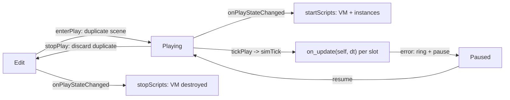

+++
title = 'Script components and the play runtime'
weight = 2
+++

# Script components and the play runtime

An entity runs gameplay logic by carrying a `ScriptComponent`: an ordered list of script slots,
each naming a `.lua` file under the project's `src/`. The component is plain data — a path and a
JSON overrides blob per slot — so it serializes like any other component and rides into the play
duplicate for free. All Lua execution lives in the `Saffron.Script` runtime, which exists only
while play is active.

## How it works

A script file returns a class table with an `on_update(self, dt)` method (`on_create` and
`on_destroy` run if present). On Play, the runtime creates one VM for the session and, for every
slot of every scripted entity, instantiates
`self = setmetatable({ entity = <handle> }, { __index = Class })` — classes are loaded once per
path and shared. Within an entity, instances run in slot order every tick; across entities the
order is unspecified. `self.entity` is an opaque handle (the full method set is in the
[API reference](#api-reference) below); it reaches the scene only while a script callback is on
the stack, so a handle smuggled past its session degrades to a logged no-op.

The lifecycle rides the existing play seams. `enterPlay` duplicates the authored scene by serde,
so scripts always mutate the throwaway duplicate and Stop discards everything; the Host subscribes
to `onPlayStateChanged` to create the VM on Edit→Playing and destroy it on →Edit (pause keeps it),
and points the context's `simTick` hook at the runtime so `tickPlay` drives `on_update` with the
clamped, fixed-step-aware dt.

Errors are contained per instance: every callback runs under `lua_pcall` with a traceback handler.
The first failing instance halts that tick, the error lands in a bounded ring on the edit context
(drained over the control plane), and play flips to Paused one frame later — never from inside the
tick, and never by crashing the host. A slot whose file is missing or fails to load is a logged
skip. The VM survives an error, so Resume retries with state intact.

## API reference

Module functions, available as `se.*` inside every script:

| Function | Returns | Notes |
|---|---|---|
| `se.log(message)` | — | writes to the engine log under the `script` subsystem |
| `se.get_entity_by_name(name)` | entity handle | first match in iteration order — names are not unique; an invalid handle when absent, so check `:valid()` |
| `se.primary_camera()` | entity handle | the first primary `CameraComponent` entity; moving its transform is "move camera". Invalid when the scene has none (the viewport falls back to the fly-cam) |

Entity handle methods (`self.entity` and anything the functions above return):

| Method | Returns | Notes |
|---|---|---|
| `:valid()` | boolean | false for a missed lookup or a destroyed entity |
| `:name()` | string | the `NameComponent`; `""` when absent |
| `:get_component(name)` | table or nil | a read-only snapshot of any registered component in its serialized wire shape (vectors as `{x, y, z}` tables, ids as decimal strings); nil when the entity lacks it or the name is unknown. Mutating the table writes nothing back |
| `:get_position()` | `{x, y, z}` table | the local `TransformComponent.translation` |
| `:set_position(x, y, z)` | — | writes the local translation |
| `:set_rotation(rx, ry, rz)` | — | local Euler XYZ, **radians** |
| `:set_scale(sx, sy, sz)` | — | writes the local scale |

Transforms are local only: a snapshot read after a same-tick setter sees the written local value,
but world matrices refresh at render, after the tick. A setter on an entity without a transform —
or any access outside a script callback — is a logged no-op, never a crash.

## In the code

| What | File | Symbols |
|---|---|---|
| The data-only component | `scene.cppm` | `ScriptComponent`, `ScriptSlot` |
| The per-entity runtime | `script_runtime.cpp` | `startScripts`, `tickScripts`, `stopScripts`, `ScriptHost` |
| The tick + lifecycle seams | `scene_edit_context.cppm` | `SceneEditContext::simTick`, `onPlayStateChanged`, `pushScriptError` |
| The Host wiring | `host.cppm` | `HostState::script`, the `onPlayStateChanged` subscriber |
| Status + error drain commands | `control_commands_scene.cpp` | `get-script-status`, `drain-script-errors` |
| The Inspector slot UI | `ScriptSlots.tsx` | `ScriptSlots` |
| The src/ scaffold + starter script | `assets.cppm` | `ensureScriptSrc`, `StarterScript` |
| New-script boilerplate (`create-script`) | `assets.cppm`; `control_commands_asset.cpp` | `createProjectScript` |
| Error toasts during play | `scriptErrorToasts.ts` | `routeScriptErrorToasts` |
| End-to-end coverage | `tests/e2e/script.test.ts` | move / slot order / contained error |

## Related

- [Lua runtime](../lua-runtime/) — the VM, sandboxing, and the errors-as-values boundary underneath
- [Play mode](../../ui-and-editor/play-mode/) — the duplicate-and-discard state machine this rides on
