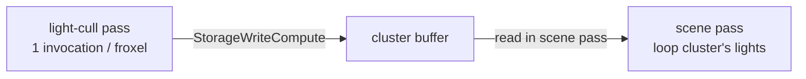

+++
title = 'Light culling'
weight = 6
math = true
+++

# Light culling

Clustered light culling partitions the view frustum into a 3D grid of cells and, in a compute pass, builds for each cell the list of punctual lights that touch it. The mesh fragment then evaluates only the lights in its own cell.

A punctual light affects only the pixels within its range, so iterating every light for every fragment scales poorly. Restricting each fragment to a short per-cell list bounds the work to the lights that can plausibly contribute. This is the engine's first compute pipeline and the core of its Forward+ lighting.

## The froxel grid

The grid is 16×9×24 — 3456 clusters, or froxels. X and Y tile the screen; Z slices view-space depth. The Z slices are exponential, not linear:

$$
z_n = -\text{near}\,\left(\frac{\text{far}}{\text{near}}\right)^{n / N_z}
$$

Exponential spacing places thin slices near the camera and wide ones far away, matching how perspective compresses depth. Each froxel then covers roughly constant screen-and-depth volume, so lights cluster sensibly at all distances. The fragment inverts the same formula in `clusterIndexFor` to find a pixel's slice; [froxel bounds](../froxel-bounds/) covers how each cell's view-space box is built.

## The cull dispatch

`light_cull.slang`'s `computeMain` runs one invocation per cluster, in groups of 64. The test is sphere-vs-AABB: a light is a sphere (position plus range), and the cluster is a view-space box. `clamp` finds the closest point in the box to the sphere center, and the light intersects when that point lies within the radius. This is the standard squared-distance test, with no square root:

```hlsl
float3 closest = clamp(posView, aabbMin, aabbMax);
float3 delta = posView - closest;
if (dot(delta, delta) <= radius * radius) { /* append index */ }
```

The renderer dispatches `CLUSTER_COUNT.div_ceil(64)` groups as a `RgPassKind::Compute` graph pass (`"light-cull"`) that writes the cluster buffer (`RgUsage::StorageWriteCompute`); the scene fragment reads it. The [render graph](../../frame-and-render-graph/render-graph-overview/) derives the compute-to-fragment barrier from those declared usages.



## Reading it in the fragment

The mesh fragment finds its cluster from pixel position and view-space Z, then loops only that cluster's lights. The same `punctual` BRDF runs whether the loop comes from a cluster or from the brute-force fallback (`clusterParams.screenSize.z == 0`). The clustered and reference paths are therefore pixel-identical: the cull only changes which lights are visited, never how they shade.

## Design and trade-offs

The cluster AABBs are rebuilt every frame in the compute pass rather than cached. This keeps the code simple and correct under any camera, and the grid is small enough to make it cheap. Two hard limits are fixed-size:

- Each cluster holds at most `MAX_LIGHTS_PER_CLUSTER` = 64 lights; excess past that is dropped silently.
- The grid is single-resolution, with no hierarchy.

These caps suit the engine's scene scale, and the cluster buffer and dispatch are left as the seam for a larger grid or a tighter cull. The grid dimensions and cap are mirrored between `lighting.rs` and the `light_cull.slang` / `lighting.slang` shaders, so they must change together. A CPU mirror of the same test (`cull_clusters_cpu`) backs the rendering crate's unit tests.

## In the code

| What | File | Symbols |
|---|---|---|
| The cull kernel | `assets/shaders/light_cull.slang` | `computeMain` |
| Exponential Z slices | `assets/shaders/light_cull.slang` | `tileNear`, `tileFar` |
| Grid dims + cap | `crates/rendering/src/lighting.rs` | `CLUSTER_GRID_X/Y/Z`, `CLUSTER_COUNT`, `MAX_LIGHTS_PER_CLUSTER` |
| Dispatch + buffer usage | `crates/rendering/src/renderer.rs` | `"light-cull"` pass (`cmd_dispatch`) |
| Cluster-params upload | `crates/rendering/src/lighting.rs` | `ClusterParams`, `ClusterCamera`, `Lighting::set_cluster_camera` |
| CPU mirror for tests | `crates/rendering/src/lighting.rs` | `cull_clusters_cpu`, `light_intersects_cluster` |
| Fragment lookup + loop | `assets/shaders/lighting.slang` | `clusterIndexFor`, `evalLighting` (clustered branch) |

## Related

- [Froxel bounds](../froxel-bounds/) — how each cluster's view-space AABB is built
- [Clustered forward](../../lighting-and-brdf/clustered-forward/) — the lighting model this feeds
- [Punctual lights and attenuation](../../lighting-and-brdf/punctual-lights-and-attenuation/) — what `punctual` evaluates
- [Render graph](../../frame-and-render-graph/render-graph-overview/) — where the compute pass slots in
