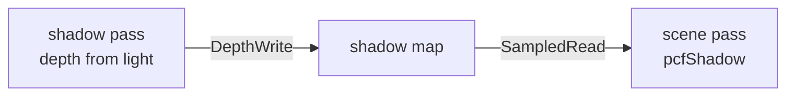

+++
title = 'Directional shadows'
weight = 1
math = true
+++

# Directional shadows

A directional shadow is a shadow cast by a light treated as parallel rays from infinity, like the sun. The scene is rendered once into a single 2D depth map from the light's point of view. Each mesh fragment then tests that map to find whether a nearer surface stood between it and the light.

A shadow map records the distance to the nearest surface along each direction the light sees. For a directional source the whole scene fits one orthographic frustum, so there is no cascade split — a single depth map covers everything.

## Light view and the depth pass

A directional light has a direction but no position, so its view is an orthographic projection looking down that direction. `renderScene` fits the frustum to the scene's world-space AABB each frame, building the light transform from a bounding sphere of that box so the fit stays stable as the light rotates. With `GLM_FORCE_DEPTH_ZERO_TO_ONE`, `glm::ortho` emits Vulkan's $[0, 1]$ clip depth directly, with no remap. The transform reaches the renderer through `setDirectionalShadow`, which uploads it as `shadowViewProj` in the light UBO.

The pass itself is a depth-only draw. The graph adds it before the scene pass when a caster is present, with the 2048² `D32` shadow map as its sole depth attachment. `recordShadowDepth` reuses the depth-pre-pass machinery — the vertex-only `shadowDepth` pipeline and the per-frame instance set — but pushes the light's viewProj instead of the camera's, and applies a [depth bias](../shadow-bias/) per batch.

The [render graph](../../frame-and-render-graph/render-graph-overview/) derives both transitions across that arrow from the declared usages (`DepthWrite`, then `SampledRead`); no barrier is hand-written.

## Sampling in the scene pass

The mesh fragment evaluates the directional light through the same BRDF as every other light, then multiplies the result by visibility from `pcfShadow`. The `globals.counts.y` flag is the directional-shadow toggle, so the map is sampled only when a caster ran this frame. `pcfShadow` projects the world position into the light's clip space and runs a 3×3 comparison filter — see [PCF filtering](../pcf-filtering/) for the kernel.

## Design and trade-offs

One orthographic frustum fit to the whole scene is the simplest correct approach and stays correct as the scene grows. The cost is resolution: a single 2048² map spread over a large world gives coarse texels far from the camera. Cascaded shadow maps are the standard fix and a clean future addition, since the pass already slots into the graph by declaration. The map is persistently transitioned to `ShaderReadOnly` at startup, so its descriptor stays valid on frames where no caster runs.

## In the code

| What | File | Symbols |
|---|---|---|
| Fit the ortho frustum | `assets.cppm` | `renderScene` (`castShadow` block) |
| Store + flag the transform | `renderer.cppm` | `setDirectionalShadow` |
| Add the pass | `renderer.cppm` | `beginFrameGraph` (`doShadow`) |
| Record depth from the light | `renderer_drawlist.cpp` | `recordShadowDepth` |
| Map size + bias constants | `renderer_detail.cppm` | `ShadowMapSize`, `ShadowDepthBias*` |
| Sample + compare | `mesh.slang` | `pcfShadow`, `fragmentMain` (`counts.y` branch) |

## Related

- [PCF filtering](../pcf-filtering/) — the 3×3 comparison kernel that samples the map
- [Shadow bias](../shadow-bias/) — the constant + slope bias that fights acne
- [Spot-light shadows](../spot-light-shadows/) — the same depth path with a perspective frustum
- [Render graph](../../frame-and-render-graph/render-graph-overview/) — where the shadow pass slots in
