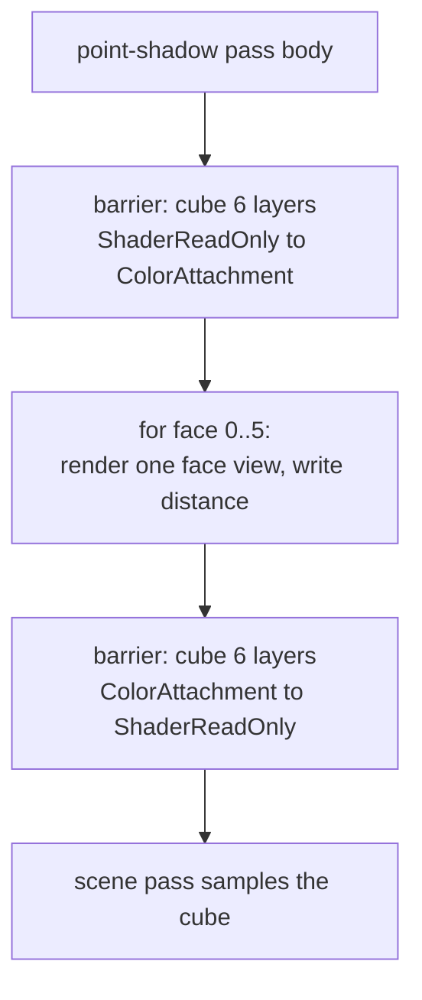

+++
title = 'Point shadows'
weight = 3
math = true
+++

# Point shadows

A point shadow is an omnidirectional shadow: the world-space distance from a point light to the
nearest occluder is rendered into the six faces of a cubemap, and a mesh fragment samples that cube
along the light-to-fragment direction. The cube stores distance, not depth — the key difference from
the 2D maps used for directional and spot lights.

A point light shines in every direction, so a single 2D depth map cannot cover it. A cubemap tiles
the full sphere, and a distance value is comparable across faces, which makes it the natural fit.

> [!NOTE]
> Only one point light is shadowed. The six scene re-draws run only when the cube is *dirty* (see
> [caching](#caching-the-cube)) — a static light over static casters reuses the cube even as the
> camera moves.

## Distance, not depth

The 2D maps store clip-space depth, which is meaningful only relative to one projection. A point
light has six projections, and a fragment does not know which face it lands on until it picks a
sample direction. Linear world distance avoids that: whatever face the light-to-fragment ray hits,
the value there is the distance to the nearest occluder along that ray, directly comparable to the
fragment's own distance to the light. The shadow-pass fragment is `length(input.worldPos - pc.lightPos.xyz)`. The
cube is an `R32_SFLOAT` color image, 512 per face, with six color attachment views plus one cube view
for sampling.

## Rendering the six faces

`point_shadow_face_matrices` builds six world-to-clip matrices, one per face, with a 90° vertical FOV
and aspect 1 — exactly enough to tile the full sphere with no gaps or overlap. The projection's Y is
flipped so the rendered faces round-trip with a `SamplerCube` sampled by world direction. Each face
clears its color to `far_plane * 2`, so any texel no triangle covers reads as "no occluder."

The cube cannot be a single graph attachment, because its six array layers exceed the graph's
single-layer image barrier. The point-shadow pass is therefore declared as a `RgPassKind::Compute` pass — the
graph opens no rendering scope — and its body (`record_point_shadow`) opens six per-face
dynamic-rendering scopes and manages the cube's layout transitions by hand.



## Sampling and comparing

In the mesh fragment, `pointShadow` reconstructs the fragment's distance to the light, samples the
cube along the light-to-fragment direction, and compares the two:

```hlsl
float dist = length(worldPos - globals.pointShadow.xyz);
float stored = pointShadowMap.SampleLevel(normalize(toFrag), 0.0).r;
return dist - bias <= stored ? 1.0 : 0.0;
```

If the fragment is at most `stored + bias` away, nothing nearer blocked the light along that ray, so
it is lit. The constant `bias` is `0.08` world units, not depth
units — see [shadow bias](../shadow-bias/). As with the spot light, this applies only to the one
shadowed point light, gated by `pointShadowMeta.x` (its index) and `.y` (enabled).

## Caching the cube

The cube is **camera-independent** — it stores light-to-occluder distance, which does not change when
the camera moves — yet it was re-rendered every frame regardless. The renderer now caches it: each
frame `render_scene` computes a `content_key`, an FNV hash of the light position + far plane and every
caster's world matrix + mesh id (`point_shadow_content_key`). The renderer renders the six faces only
when that key, or the cube image handle, differs from the last render; otherwise the `point-shadow`
pass is skipped and the persistent cube (held in `SHADER_READ_ONLY` between frames) is sampled as-is.
Panning or orbiting over a static light + static casters therefore costs nothing, while moving the
light, moving a caster (an animation, a gizmo drag, physics), or adding/removing a mesh changes the
key and re-renders. A target recreation (a viewport resize) mints a new cube image handle, which also
forces a re-render so the fresh `UNDEFINED` cube is seeded.

This pairs with the [reactive loop](../../app-lifecycle-and-window/main-loop-and-run/): a fully static
viewport stops rendering entirely (so the cube isn't touched either), and the cache covers the case
where *something else* moves the camera while the shadow inputs hold still.

> The 2D directional/spot maps are **not** cached this way: cascaded directional shadows re-fit to the
> camera frustum each frame, so they are camera-*dependent* — the reactive loop's full-static idle is
> what spares them.

## Design and trade-offs

A distance cube is direction-agnostic, which is why it fits point lights naturally. The comparison
is a hard test (`<=`) rather than filtered, so point shadows have crisper, slightly aliased edges
than the PCF-filtered 2D maps; a PCF cube or variance shadows would soften them. The bias is a
single world-space constant, which can under- or over-bias depending on the light's range, but it is
stable for the modest scenes the engine targets.

## In the code

| What | File | Symbols |
|---|---|---|
| Write distance per face | `assets/shaders/point_shadow.slang` | `fragmentMain` |
| Six face matrices | `crates/rendering/src/lighting.rs` | `point_shadow_face_matrices` |
| Cube + face views + clear | `crates/rendering/src/scene_pass.rs` | `PointShadowTarget`, `record_point_shadow` (`far_plane * 2.0`) |
| Cube format + size | `crates/rendering/src/lighting.rs` | `POINT_SHADOW_SIZE`, `POINT_SHADOW_COLOR_FORMAT` |
| Add the compute-kind pass | `crates/rendering/src/renderer.rs` | `"point-shadow"` pass |
| Cube cache (key + skip) | `crates/assets/src/render_scene.rs`, `crates/rendering/src/renderer.rs` | `point_shadow_content_key`, `last_point_shadow_key`/`last_point_shadow_cube` |
| Sample + compare distance | `assets/shaders/lighting.slang` | `pointShadow` |

## Related

- [Shadow bias](../shadow-bias/) — the world-space distance bias used here
- [Directional shadows](../directional-shadows/) — the 2D depth-map alternative
- [Render graph](../../frame-and-render-graph/render-graph-overview/) — why this is a compute-kind pass
