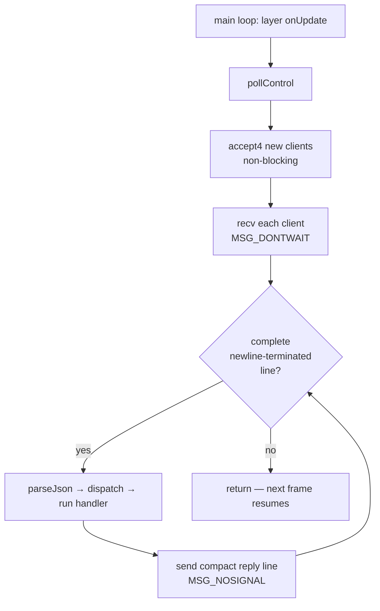

+++
title = 'Control plane'
weight = 1
+++

# Control plane

A control plane is an out-of-band channel for driving a running program: an external process sends
named requests over a socket, the program runs them against its live state, and replies. It turns an
otherwise opaque process into something scriptable and inspectable from outside.

In Saffron the control plane makes the host scriptable from the [`se` CLI](../se-cli-protocol/) and
from tests. The host listens on a unix socket, and each request mutates or inspects the scene, the
asset catalog, or the renderer.

## How it works

The plane has three parts: a non-blocking socket, a registry of named commands, and a drain that
runs once per frame on the main thread. Each frame the host accepts pending connections, reads
whatever data has arrived, splits the input on newlines, and dispatches each complete request to its
named handler.

A request is one JSON line — `{"cmd": ..., "params": ..., "id": ...}`. `dispatch` looks the command
up, calls its handler with `params`, and wraps the outcome into a reply that echoes the request
`id`. An unknown command name produces an `ok:false` reply rather than a crash. The error path is
the [`Result<T>`](../../core-and-conventions/error-handling/) pattern carried out to the socket: a
handler returns `Err("…")` and the message lands in `reply["error"]`.



## A command is data plus a closure

There is no command base class and no `switch` over names. A command is a `CommandTraits` row: a
name, a one-line help string, and a handler closure that runs on the main thread and returns a
`Result<json>`. `registerCommand` appends the row and indexes it by name.

```cpp
struct CommandTraits
{
    std::string name;
    std::string help;
    std::function<Result<json>(EngineContext&, const json&)> run;
};
```

Adding a command is one `registerCommand` call inside one of the `register*Commands` functions —
no central enum, no dispatch table to edit. This is the same struct-of-closures itable the
components and layers use. The built-ins register render → scene → asset, and `help`/`list` iterate
`reg.rows` in that order.

A handler reaches live engine state through an `EngineContext` of references. It is built fresh in
`pollControl` each frame and never stored past it.

```cpp
struct EngineContext
{
    Window& window;
    Renderer& renderer;
    EditorContext& editor;
    AssetServer& assets;
};
```

## Drained once per frame on the main thread

`drainControlServer` runs three steps in order: `accept4` every pending connection, `recv` each
client with `MSG_DONTWAIT` and append to its input buffer, then split that buffer on newlines and
dispatch each complete line. Replies are compact single-line JSON, sent with `MSG_NOSIGNAL` so a
client that vanished mid-reply cannot raise `SIGPIPE`.

Running on the main thread is deliberate. A handler mutates the scene, asset catalog, and renderer
directly with no locks, because it runs at a known point in the frame where nothing else touches
that state. The cost is that a handler must not block — hence the non-blocking socket and per-frame
drain instead of a worker thread with a mutex around the whole engine. The drain is wired in as a
layer `onUpdate`, so it sits inside the ordinary
[main loop](../../app-lifecycle-and-window/main-loop-and-run/).

## Why a unix socket, and why JSON

A unix socket is local-only, needs no port allocation, and takes its access control from the
filesystem: the socket file is `chmod 0600` under `$XDG_RUNTIME_DIR` (a 0700 dir), so only the
owning user can connect. The path falls back to `$SAFFRON_CONTROL_SOCK` if set, then
`/tmp/saffron-control-<uid>.sock`.

JSON is the payload because the command params already mirror the scene-file shape — a
`set-component` body is the same object a scene file stores — and because a line-delimited text
protocol is trivial to speak from a tiny client with no engine dependency.

## Lifecycle

`newControlContext` heap-allocates the context (so the client TU holds only a pointer), registers
the built-ins, and starts the server. A bind failure is logged and the context comes back inactive —
the app still runs, just unscriptable. `destroyControlContext` stops the server, closes client fds,
and unlinks the socket file.

## In the code

| What | File | Symbols |
|---|---|---|
| Command types + registry | `command.cppm` | `CommandTraits`, `CommandRegistry`, `EngineContext` |
| Register, look up, dispatch | `control_server.cpp` | `registerCommand`, `findCommand`, `dispatch` |
| Socket + per-frame drain | `control_server.cpp` | `startControlServer`, `drainControlServer`, `controlSocketPath` |
| Context lifecycle | `control_server.cpp` | `newControlContext`, `destroyControlContext`, `pollControl` |
| Where the drain runs | `editor_app.cppm` | `EditorLayer` `onUpdate` calling `pollControl` |

> [!NOTE]
> A handler runs synchronously inside the frame and shares the engine's single-threaded state, so it must never block or sleep. Long work belongs to a render-graph pass or a background import that the handler kicks off, not the handler body.

## Related
- [se CLI](../se-cli-protocol/) — the client that speaks this wire shape
- [Scene commands](../scene-commands/) · [Render commands](../render-commands/) · [Asset commands](../asset-commands/) — the built-in command set
- [Main loop](../../app-lifecycle-and-window/main-loop-and-run/) — where the drain is called
- [Error handling](../../core-and-conventions/error-handling/) — the `Result<T>` carried out to the reply
