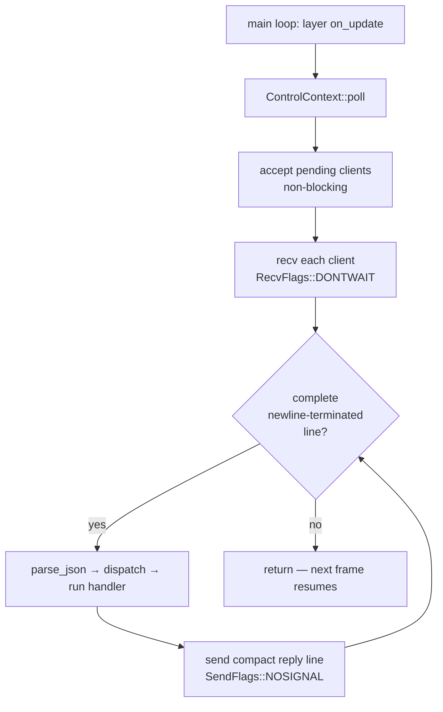

+++
title = 'Control plane'
weight = 1
+++

# Control plane

A control plane is an out-of-band channel for driving a running program: an external process sends
named requests over a socket, the program runs them against its live state, and replies. It turns an
otherwise opaque process into something scriptable and inspectable from outside.

In Saffron the control plane makes the host scriptable from the [`sa` CLI](../sa-cli-protocol/) and
from the e2e harness. The host listens on a unix socket, and each request mutates or inspects the
scene, the asset catalog, the renderer, or the live physics world.

## How it works

The plane has three parts: a non-blocking socket, a registry of named commands, and a drain that
runs once per frame on the main thread. Each frame the host accepts pending connections, reads
whatever data has arrived, splits the input on newlines, and dispatches each complete request to its
named handler.

A request is one JSON line — `{"cmd": ..., "params": ..., "id": ...}`. `CommandRegistry::dispatch`
looks the command up, runs its handler with `params`, and wraps the outcome into a reply that echoes
the request `id`. An unknown command name produces an `ok:false` reply rather than a crash. The
error path is the [`Result<T>`](../../core-and-conventions/error-handling/) pattern carried out to
the socket: a handler returns `Err(Error::command("…"))` and the message lands in `reply["error"]`.



## A command is a name plus a handler

There is no command base class and no `match` over names in the dispatcher. A command is a `Command`
row: a name, a one-line help string, and a boxed handler closure that runs on the main thread and
returns `Result<Value>`. `CommandRegistry::register` appends the row and indexes it by name.

```rust
pub struct Command {
    pub name: &'static str,
    pub help: &'static str,
    run: HandlerFn,
}
```

Most commands use the typed `register::<P, R>` entry: it deserializes the params DTO `P` from the
request JSON, runs a `Fn(&mut EngineContext, P) -> Result<R>`, and serializes `R` back to a `Value`.
This is the single site the frozen wire encoding (decimal-string ids, kebab-case enums) is applied,
so every typed handler inherits the contract for free. The reflective `help` builtin is the lone
`register_raw` row, because it walks the live registry.

Adding a command is one `register::<P, R>` call inside one of the `register_*_commands` functions —
no central enum, no dispatch table to edit. The builtins register `ping` then `help`, then the
domain groups in the frozen order render → scene → animation → physics → asset.

A handler reaches live engine state through an `EngineContext` of references. It is built fresh in
`ControlContext::poll` each frame and never stored past it.

```rust
pub struct EngineContext<'a> {
    pub window: &'a mut Window,
    pub renderer: &'a mut dyn ControlRenderer,
    pub scene_edit: &'a mut SceneEditContext,
    pub assets: &'a mut AssetServer,
    pub physics: Option<&'a mut World>,
}
```

The renderer is borrowed behind the `ControlRenderer` trait rather than the concrete `Renderer`,
because the concrete renderer's swapchain WSI has no offscreen backing under a software rasterizer
and so cannot be built headless. The host's `HostControlRenderer` is the live implementation; a unit
test stub implements the same trait over plain in-memory state. `physics` is the live play world or
`None` in Edit / before the first play.

## Drained once per frame on the main thread

`ControlServer::drain` runs three steps in order: accept every pending connection, `recv` each client
with `RecvFlags::DONTWAIT` and append to its input buffer, then split that buffer on newlines and
dispatch each complete line. Replies are compact single-line JSON, sent with `SendFlags::NOSIGNAL` so
a client that vanished mid-reply cannot raise `SIGPIPE`; the flush loops over short writes,
`poll`-waiting on writability when the send buffer fills.

Running on the main thread is deliberate. A handler mutates the scene, asset catalog, and renderer
directly with no locks, because it runs at a known point in the frame where nothing else touches that
state. The cost is that a handler must not block — hence the non-blocking socket and per-frame drain
instead of a worker thread with a mutex around the whole engine. The drain is wired in as the host
layer's `on_update`, so it sits inside the ordinary
[main loop](../../app-lifecycle-and-window/main-loop-and-run/).

## Why a unix socket, and why JSON

A unix socket is local-only, needs no port allocation, and takes its access control from the
filesystem: the socket file is `chmod 0600` under `$XDG_RUNTIME_DIR` (a 0700 dir), so only the
owning user can connect. The path resolves from `$SAFFRON_CONTROL_SOCK` if set, then
`$XDG_RUNTIME_DIR/saffron-control.sock`, then `/tmp/saffron-control-<uid>.sock`.

JSON is the payload because the command params already mirror the scene-file shape — a
`set-component` body is the same object a scene file stores — and because a line-delimited text
protocol is trivial to speak from a tiny client with no engine dependency.

## Id encoding on the wire

Entity and asset ids are `u64`. The host emits every id as a **decimal JSON string** — `"id":
"12884901889"`, never the bare number `12884901889`. A u64 id spans the full 64-bit range, past the
`2^53` a JavaScript number holds exactly, so a bare number would be silently rounded the moment a JS
client ran the reply through `JSON.parse`. A decimal string survives every JSON parser intact, so the
editor and the `sa` CLI both read the exact id back. The encoding lives in one place: the
[`Uuid`](../shared-types/) wire newtype's serde adapter.

The contract is symmetric and forgiving on input. An entity selector — the `entity` param on
`select`, `inspect`, `set-transform`, and the rest — resolves through `resolve_entity`, which accepts
a **string id**, a **number id**, or an **exact entity name**; it tries the id first because it is
stable across reloads. Asset selectors take an id or name the same way. So a script may pass `sa
select 42` (a bare number the CLI types as an integer) or `sa select "42"` and both resolve, while
the reply that comes back always carries the id as a string.

| What | File | Symbols |
|---|---|---|
| Id → wire string | `engine/crates/json/src/lib.rs` | `uuid_to_json` |
| String-or-number id read | `engine/crates/json/src/lib.rs` | `json_u64` |
| Entity resolution | `engine/crates/control/src/selector.rs` | `resolve_entity`, `entity_ref_dto`, `entity_uuid` |

## What the editor polls: scene and selection versions

The editor does not get pushed updates; it reconciles on a focus-gated poll keyed on monotonic
counters the `SceneEditContext` carries. `scene_version` covers structural and component edits;
`selection_version` covers which entity is selected; `play_version` covers the play-state machine.
When a counter advances, the editor refetches the affected state; when none moves, the poll is a
no-op.

| Counter | Bumped by |
|---|---|
| `scene_version` | every scene-mutating command: `create-entity`, `destroy-entity`, `add-component`, `remove-component`, `set-component`, `set-component-field`, `set-transform`, `set-material`, `set-light`, `set-environment`, `add-entity`, `copy-entity`, `rename-entity`; the asset/project commands that touch the scene: `import-model`, `assign-asset`, `load-scene`, `load-project`, `open-project`, `new-project` |
| `selection_version` | every `set_selection`: `select`, `deselect`, `pick`, the commands that auto-select (`add-entity`, `copy-entity`, `instantiate-model`) or auto-deselect (`destroy-entity` of the selected entity, and the project/scene loads that clear selection) |

A command that loads a scene or project moves both: the scene contents change and the selection is
cleared. The pairing is intentional, so a single poll round both rebuilds the hierarchy and clears
the inspector.

## Lifecycle

`ControlContext::new` registers the builtins and binds the control socket. A bind failure is
non-fatal: the context is constructed with no server and runs inactive (`is_active` returns false),
so the host still runs, just unscriptable. The host registers the one host-owned command
(`get-script-schema`, which needs the Lua schema reader) through `ControlContext::register` after the
builtins. `ControlContext::shutdown` drops the `ControlServer`, which closes the listening socket and
unlinks the socket file on `Drop`.

## In the code

| What | File | Symbols |
|---|---|---|
| Command types + registry | `engine/crates/control/src/registry.rs` | `Command`, `CommandRegistry`, `EngineContext`, `ControlRenderer`, `positional_or` |
| Register, look up, dispatch | `engine/crates/control/src/registry.rs` | `CommandRegistry::register`, `register_raw`, `find`, `dispatch`, `register_builtin_commands` |
| Socket + per-frame drain | `engine/crates/control/src/server.rs` | `ControlServer`, `start_control_server`, `ControlServer::drain`, `control_socket_path` |
| Context lifecycle + poll | `engine/crates/control/src/context.rs` | `ControlContext::new`, `shutdown`, `poll`, `register` |
| Where the drain runs | `engine/crates/host/src/layer.rs` | the host layer `on_update` calling `ControlContext::poll` |
| Poll counters | `engine/crates/sceneedit/src/context.rs` | `SceneEditContext::scene_version`, `selection_version`, `play_version`, `set_selection` |

> [!NOTE]
> A handler runs synchronously inside the frame and shares the engine's single-threaded state, so it
> must never block or sleep. Long work belongs to a render-graph pass or a background import that the
> handler kicks off (as the thumbnail worker does), not the handler body.

## Related
- [sa CLI](../sa-cli-protocol/) — the client that speaks this wire shape
- [Scene commands](../scene-commands/) · [Render commands](../render-commands/) · [Asset commands](../asset-commands/) — the built-in command set
- [Main loop](../../app-lifecycle-and-window/main-loop-and-run/) — where the drain is called
- [Error handling](../../core-and-conventions/error-handling/) — the `Result<T>` carried out to the reply
