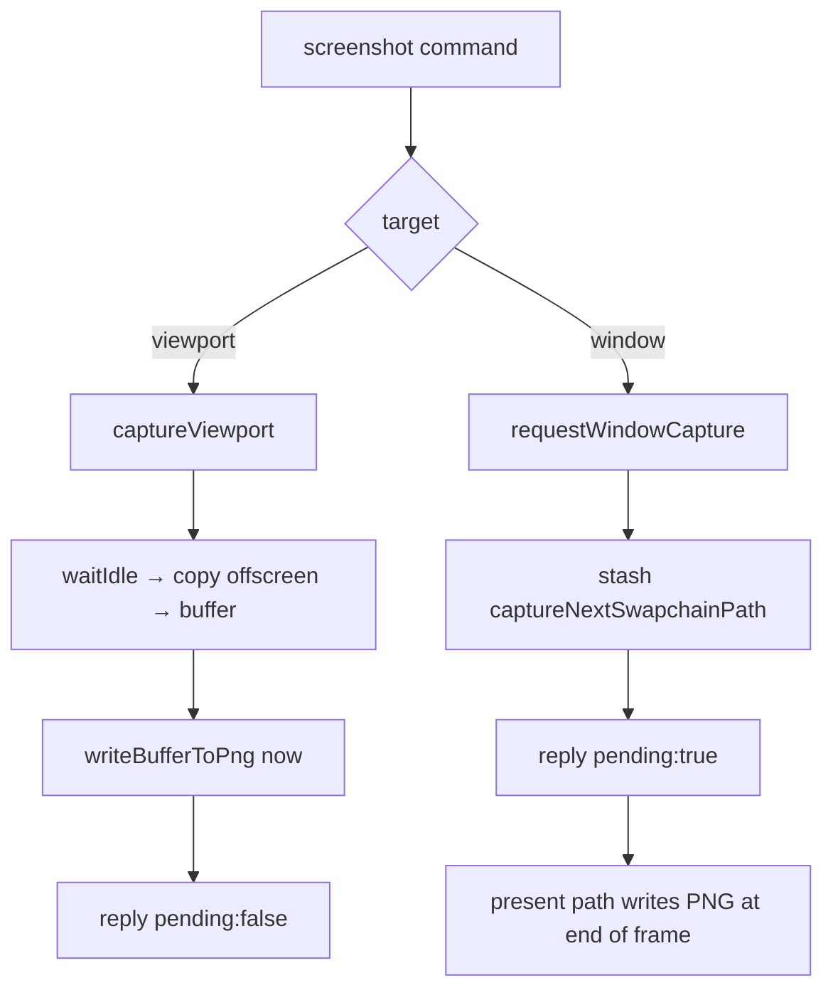

+++
title = 'Capture'
weight = 6
+++

# Capture

The `screenshot` command writes a PNG of either the scene viewport or the whole window. The two targets take different paths because one image is renderer-owned and idle-able, while the other is a swapchain image you cannot touch until it has been presented. The split shows up in the reply's `pending` field: a viewport grab finishes inside the command (`pending:false`), while a window grab only *requests* the capture and returns immediately (`pending:true`), writing the file when the current frame presents.

## Viewport, synchronously

`captureViewport` copies the renderer's offscreen color image. Because that image may still be sampled by an in-flight frame, the function first `device.waitIdle()` so its layout transition cannot race the read. Then it:

1. allocates a host-visible capture buffer sized `width * height * formatPixelBytes(format)`;
2. records a one-time command buffer that transitions the offscreen, copies it into the buffer (`captureImageToBuffer`), then transitions it **back to `ShaderReadOnly`**;
3. submits, idles again, invalidates the mapped allocation, and `writeBufferToPng`.

Leaving the image in `eShaderReadOnlyOptimal` matters: the next frame's producer barrier assumes the offscreen comes in as a shader-read image, because the [render graph](../../frame-and-render-graph/render-graph-overview/) tracks layouts across the frame boundary. The trade is bluntness — two full device idles around one blocking copy. That is fine for a debug tool grabbing an occasional frame, and it keeps the path simple: no fences, no readback ring.

## Window, deferred

A swapchain image is owned by the presentation engine, not the renderer, so it cannot be copied on demand mid-frame. `requestWindowCapture` instead stashes the path on the renderer (`captureNextSwapchainPath`); the present path checks that field and writes the PNG at end-of-frame, when the rendered swapchain image is the right one and is in a layout it can transfer from. This needs the surface to advertise `TRANSFER_SRC` usage; if it does not, `requestWindowCapture` returns an error up front.

## The other capture entry

The same viewport capture also runs without the control plane: `SAFFRON_CAPTURE=path` dumps the offscreen to a PNG during a [headless run](../../app-lifecycle-and-window/main-loop-and-run/), which is how automated checks grab a frame without a socket client attached.

## In the code

| What | File | Symbols |
|---|---|---|
| The command | `control_commands_asset.cpp` | `screenshot` (viewport vs. window, `pending`) |
| Synchronous viewport grab | `renderer_capture.cpp` | `captureViewport`, `captureImageToBuffer`, `writeBufferToPng` |
| Deferred window grab | `renderer_capture.cpp` | `requestWindowCapture`, `captureNextSwapchainPath`, `captureSupported` |
| Cross-frame layout assumption | `render_graph.cppm` | `importImage`, `externalLayout` |

> [!NOTE]
> A window screenshot returns `pending:true` before the file exists. A script that reads the PNG immediately must wait for at least one more frame to present; a viewport grab (`pending:false`) is already on disk when the reply arrives.

## Related
- [Asset commands](../asset-commands/) — where `screenshot` and `quit` are registered
- [Render graph](../../frame-and-render-graph/render-graph-overview/) — the cross-frame layout the capture preserves
- [Main loop](../../app-lifecycle-and-window/main-loop-and-run/) — `SAFFRON_CAPTURE` headless capture
