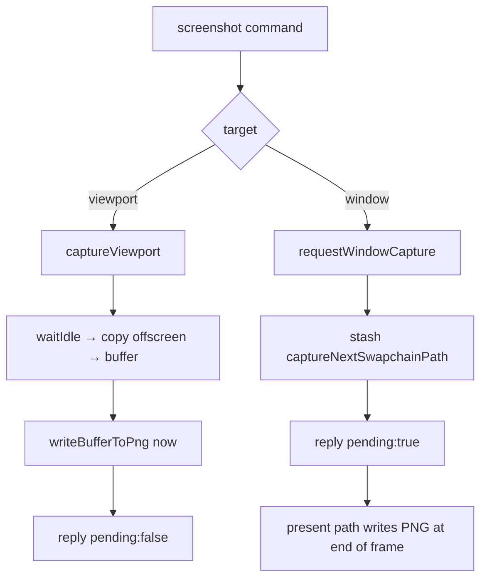

+++
title = 'Capture'
weight = 6
+++

# Capture

Capture writes a frame of rendered output to a PNG on disk. The `screenshot` command targets either the scene viewport or the whole window, and the two targets follow different paths because they own their images differently.

The viewport is a renderer-owned offscreen image that can be made idle and copied on demand. The window's image belongs to the presentation engine and is untouchable until it has been presented. The reply's `pending` field records the difference: a viewport grab finishes inside the command (`pending:false`), while a window grab only requests the capture and returns immediately (`pending:true`), writing the file when the current frame presents.

The viewport grab reads the offscreen image back the same way the [live frame transport](../../ui-and-editor/tauri-editor-and-viewport-transport/) does — the per-frame readback ring that feeds the editor canvas is the same offscreen-to-host copy, made async. A window grab targets the swapchain image, so it exists only in the standalone swapchain run; under the editor's windowless transport there is no swapchain to copy from.

## Synchronous viewport capture

`captureViewport` copies the renderer's offscreen color image. That image may still be sampled by an in-flight frame, so the function first calls `device.waitIdle()` to keep its layout transition from racing the read. It then:

1. allocates a host-visible capture buffer sized `width * height * formatPixelBytes(format)`;
2. records a one-time command buffer that transitions the offscreen, copies it into the buffer (`captureImageToBuffer`), then transitions it **back to `ShaderReadOnly`**;
3. submits, idles again, invalidates the mapped allocation, and `writeBufferToPng`.

Leaving the image in `eShaderReadOnlyOptimal` matters: the next frame's producer barrier assumes the offscreen arrives as a shader-read image, because the [render graph](../../frame-and-render-graph/render-graph-overview/) tracks layouts across the frame boundary. The cost is two full device idles around one blocking copy. That suits a debug tool grabbing an occasional frame and keeps the path simple, with no fences and no readback ring.

## Deferred window capture

A swapchain image is owned by the presentation engine rather than the renderer, so it cannot be copied on demand mid-frame. `requestWindowCapture` stashes the path on the renderer (`captureNextSwapchainPath`); the present path checks that field and writes the PNG at end-of-frame, when the rendered swapchain image is the correct one and is in a layout it can transfer from. This needs the surface to advertise `TRANSFER_SRC` usage; if it does not, `requestWindowCapture` returns an error up front.

## Headless capture

Viewport capture also runs without the control plane: `SAFFRON_CAPTURE=path` dumps the offscreen to a PNG during a [headless run](../../app-lifecycle-and-window/main-loop-and-run/). This is how automated checks grab a frame with no socket client attached.

## In the code

| What | File | Symbols |
|---|---|---|
| The command | `control_commands_asset.cpp` | `screenshot` (viewport vs. window, `pending`) |
| Synchronous viewport grab | `renderer_capture.cpp` | `captureViewport`, `captureImageToBuffer`, `writeBufferToPng` |
| Deferred window grab | `renderer_capture.cpp` | `requestWindowCapture`, `captureNextSwapchainPath`, `captureSupported` |
| Cross-frame layout assumption | `render_graph.cppm` | `importImage`, `externalLayout` |

> [!NOTE]
> A window screenshot returns `pending:true` before the file exists. A script that reads the PNG immediately must wait for at least one more frame to present; a viewport grab (`pending:false`) is already on disk when the reply arrives.

## Related
- [Asset commands](../asset-commands/) — where `screenshot` and `quit` are registered
- [Render graph](../../frame-and-render-graph/render-graph-overview/) — the cross-frame layout the capture preserves
- [Main loop](../../app-lifecycle-and-window/main-loop-and-run/) — `SAFFRON_CAPTURE` headless capture
