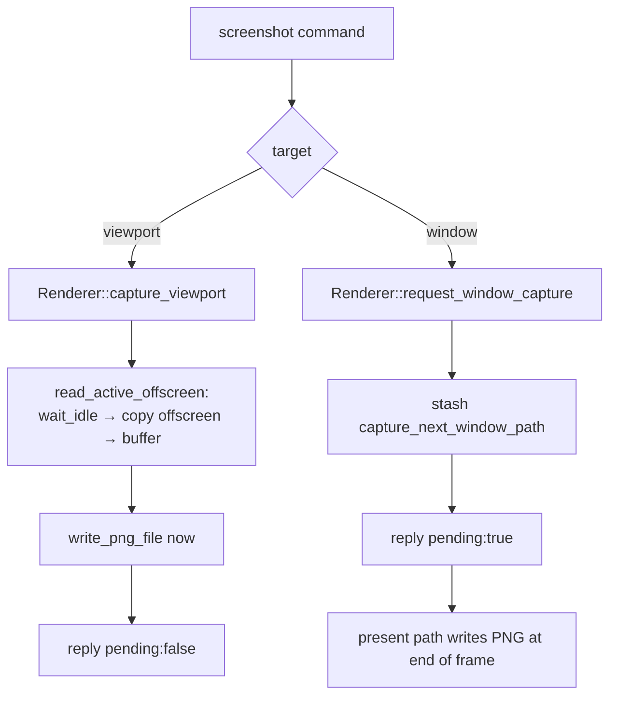

+++
title = 'Capture'
weight = 6
+++

# Capture

Capture writes a frame of rendered output to a PNG on disk. The `screenshot` command targets either
the scene viewport or the whole window, and the two targets follow different paths because they own
their images differently.

The viewport is a renderer-owned offscreen image that can be made idle and copied on demand. The
window's image belongs to the presentation engine and is untouchable until it has been presented. The
reply's `pending` field records the difference: a viewport grab finishes inside the command
(`pending:false`), while a window grab only requests the capture and returns immediately
(`pending:true`), writing the file when the current frame presents.

The viewport grab reads the offscreen image back the same way the
[live frame transport](../../ui-and-editor/viewport-compositing/) does — the per-frame readback ring
that feeds the editor canvas is the same offscreen-to-host copy, made async. A window grab targets the
swapchain image, so it exists only in the standalone swapchain run; under the editor's windowless
transport there is no swapchain to copy from.

## Synchronous viewport capture

`Renderer::capture_viewport` calls `read_active_offscreen` to copy the active view's offscreen color
image, then `write_png_file` to encode it. The offscreen may still be sampled by an in-flight frame,
so `read_active_offscreen` first calls `device.wait_idle()` to keep its layout transition from racing
the read. It then:

1. allocates a host-visible capture buffer sized to the offscreen extent and format;
2. records a one-time command buffer that transitions the offscreen to `TRANSFER_SRC`, copies it into
   the buffer, and submits behind a fence;
3. maps the buffer and returns the raw bytes for PNG encoding (the unconverted `RGBA16F` halves, so
   the encoder can tonemap/clamp on the way out).

The offscreen is left resting in `TRANSFER_SRC_OPTIMAL`, and the renderer records that as the image's
tracked layout. That matters because the next frame's first write transitions *from* this tracked
layout: the [render graph](../../frame-and-render-graph/render-graph-overview/) imports the offscreen
with an external-layout slot, so it derives the correct barrier across the frame boundary. The cost is
one full device idle around one blocking copy. That suits a debug tool grabbing an occasional frame
and keeps the path simple, with no fences and no readback ring.

## Deferred window capture

A swapchain image is owned by the presentation engine rather than the renderer, so it cannot be copied
on demand mid-frame. `Renderer::request_window_capture` stashes the path on the renderer
(`capture_next_window_path`); the present path checks that field and writes the PNG at end-of-frame,
when the rendered swapchain image is the correct one and is in a layout it can transfer from. This
needs the surface to advertise `TRANSFER_SRC` usage; if it does not (`swapchain.capture_supported` is
false), `request_window_capture` returns an error up front.

## In the code

| What | File | Symbols |
|---|---|---|
| The command | `engine/crates/control/src/commands_asset.rs` | the `screenshot` row (viewport vs. window, `pending`) |
| Renderer seam | `engine/crates/host/src/control_renderer.rs` | `ControlRenderer::capture_viewport`, `request_window_capture` |
| Synchronous viewport grab | `engine/crates/rendering/src/renderer.rs` | `Renderer::capture_viewport`, `read_active_offscreen` |
| Deferred window grab | `engine/crates/rendering/src/renderer.rs` | `request_window_capture`, `capture_next_window_path`, `window_capture_pending` |
| PNG encode | `engine/crates/rendering/src/thumbnail.rs` | `write_png_file` |
| Cross-frame layout slot | `engine/crates/rendering/src/render_graph.rs` | `import_image`, `alloc_external_layout` |

> [!NOTE]
> A window screenshot returns `pending:true` before the file exists. A script that reads the PNG
> immediately must wait for at least one more frame to present; a viewport grab (`pending:false`) is
> already on disk when the reply arrives.

## Related
- [Asset commands](../asset-commands/) — where `screenshot` and `quit` are registered
- [Render graph](../../frame-and-render-graph/render-graph-overview/) — the cross-frame layout the capture preserves
- [Main loop](../../app-lifecycle-and-window/main-loop-and-run/) — the host run loop the deferred capture rides
