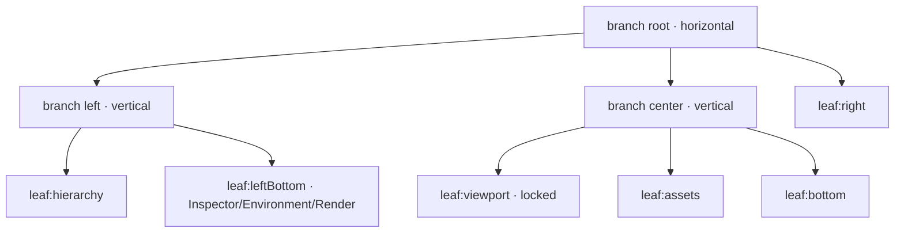

+++
title = 'Dock system'
weight = 11
+++

# Dock system

Every panel in the editor lives in a dock — a tree of resizable splits and tab groups you
rearrange by dragging a tab. Drag the Material panel beside the Timeline to tab them together,
or onto a leaf's edge to split it; the arrangement persists per project. The same machine runs
two independent surfaces: the Scene tab and the asset editor. A panel can move freely between
the vertical side docks and the horizontal bottom dock within one surface, but never crosses
into the other — that isolation is structural, not a runtime check.

The dock is built on three pieces the editor already had — the titlebar's pointer-capture tab
drag, `react-resizable-panels` for the splits, and the Zustand store — plus one borrowed
technique: panels render once and are portaled into stable host divs, so their state survives
being moved.

## One tree per main tab

A `ViewTab` is one of five kinds — `scene`, `flamegraph`, `materialGraph`, `assetEditor`,
`imageViewer`. Only two own a dock: `scene` and `assetEditor`. The store holds one layout tree
**per kind**, never a single global tree:

```ts
dockLayouts: Record<DockSpaceKind, DockLayout>;  // "scene" | "assetEditor"
```

A `DockLayout` is a pure, DOM-free tree. A `DockBranch` is an n-ary split whose orientation
alternates with depth (the VS Code gridview shape) and whose children carry percent sizes; a
`DockLeaf` is a tab group (`tabs`, `activeTab`). Two flags matter: `locked` marks the
live-subsurface leaf (no strip, no drops), and `persistent` keeps a well-known leaf in the tree
even when empty so its drop target never dangles.



The whole model is pure functions over one tree — `insertPanel`, `removePanel`, `movePanel`,
`splitLeaf`, `reorderTab`, `normalize` (delete empty non-locked non-persistent leaves, collapse
single-child branches, merge same-orientation nesting), and `validate` (drop unknown ids on
load, repair or fall back). They know nothing about React or the store, so they carry the
editor's first unit tests.

## Why cross-tab moves are impossible

The Scene and asset-editor panels are two **disjoint** id unions. A Scene id
(`inspector … viewport`) can never index into the asset-editor tree, and an asset-editor id
(`skeleton`, `preview`, `clips`, `assetTimeline`) can never index into the Scene tree — the
type system rejects it, and the store routes every action to the right tree by the id's union
membership. Combined with two more facts — only one main tab is mounted at a time, and the
drag registry is snapshotted only from the **active** island's `[data-dock-leaf]` elements
(a hidden island's leaves measure 0×0 and never hit-test) — a torn tab can only ever resolve
within its own island. There is no `if (sameIsland)` anywhere; the move is unexpressible.

## The shared tab strip

`useTabStripDrag` is the titlebar's drag machine, extracted and parameterized: pointer capture
with a 4 px latch, a single tab-centers snapshot at drag start, a transform-only reorder
preview, click-vs-drag activation, and a WAAPI FLIP settle on drop. `TabStrip` wraps it in two
size variants — `main` (the titlebar's fixed-width tabs) and `dock` (compact, shrink-to-fit).
The titlebar consumes the same hook, so there is exactly one drag implementation; parity by
copy would rot.

For a dock strip the machine also **tears out**: once the pointer escapes the strip band
vertically it hands the drag to `dockDrag` — a cursor ghost and a drop overlay — keeping the
same pointer capture, so the source strip drives the whole gesture. On release it commits one
`movePanel`. Nothing mutates the model until drop, so every cancel path (Escape, capture loss,
release over nothing) is free.

> [!NOTE]
> Hit-testing is manual. `setPointerCapture` retargets every pointer event to the source tab,
> so candidate leaves never receive `pointerover` (w3c/pointerevents#566). On each move the drag
> layer re-snapshots the mounted `[data-dock-leaf]` rects and point-tests against them; the ghost
> and overlay are `pointer-events: none` so they never become the hit result.

A leaf's drop zones follow VS Code: the strip inserts at a tab index, the body center merges
(a 100% overlay), and the outer-third edges split (a 50% overlay). The right-click **Move to…**
menu offers the same merge/split targets without dragging — the keyboard-accessible fallback.

## Panels survive the move

React reconciles by position: a component re-rendered under a different parent unmounts and
remounts, losing its state. So a panel never re-renders under a new parent. `DockPanelsHost`
renders every open panel exactly once, flat at app root, into a per-panel host div that a module
map owns for the panel's open lifetime. Each leaf body claims the hosts of the tabs it owns with
`appendChild` and toggles `display`. Because the React tree's shape never changes when a panel
moves — only the host div's DOM parent does — component state, refs, and DOM survive. The
Material panel keeps its GPU preview across a move to the bottom dock; the Timeline keeps its
canvas. A per-panel `renderer` policy (`always` vs `onlyWhenVisible`) decides whether a hidden
panel stays mounted, generalizing the old keep-mounted right sidebar.

## The live-subsurface leaf

Each island has one `locked` leaf that is a transparent hole down to the engine's Wayland
subsurface (see [viewport compositing](../viewport-compositing/)): Scene's `viewport` and the
asset editor's `preview`. A locked leaf has no strip, its tab cannot be dragged, and it accepts
no drops — edge splits beside it insert siblings, never occlude it. Any layout change must
re-glue the subsurface to its new rect, so a single store subscriber fires a forced
`emitLayoutSettled` on every `dockLayouts` mutation — no call site can forget it. Over-emitting
is harmless: a mutation on the inactive island leaves its host at 0×0, which `computeBounds`
skips. A px `minSize` (520 for the viewport) propagates up its column so it cannot collapse
while attaching.

## The asset editor as a dock island

The asset editor is a first-class island, not a special case. `AssetEditorWorkspace` provides
the live preview state (model, orbit handlers, the subsurface host ref) through a React context
wrapping its **own** `DockPanelsHost` + `DockRoot`, so the portaled panel bodies inherit it.
Its four panels are `skeleton` (the bone tree), `preview` (the locked subsurface), `clips`, and
`assetTimeline` (the shared `components/timeline/` transport + surface). Capability gating runs
through the model, not a second render branch: a rigged model opens `skeleton`, a model with
clips opens `clips` + `assetTimeline`, and `DockRoot` collapses an empty leaf — so a static
model shows just the preview. Re-previewing a different model re-derives which panels are open.

## Persistence

Both trees plus an Unreal-style last-location memory (where each panel last lived, so reopening
returns it home) persist under one per-project key, written debounced on any dock mutation and
`validate`d on load. There is no persistence without a loaded project — the layout is
session-only until then, matching the rest of the editor's per-project state.

## In the code

| What | File | Symbols |
|---|---|---|
| The pure tree model + tests | `editor/src/state/dockLayout.ts` | `DockLayout`, `DockBranch`, `DockLeaf`, `movePanel`, `splitLeaf`, `normalize`, `validate` |
| The store slice | `editor/src/state/store.ts` | `dockLayouts`, `openPanel`, `closePanel`, `movePanel`, `hydrateDockLayouts`, `isPanelOpen` |
| Shared strip + drag machine | `editor/src/components/dock/TabStrip.tsx` · `useTabStripDrag.ts` | `TabStrip`, `useTabStripDrag` |
| Tear-out, hit-test, overlay | `editor/src/components/dock/dockDrag.ts` · `DockDropOverlay.tsx` | `hitTestRects`, `snapshotLeafRects`, `DockDropOverlay` |
| Portal panel host | `editor/src/components/dock/DockPanelsHost.tsx` | `DockPanelsHost`, `LeafBody`, `hostFor` |
| Tree renderer + registry | `editor/src/components/dock/DockRoot.tsx` · `panelRegistry.tsx` | `DockRoot`, `SCENE_PANEL_REGISTRY`, `ASSET_EDITOR_PANEL_REGISTRY` |
| Move-to menu | `editor/src/components/dock/DockTabContextMenu.tsx` | `DockTabContextMenu` |
| Asset-editor island | `editor/src/panels/AssetEditorWorkspace.tsx` · `assetEditorPanels.tsx` | `AssetPreviewProvider`, the four panel bodies |

## Related

- [Viewport compositing](../viewport-compositing/) — the Wayland subsurface the locked leaves expose
- [Viewport panel](../viewport-panel/) — the bounds-sync the settle subscriber drives
- [Asset editor](asset-editor/) — the preview scene the asset-editor island hosts
- [Theme & fonts](../theme-and-fonts/) — the shadcn tokens every dock surface paints with
