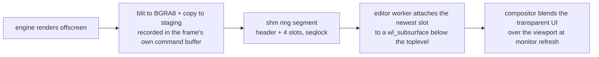

+++
title = 'Viewport compositing'
weight = 2
+++

# Viewport compositing

The editor's 3D viewport is the engine's render composited *under* the web UI: the engine
publishes each frame into shared memory, and the editor presents those frames on a Wayland
subsurface stacked below its own transparent window. Panels, shadows, rounded corners, and
translucent overlays therefore blend over the live scene — something a native child window
can never do, because window systems stack children opaquely on top ("airspace").

## The pieces

Four mechanisms carry the whole design; everything else is plumbing between them.

**Shared memory.** A POSIX shm segment is a file-backed memory region: one process creates
it by name (`shm_open` returns a file descriptor, `ftruncate` sizes it), and any process
that `mmap`s that descriptor gets the *same physical pages* in its own address space. A
write on one side is immediately a read on the other — no syscall, no copy, no message.
The engine "publishes" a frame by `memcpy`ing pixels into the mapped region, and that is
the last CPU copy in the pipeline: the editor hands the very same descriptor to the
compositor as a `wl_shm_pool`, so the compositor samples the bytes the engine wrote.

**The seqlock.** Two processes racing on the same pages need an ordering rule, and a lock
would couple their frame rates. A seqlock is the lock-free alternative for one writer and
many readers: the writer writes the payload first, then bumps a sequence counter behind a
release fence. The fence guarantees that a reader observing the new counter value also
observes the payload written before it. Torn frames are skipped, never displayed, and
neither side ever waits for the other.

**Surfaces and subsurfaces.** A Wayland `wl_surface` is a compositor-side rectangle with a
pixel buffer attached; the compositor — not the application — blends all surfaces into the
final image each refresh. A `wl_subsurface` glues one surface to a parent at an offset and
a z-order, and crucially the z-order may be *below* the parent. That inversion is the trick
the X11 reparent could never do: the engine's pixels sit under the UI's, so every
translucent UI pixel blends over the scene in the compositor, for free. `wp_viewport`
adds a crop/scale stage — the compositor samples the attached buffer at whatever
destination size the surface declares, which is what lets an old frame stretch during a
resize before the engine catches up.

**DMA, for what comes next.** Today's transport still costs one GPU→CPU readback (the
engine) and one CPU→GPU texture upload (the compositor) per frame. DMA — direct memory
access — is hardware reading or writing memory without the CPU touching the bytes, and a
*dma-buf* is a kernel handle (a file descriptor) to GPU memory that another process or
device can import directly. Exporting the engine's render targets as dma-bufs would let
the compositor's GPU sample them in place: zero copies, both transfers gone. That upgrade
is scoped in `plans/dmabuf-viewport/`.

## How it works

The engine side is a pipelined readback with zero added stalls. Each frame-in-flight slot
owns a BGRA8 image and a persistently mapped staging buffer; `endFrame` records the
offscreen→BGRA8 blit (the GPU does the format conversion) and the image→buffer copy into
the frame's normal command buffer, then submits with the frame fence only — no swapchain
acquire, no present, no `waitIdle`. When `beginFrame` waits that fence two frames later,
the readback is complete by construction and a `memcpy` publishes it into the shared
segment. The segment is grow-only with a 32-byte header (`magic, width, height, seq,
ringSlots, slotCapacity`) and a fixed-capacity 4-slot ring: frame `s` lands in slot
`s % 4`, the header is written pixels-first with `seq` bumped last behind a release fence,
so a reader that sees a new `seq` is guaranteed matching dimensions and pixels.

The editor side runs one worker thread that wraps GTK's own `wl_display` connection with a
private event queue, binds `wl_compositor`/`wl_subcompositor`/`wl_shm`/`wp_viewporter`,
and creates a **desync subsurface placed below** the toplevel. A `wl_shm_pool` wraps the
engine's segment directly — the compositor reads the very memory the engine wrote, one
copy end to end. The loop attaches the newest ring slot, damages, and commits, paced by
frame callbacks (one per monitor refresh) with a bounded self-paced fallback for the spans
when callbacks are withheld. `wp_viewport` scales the buffer to the panel's logical rect
and `set_position` pins it, both fed from the [viewport panel](../viewport-panel/)'s
bounds through a Tauri command.

## Load-bearing details

Each of these is the difference between a working viewport and one that is frozen,
seamed, or absent — none of them fails with an error.

- **Subsurface state is double-buffered on the parent.** Creation and `set_position` only
  take effect when the *toplevel* commits. A static transparent window may not be
  committing at all, so the presenter nudges `queue_draw` on bounds changes and while the
  worker comes up.
- **A fully transparent toplevel freezes GTK.** The compositor stops presenting a window
  with nothing visible, which starves GTK3's frame clock of callbacks and halts its paint
  loop — and with it the parent commits the subsurface needs. The window paints one
  near-invisible 2×2 dot in its draw handler so it always counts as visible, and clears
  its opaque region so the compositor blends below it.
- **The page must resolve against a backdrop, not the desktop.** The page is transparent,
  and not every pixel of it is opaque — panel borders are 10%-alpha hairlines, and a
  webview repaint lags an interactive resize by a frame. A second subsurface below the
  viewport subsurface stretches a single opaque theme-colored pixel (`wp_viewport` again)
  over the whole window, so every translucent or unpainted page pixel blends against
  theme-dark exactly as it would in an opaque app. Painting that backdrop from GTK under
  the webview does not work: WebKit's GL blit *replaces* the pixels beneath its
  allocation rather than blending over them.
- **The segment can be replaced under the reader.** The engine recreates the shm segment
  if a frame ever outgrows the slot capacity, and a restarted engine makes a fresh one —
  same name, new inode. A mapping is per-inode, so a reader that keeps its old `mmap`
  reads a frozen orphan forever. The capacity is floored at 4K so ordinary resizes never
  trigger this (shm pages are sparse; unused capacity costs nothing), and the presenter
  probes the inode every 250ms and remaps its pool + buffers when it changes.
- **Frame callbacks pace, they do not certify.** A callback per commit proves cadence, not
  that those pixels reached glass. `wp_presentation` feedback (counted per second behind
  `SAFFRON_VIEWPORT_STATS=1`) reports `presented`/`discarded` plus the vblank delta — and
  even `presented` only certifies the surface was in an on-screen repaint, so the eyeball
  test on fast motion stays part of verification.

Because the engine never presents, nothing throttles its loop; the editor caps it via
`SAFFRON_MAX_FPS` (default 500) so slots are not rewritten mid-read at thousands of fps.

## Resizing in two tiers

Changing the engine's render size recreates the whole offscreen chain (color, depth, and
every post-process target) behind a device idle — far too expensive per drag tick. The
panel therefore splits its bounds sync: live ticks (~16ms) only move and stretch the
subsurface, applying the new position and `wp_viewport` destination to the
already-attached buffer, so the viewport stays glued to the divider showing a scaled old
frame. One debounced end commit (~150ms after the gesture settles) sends
`set-viewport-size`, and the next frames arrive sharp at the final resolution.

> [!NOTE]
> On NVIDIA, WebKitGTK's default DMABUF renderer draws nothing under Wayland and its
> fallback loses transparency. The editor steers WebKit onto Mesa's software EGL
> (`__EGL_VENDOR_LIBRARY_FILENAMES` + `LIBGL_ALWAYS_SOFTWARE=1`), gated on NVIDIA being
> present so AMD/Intel keep the fast path. The engine itself still renders on the
> hardware ICD.

## Input rides the control plane

The engine's SDL window is hidden and receives no events, so every input path is a control
command from the webview: `gizmo-pointer` and `pick` for the [gizmo](../gizmo/) and
[selection](../selection/), and `fly-input` for the [editor camera](../editor-camera/)
(pointer-lock relative deltas + move keys). Webview pointer events arrive at ~60Hz, so the
engine smooths gizmo drag samples toward their target each rendered frame
(`stepNativeGizmoDrag`) instead of staircase-stepping at the sample rate.

> [!NOTE]
> wl_shm makes the compositor upload each frame on its paint thread, and the ring has no
> `wl_buffer.release` handshake. The planned cure is zero-copy linux-dmabuf buffers with a
> release-driven lifecycle — see `plans/dmabuf-viewport/`.

## In the code

| What | File | Symbols |
|---|---|---|
| Publish state + slots | `renderer_types.cppm` | `ShmPublish`, `ShmPublishSlot` |
| Slot lifecycle + segment | `renderer_capture.cpp` | `enableViewportShmPublish`, `ensureShmPublishSlot`, `publishShmPublishSlot`, `destroyShmPublish` |
| Recorded readback + fence-only submit | `renderer.cppm` | `recordShmPublishCopy`, the `shmPublish` branches in `beginFrame`/`endFrame` |
| Loop cap | `app.cppm` | `maxFpsFromEnv` |
| Subsurface presenter | `editor/src-tauri/src/wayland_viewport.rs` | `install`, `run`, `ViewportShared`, `PresentationStats` |
| Backdrop + segment remap | `editor/src-tauri/src/wayland_viewport.rs` | `backdrop_pixel_fd`, `stat_shm` |
| Rect + park bridge | `editor/src-tauri/src/lib.rs` | `set_viewport_bounds`, `set_viewport_hidden`, `spawn_engine` |
| Render size command | `control_commands_render.cpp` | `set-viewport-size` |

## Related

- [Tauri editor and the viewport bridge](../tauri-editor-and-viewport-bridge/) — the shell and control passthrough around this transport
- [Viewport panel](../viewport-panel/) — the rect, input forwarding, and parking
- [Editor camera](../editor-camera/) — the fly input streamed over `fly-input`
- [Control plane](../../tooling-and-control/control-plane-architecture/) — the socket the input and size commands ride
