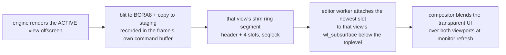

+++
title = 'Viewport compositing'
weight = 2
+++

# Viewport compositing

The editor's 3D viewport is the engine's render composited *under* the web UI: the engine
publishes each frame into shared memory, and the editor presents those frames on a Wayland
subsurface stacked below its own transparent window. Panels, shadows, rounded corners, and
translucent overlays therefore blend over the live scene — something a native child window
can never do, because window systems stack children opaquely on top ("airspace").

## The pieces

Four mechanisms carry the whole design; everything else is plumbing between them.

**Shared memory.** A POSIX shm segment is a file-backed memory region: one process creates
it by name (`shm_open` returns a file descriptor, `ftruncate` sizes it), and any process
that `mmap`s that descriptor gets the *same physical pages* in its own address space. A
write on one side is immediately a read on the other — no syscall, no copy, no message.
The engine "publishes" a frame by `memcpy`ing pixels into the mapped region, and that is
the last CPU copy in the pipeline: the editor hands the very same descriptor to the
compositor as a `wl_shm_pool`, so the compositor samples the bytes the engine wrote.

**The seqlock.** Two processes racing on the same pages need an ordering rule, and a lock
would couple their frame rates. A seqlock is the lock-free alternative for one writer and
many readers: the writer writes the payload first, then bumps a sequence counter behind a
release fence. The fence guarantees that a reader observing the new counter value also
observes the payload written before it. Torn frames are skipped, never displayed, and
neither side ever waits for the other.

**Surfaces and subsurfaces.** A Wayland `wl_surface` is a compositor-side rectangle with a
pixel buffer attached; the compositor — not the application — blends all surfaces into the
final image each refresh. A `wl_subsurface` glues one surface to a parent at an offset and
a z-order, and crucially the z-order may be *below* the parent. That inversion is the trick
the X11 reparent could never do: the engine's pixels sit under the UI's, so every
translucent UI pixel blends over the scene in the compositor, for free. The editor runs
**two** such viewport subsurfaces — one per [view](../asset-editor/), the Scene viewport and
the asset-editor preview — each permanently glued to its own pane, plus a shared opaque
backdrop subsurface below both. `wp_viewport` adds a crop/scale stage, so each view's buffer
is sampled to its pane's destination size independently; a *parked* view (its tab inactive)
keeps its last attached buffer frozen on screen at no cost.

**DMA, for what comes next.** Today's transport still costs one GPU→CPU readback (the
engine) and one CPU→GPU texture upload (the compositor) per frame. DMA — direct memory
access — is hardware reading or writing memory without the CPU touching the bytes, and a
*dma-buf* is a kernel handle (a file descriptor) to GPU memory that another process or
device can import directly. Exporting the engine's render targets as dma-bufs would let
the compositor's GPU sample them in place: zero copies, both transfers gone. That upgrade
is scoped in `plans/dmabuf-viewport/`.

## How it works

The engine side is a pipelined readback with zero added stalls. Each frame-in-flight slot
owns a BGRA8 image and a persistently mapped staging buffer; `end_frame` records the
offscreen→BGRA8 blit (the GPU does the format conversion) and the image→buffer copy into
the frame's normal command buffer, then submits with the frame fence only — no swapchain
acquire, no present, no `wait_gpu_idle`. When `begin_frame` waits that fence two frames later,
the readback is complete by construction and a `memcpy` publishes it into the **active
view's** shared segment. Each view owns its own segment + ring, and only the active view is
rendered and published each frame, so the inactive view's last frame stays put. A segment is
grow-only with a 32-byte header (`magic, width, height, seq, ring_slots, slot_capacity`) and a
fixed-capacity 4-slot ring: frame `s` lands in slot `s % 4`, the header is written
pixels-first with `seq` bumped last behind a release fence, so a reader that sees a new `seq`
is guaranteed matching dimensions and pixels.

The editor side runs one worker thread that wraps GTK's own `wl_display` connection with a
private event queue, binds `wl_compositor`/`wl_subcompositor`/`wl_shm`/`wp_viewporter`,
and creates **two desync subsurfaces placed below** the toplevel (one per view), plus a
shared opaque backdrop subsurface below both. One `wl_shm_pool` per view wraps that view's
segment directly — the compositor reads the very memory the engine wrote, one copy end to
end. The single loop polls both segments and, for each *unparked* view, attaches its newest
ring slot, damages, and commits, paced by frame callbacks (one per monitor refresh) with a
bounded self-paced fallback for the spans when callbacks are withheld. `wp_viewport` scales
each view's buffer to its pane's logical rect and `set_position` pins it, both fed per-view
from the [viewport panel](../viewport-panel/)'s bounds through a Tauri command
(`set_viewport_bounds(view, …)`); a parked view's surface is left untouched, freezing its
last frame.

## Load-bearing details

Each of these is the difference between a working viewport and one that is frozen,
seamed, or absent — none of them fails with an error.

- **Subsurface state is double-buffered on the parent.** Creation and `set_position` only
  take effect when the *toplevel* commits. A static transparent window may not be
  committing at all, so the presenter nudges `queue_draw` on bounds changes and while the
  worker comes up.
- **A fully transparent toplevel freezes GTK.** The compositor stops presenting a window
  with nothing visible, which starves GTK3's frame clock of callbacks and halts its paint
  loop — and with it the parent commits the subsurface needs. The window paints one
  near-invisible 2×2 dot in its draw handler so it always counts as visible, and clears
  its opaque region so the compositor blends below it.
- **The page must resolve against a backdrop, not the desktop.** The page is transparent,
  and not every pixel of it is opaque — panel borders are 10%-alpha hairlines, and a
  webview repaint lags an interactive resize by a frame. A backdrop subsurface below *both*
  viewport subsurfaces stretches a single opaque theme-colored pixel (`wp_viewport` again)
  over the whole window — including a parked view's frozen hole — so every translucent or
  unpainted page pixel blends against
  theme-dark exactly as it would in an opaque app. Painting that backdrop from GTK under
  the webview does not work: WebKit's GL blit *replaces* the pixels beneath its
  allocation rather than blending over them.
- **A segment can be replaced under the reader.** The engine recreates a view's shm segment
  if a frame ever outgrows the slot capacity, and a restarted engine makes a fresh one —
  same name, new inode. A mapping is per-inode, so a reader that keeps its old `mmap`
  reads a frozen orphan forever. The capacity is floored at 4K so ordinary resizes never
  trigger this (shm pages are sparse; unused capacity costs nothing), and the presenter
  probes each view's inode every 250ms and remaps that view's pool + buffers when it changes.
- **Parking freezes, it does not clear.** A parked view (its tab inactive, or a modal owns
  the region) is simply left out of the commit loop — its surface keeps the last buffer it
  was given, so the inactive pane shows its last rendered frame frozen rather than going
  black. Unparking resumes attaching that view's fresh frames; because the surface was never
  re-bound and the engine resumes publishing the same segment, the live image returns within
  a frame.
- **Frame callbacks pace, they do not certify.** A callback per commit proves cadence, not
  that those pixels reached glass. `wp_presentation` feedback (counted per second behind
  `SAFFRON_VIEWPORT_STATS=1`) reports `presented`/`discarded` plus the vblank delta — and
  even `presented` only certifies the surface was in an on-screen repaint, so the eyeball
  test on fast motion stays part of verification.

Because the engine never presents, no swapchain vsync throttles its loop. Instead the host paces
itself reactively (see [the main loop](../app-lifecycle-and-window/main-loop-and-run/)): it renders
at the perf-config `target_fps` while the scene is active and idles the GPU on a static viewport,
so slots are neither rewritten at thousands of fps nor refreshed when nothing changed.

## Two views, two surfaces

The editor has two viewport panes — the Scene viewport and the [asset-editor](../asset-editor/)
preview — and each owns a permanent triple: an offscreen render target, an shm ring segment,
and a Wayland subsurface glued to its pane. Switching tabs never re-binds a surface or resizes
a target. The engine just changes which view is active (`set-active-view {scene|assetPreview}`),
and the editor parks the surface whose pane is now hidden and unparks the one now showing. The
appearing pane was already sized to its pane, so its first composited frame is correct — there
is no resize, no device idle, and no stale-size frame on the switch.

Only the active view is rendered and advances its seqlock each frame; the parked view's surface
holds its last color frame frozen. The tradeoff is deliberate: per-view temporal state (TAA
history, motion vectors, ReSTIR reservoirs, the DDGI volume) resets when a view becomes active
again, so GI and antialiasing re-converge over a few frames rather than the engine paying to
keep two histories warm. Resizing a pane debounces a `set-viewport-size {view}` after the
gesture settles (~150ms); a parked view defers the actual target recreation — recreating the
whole offscreen chain behind a device idle — until it is next activated, so a hidden pane never
stalls the visible one.

> [!NOTE]
> On NVIDIA, WebKitGTK's default DMABUF renderer draws nothing under Wayland and its
> fallback loses transparency. The editor steers WebKit onto Mesa's software EGL
> (`__EGL_VENDOR_LIBRARY_FILENAMES` + `LIBGL_ALWAYS_SOFTWARE=1`), gated on NVIDIA being
> present so AMD/Intel keep the fast path. The engine itself still renders on the
> hardware ICD.

## Input rides the control plane

The engine's winit window is hidden and receives no events, so every input path is a control
command from the webview: `gizmo-pointer` and `pick` for the [gizmo](../gizmo/) and
[selection](../selection/), and `fly-input` for the [editor camera](../editor-camera/)
(pointer-lock relative deltas + move keys). Webview pointer events arrive at ~60Hz, so the
engine smooths gizmo drag samples toward their target each rendered frame
(`step_native_gizmo_drag`) instead of staircase-stepping at the sample rate.

> [!NOTE]
> wl_shm makes the compositor upload each frame on its paint thread, and the ring has no
> `wl_buffer.release` handshake. The planned cure is zero-copy linux-dmabuf buffers with a
> release-driven lifecycle — see `plans/dmabuf-viewport/`.

## In the code

| What | File | Symbols |
|---|---|---|
| Per-view targets + identity | `engine/crates/rendering/src/renderer.rs` · `view_target.rs` | `ViewId`, `ViewTarget`, `ShmCapture`, `active_view`, `active_view_id` |
| Active view + temporal reset | `engine/crates/rendering/src/renderer.rs` | `set_active_view`, `reset_view_temporal` |
| Segment publisher (seqlock ring) | `engine/crates/rendering/src/shm_publish.rs` | `ShmPublish`, `enable`, `publish`, `seq`, `slot_capacity` |
| Recorded readback + fence-only submit | `engine/crates/rendering/src/renderer.rs` | `record_shm_copy`, `read_active_view_bgra8`, the active-view shm branch in `end_frame` |
| Host shm wiring (per-view configs) | `engine/crates/host/src/viewport_shm.rs` | `ViewportShmPublisher`, `ShmViewConfig`, `configs_from_env` |
| Loop cap | `engine/crates/app/src/lib.rs` | `max_fps_from_env`, `pace_loop` |
| Two subsurfaces + one loop | `editor/src-tauri/src/wayland_viewport.rs` | `install`, `run`, `Viewports`, `ViewportShared`, `ViewSurface`, `PresentationStats` |
| Backdrop + per-view segment remap | `editor/src-tauri/src/wayland_viewport.rs` | `backdrop_pixel_fd`, `stat_shm` |
| Rect + park bridge (per view) | `editor/src-tauri/src/lib.rs` | `set_viewport_bounds`, `set_viewport_parked`, `viewport_shm_name`, `spawn_engine` |
| Render size + active-view commands | `engine/crates/control/src/commands_render.rs` · `commands_asset.rs` | `set-viewport-size`, `set-active-view` |

## Related

- [Tauri editor and the viewport bridge](../tauri-editor-and-viewport-bridge/) — the shell and control passthrough around this transport
- [Viewport panel](../viewport-panel/) — the rect, input forwarding, and parking
- [Editor camera](../editor-camera/) — the fly input streamed over `fly-input`
- [Control plane](../../tooling-and-control/control-plane-architecture/) — the socket the input and size commands ride
