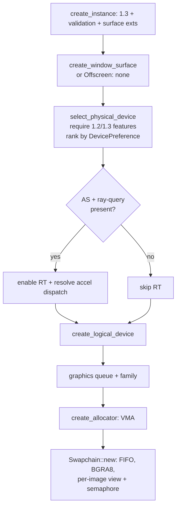

+++
title = 'Device & swapchain'
weight = 2
+++

# Device & swapchain

Bringing up Vulkan is the sequence of selecting an instance, a physical device, a logical device with
the features the renderer needs, a queue, the VMA allocator, and (for the windowed host) a swapchain
over the window surface. These objects are the foundation every later GPU operation builds on, and each
step can fail for reasons outside the program's control — no GPU, a missing feature, a surface the
platform refuses.

`Device::new` runs the whole bring-up top to bottom and returns a `Result<Device>`, so any failure
surfaces as a readable [`Error`](../vulkan-hpp-no-exceptions/) rather than a crash. The bring-up is
hand-rolled against `ash` — there is no builder helper layer; the ~150-line feature-probe and
degradation chain is the engine's own.

## Surface source, not a fork

Bring-up takes a `SurfaceSource`, which is a parameter rather than two code paths. `SurfaceSource::Window`
enables `VK_KHR_surface` plus the platform surface extension and creates a real surface for the present
swapchain (the standalone present-only host). `SurfaceSource::Offscreen` enables **no** surface extension
and creates **no** surface object: it renders into an offscreen image, reads it back, and publishes
frames to shared memory — the editor native-viewport host, every headless render-and-read-back, and the
validation-clean smoke. A no-surface instance is what lets the editor host boot under an NVIDIA ICD,
whose driver implements no headless-surface extension.

## Instance and surface

`create_instance` sets the app and engine names, requests API version 1.3, and — in debug builds, or
when `SAFFRON_FORCE_VALIDATION` is set — enables the Khronos validation layer plus `VK_EXT_debug_utils`.
The debug messenger routes validation/performance messages into the engine log under the `vulkan`
subsystem (one `[vulkan] …` line, loader chatter filtered) and bumps `validation_issue_count`, the
counter the validation-clean gate reads — see [Logging](../../core-and-conventions/logging/).

For the windowed host, `ash-window` supplies the platform surface extensions from the window's display
handle (`enumerate_required_extensions`), and `create_window_surface` builds the `vk::SurfaceKHR` from the
window's raw display+window handle pair.

## Feature negotiation

A bare 1.3 device is not enough. Selection requires specific feature bits across two feature structs and
rejects a device that lacks any of them, with a clear message rather than a later crash:

- **1.3:** `dynamic_rendering` and `synchronization2` — the two pillars the renderer is built on (see
  [dynamic rendering](../dynamic-rendering/) and [barriers](../synchronization2-and-barriers/)). No
  render-pass objects, no legacy barriers.
- **1.2:** descriptor-indexing bits for [bindless textures](../../materials-and-pipelines/bindless-textures/)
  (`runtime_descriptor_array`, `descriptor_binding_partially_bound`,
  `descriptor_binding_sampled_image_update_after_bind`, `shader_sampled_image_array_non_uniform_indexing`)
  plus `buffer_device_address` (needed by KHR acceleration structures).

The logical device additionally enables `shader_draw_parameters` (1.1), because Slang's `SV_VertexID`
fullscreen-triangle shaders emit the SPIR-V `DrawParameters` capability.

## Optional features, probed never gated

`probe_optional_features` reads the features that tune the renderer but never gate selection:
acceleration-structure + ray-query (ray tracing), `fill_mode_non_solid` (the wireframe view mode),
`VK_EXT_memory_budget` (VRAM telemetry), `pipeline_statistics_query` (the deepest profiler level), and
whether the device is a software rasterizer (its name contains `llvmpipe` / `lavapipe` / `swiftshader`
or its type is `CPU`). A software (llvmpipe) device reports `rt_supported == false` and is created and
used regardless — the degradation a unit test asserts.

When the acceleration-structure and ray-query extensions are both present, `create_logical_device`
enables them (with `VK_KHR_deferred_host_operations`) and the acceleration-structure dispatch is resolved
into an `accel::Device` table. On a software device that table stays `None` and every RT path is a no-op.

## Device preference, never exclusion

`select_physical_device` ranks every qualifying device by `DevicePreference` (discrete > integrated >
virtual > cpu) and keeps the highest. With an NVIDIA ICD enumerated next to Mesa's llvmpipe, both qualify
and the discrete GPU wins on rank; when the only qualifying device is the software rasterizer (the CI
toolbox), it is still selected. A single graphics queue is fetched along with its family index — the
engine is single-queue. The windowed host additionally requires that family to support present
(`require_present`); the offscreen host has no surface, so it gates on a graphics queue alone.

The MSAA capability is read on demand from `supported_sample_counts`: the intersection of the device's
framebuffer color/depth sample limits with each attachment format's optimal-tiling sample support, which
[MSAA](../../anti-aliasing/msaa/) clamps user requests against.

## Swapchain

`Swapchain::new` (windowed host only) clamps the requested extent to the surface capabilities, picks a
`FIFO` present mode (v-sync, always supported), and requests `min_image_count + 1` images (clamped to the
maximum). It requests a `B8G8R8A8_UNORM` / sRGB-nonlinear format, falling back to the first advertised
format. Each swapchain image gets a 2D view and a `render_finished` semaphore — one per image, not per
frame (see [frame sync](../frame-sync-and-resize/)).

`TRANSFER_SRC` on swapchain images is requested only when the surface capabilities allow it
(`capture_supported`); a surface that disallows it disables window screenshots instead of failing the
build. The `Swapchain` is not a `Drop` type — its handles borrow the device — so the renderer calls
`Swapchain::destroy` after `wait_idle`, and a resize destroys the old swapchain and builds a fresh one.

## Teardown order

`Device` holds the ash device + VMA allocator behind one `Arc<DeviceResources>` so a resource can free
itself in its own `Drop`. Rust drops fields top to bottom, and `Device::drop` is explicit: destroy the
surface + debug messenger, release the shared bundle (which frees the allocator then the device), then
destroy the instance last. The run loop's `wait_idle` and the owner's resource teardown run first, so
nothing is freed under a live GPU read.

## In the code

| What | File | Symbols |
|---|---|---|
| Whole bring-up | `device.rs` | `Device::new` |
| Surface parameter | `device.rs` | `SurfaceSource`, `create_window_surface` |
| Required-feature gate | `device.rs` | `evaluate_device`, `create_logical_device` |
| Optional-feature probe | `device.rs` | `probe_optional_features`, `Capabilities` |
| Device ranking | `device.rs` | `select_physical_device`, `DevicePreference` |
| Allocator creation | `device.rs` | `create_allocator` |
| Swapchain build | `swapchain.rs` | `Swapchain::new`, `choose_extent`, `choose_image_count` |
| Teardown order | `device.rs`, `resources.rs` | `Device::drop`, `DeviceResources::drop` |

## Related

- [Ash and the Vulkan seam](../vulkan-hpp-no-exceptions/) — the `Result`-returning style every step uses
- [Frame sync](../frame-sync-and-resize/) — the per-image semaphores + swapchain rebuild
- [Dynamic rendering](../dynamic-rendering/) — the 1.3 feature that removes render passes
- [VMA allocator](../vma-allocator/) — created right after the device
