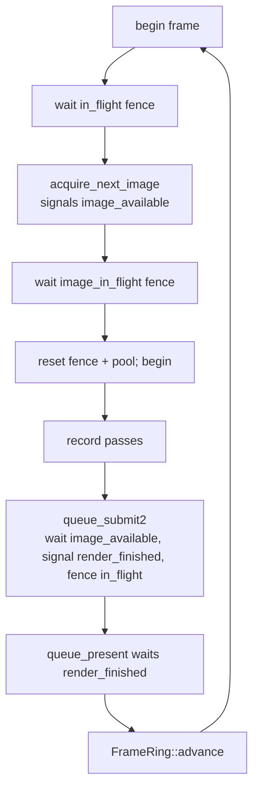

+++
title = 'Frame sync'
weight = 6
+++

# Frame sync

Frame synchronization is the set of fences and semaphores that lets the CPU record one frame while the GPU
renders another without either overwriting the other's work. The CPU never resets a command buffer the GPU
is still reading, and a swapchain image is never reused before its previous present completes.

The renderer keeps two frames in flight and coordinates them with a per-frame ring of sync objects plus a
per-image fence on the swapchain. Window and viewport resize are handled as ordinary swapchain and target
recreation, gated on a device idle.

## The frame ring

`MAX_FRAMES_IN_FLIGHT` is 2. `FrameRing` holds a `Vec<FrameData>` and a rotating `index`. Each
`FrameData` is the CPU-side recording context for one in-flight slot — its own command pool + buffer,
image-available semaphore, and in-flight fence:

```rust
struct FrameData {
    command_pool: vk::CommandPool,
    command_buffer: vk::CommandBuffer,
    image_available: vk::Semaphore,
    in_flight: vk::Fence,
}
```

The `image_available` semaphore and `in_flight` fence belong to the *frame slot*. The `render_finished`
semaphores belong to the *swapchain image* — one per image, not per frame, held by `Swapchain`. Present
waits on "this image's rendering is done," and an image can be presented across different frame slots.

`FrameRing` is not a `Drop` type — its handles borrow the device and command pools are not thread-safe —
so the renderer calls `FrameRing::destroy` after `wait_idle`, before the device is torn down.

## Acquiring a frame

`begin_offscreen_frame` (the editor/headless scene path) and `render_frame` (the windowed present-only
path) run the same CPU-side waits:

1. **Wait on the frame fence.** `wait_for_fences(in_flight)` blocks until the GPU finishes the work this
   slot submitted two frames ago, freeing its command buffer to reset and re-record. The in-flight fence
   is created `SIGNALED` so the first frame's wait returns immediately.
2. **Reset the fence and command pool**, then begin recording with `ONE_TIME_SUBMIT`.

The windowed present path additionally **acquires the next swapchain image** (`acquire_next_image`,
signaling the slot's `image_available`), and **waits any fence still tracking that image** before reusing
its `render_finished` semaphore — `Swapchain::image_in_flight` records which frame fence last used each
image. `ERROR_OUT_OF_DATE_KHR` from acquire returns early so the caller rebuilds the swapchain.

## Submitting and presenting

The editor/headless host renders into the offscreen image and submits once per frame with `queue_submit2`,
fencing the slot's `in_flight` so it can wait next time around, then publishes the read-back BGRA8 frame to
shared memory — it never presents. The windowed present-only host records an
`UNDEFINED → TRANSFER_DST → PRESENT_SRC` clear and submits with a binary-semaphore handshake: **wait** on
`image_available`, **signal** the image's `render_finished`, **fence** `in_flight`; then `queue_present`
queues the image. An out-of-date or suboptimal present triggers a swapchain rebuild. The slot then
advances via `FrameRing::advance` (`index = (index + 1) % MAX_FRAMES_IN_FLIGHT`).



## Resize

Resizes are gated on a device idle. A full `wait_idle` is the simple, correct choice: the offscreen is a
single shared target, nothing may still be reading it, and resizes are rare (a dragged panel edge), so the
stall is acceptable.

**Viewport resize.** The editor's viewport panel can differ in size from the window and drives a view's
desired size. `set_viewport_desired_size` idles the device and calls `ViewTarget::resize`, which recreates
the offscreen color, depth, and every dependent target — screen-space G-buffer/AO, AA motion + history,
ReSTIR reservoirs — and bumps a `generation` counter so the UI knows the
[viewport descriptor](../../frame-and-render-graph/cross-frame-layouts/) must refresh. The old `Image`s
drop when replaced; their VMA allocations free at that point.

**Swapchain resize.** When the window extent differs from the swapchain extent, the windowed host idles,
destroys the old swapchain, and builds a fresh one. Per-image views and `render_finished` semaphores are
recreated to match.

## Why a per-image fence on top of per-frame fences

The per-frame fence alone guarantees the *slot's* command buffer is safe to reuse. It does not guarantee
the *image* is free. With 3 swapchain images and 2 frames in flight, a just-acquired image might have last
been used by the other slot. Reusing its `render_finished` semaphore before that work finishes is a
validation error. `Swapchain::set_image_in_flight` / `image_in_flight` close the gap by tracking the last
frame fence per image and waiting on it.

## In the code

| What | File | Symbols |
|---|---|---|
| Frames-in-flight constant | `frame.rs` | `MAX_FRAMES_IN_FLIGHT` |
| Per-frame sync objects | `frame.rs` | `FrameData`, `FrameRing` |
| Per-image fences/semaphores | `swapchain.rs` | `images_in_flight`, `render_finished`, `set_image_in_flight` |
| Scene-frame begin | `renderer.rs` | `begin_offscreen_frame` |
| Present acquire + submit | `renderer.rs` | `render_frame`, `record_clear`, `submit_and_present` |
| Viewport resize | `renderer.rs`, `view_target.rs` | `set_viewport_desired_size`, `ViewTarget::resize`, `generation` |

> [!NOTE]
> `acquire_next_image` and `queue_present` returning `SUBOPTIMAL_KHR` or `ERROR_OUT_OF_DATE_KHR` are not
> errors — they mean "rebuild the swapchain." Both sites `match` the raw `vk::Result` directly rather than
> mapping every non-success code to an `Error::Vk` — see [the Vulkan seam](../vulkan-hpp-no-exceptions/).

## Related

- [Device & swapchain](../device-and-swapchain/) — how the swapchain + its semaphores are built
- [Cross-frame layouts](../../frame-and-render-graph/cross-frame-layouts/) — the offscreen layout + generation counter carried across frames
- [Ash and the Vulkan seam](../vulkan-hpp-no-exceptions/) — why acquire/present match the raw result
- [Render graph overview](../../frame-and-render-graph/render-graph-overview/) — recorded between begin and submit
