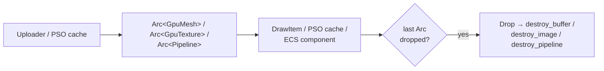

+++
title = 'Meta-layer resources'
weight = 7
+++

# Meta-layer resources

A meta-layer resource is a RAII wrapper around one or more raw Vulkan and VMA handles, owning them and
freeing them in its `Drop`. The crate defines a small set — `Buffer`, `Image`, `Image3D`, `GpuTexture`,
`GpuMesh`, `Pipeline`, and `AccelerationStructure`. A logical resource is a value backed by a plain struct,
not an opaque integer behind a manager, and shared resources are wrapped in `Arc<T>` where the scene draw
list, the PSO cache, ECS components, and capture closures all need to hold one.

The layer sits between the raw `ash` handles and the rest of the engine. It is thin enough to carry no
abstraction tax, yet present enough that nothing outside the rendering crate touches a raw handle.

## The wrapper shape

Every wrapper follows the same shape, illustrated by `Pipeline`:

```rust
pub struct Pipeline {
    resources: Arc<DeviceResources>,
    pipeline: vk::Pipeline,
    layout: vk::PipelineLayout,
}

impl Drop for Pipeline {
    fn drop(&mut self) {
        unsafe {
            self.resources.device().destroy_pipeline(self.pipeline, None);
            self.resources.device().destroy_pipeline_layout(self.layout, None);
        }
    }
}
```

Two invariants hold for all of them:

- **`Drop` is the single free path.** Each wrapper frees its own handles in `Drop` — `Image`,
  `Image3D`, and `GpuTexture` free a view then an image; `Buffer` and `GpuMesh` free buffers;
  `AccelerationStructure` frees the AS handle through a cloned dispatch table, then its backing buffer. The
  language's move semantics mean a wrapper is freed exactly once; there is no manual null-out or
  double-free guard to write.
- **A shared device + allocator, not a borrow.** Rust cannot encode "borrowed but the owner outlives me"
  for a `Drop` type, so each wrapper holds a clone of `Arc<DeviceResources>` — the ash device + the VMA
  allocator behind one `Arc`. The allocator/device are destroyed only when the last clone drops.

## Arc for sharing, Send for off-thread drop

The wrappers themselves are owned values; a *shared* logical resource is an `Arc<T>`. The upload path
hands out `Arc<GpuMesh>` and `Arc<GpuTexture>`, and the PSO cache holds `Arc<Pipeline>`. When the last
`Arc` drops, the wrapper's `Drop` runs and frees the GPU resource — no base class, no virtual destructor,
no handle table.

Each wrapper is `unsafe impl Send` (and the shared ones `Sync`): the raw handles carry no thread-affine
state and `vk-mem`'s `Allocation` is `Send`. This is load-bearing — a worker-uploaded `GpuTexture` may be
dropped off the main thread, and its `Drop` returns its bindless slot to the shared free-list under a
mutex (`Arc<Mutex<Vec<u32>>>`) before freeing the image.



## The teardown contract

Every wrapper holds a clone of `Arc<DeviceResources>`, so nothing leaks the device/allocator and nothing
is freed under a live read:

1. **`wait_idle` before releasing resources.** No in-flight command buffer may still reference a resource
   when its `Drop` runs. The run loop calls `wait_idle` before any teardown.
2. **The bundle outlives every resource structurally.** The allocator and device are destroyed only when
   the last `Arc<DeviceResources>` clone drops. Normally that is the `Device` itself, after the run loop's
   `wait_idle` and the owner's resource teardown. `DeviceResources::drop` then frees the allocator before
   the device (`vmaDestroyAllocator` before `vkDestroyDevice`). A resource that outlived the device would
   keep the bundle alive, which the validation layer flags.

## In the code

| What | File | Symbols |
|---|---|---|
| The wrappers | `resources.rs` | `Buffer`, `Image`, `Image3D`, `GpuTexture`, `GpuMesh`, `Pipeline`, `AccelerationStructure` |
| `Drop` free paths | `resources.rs` | each wrapper's `Drop` impl |
| The shared bundle | `resources.rs` | `DeviceResources`, `DeviceResources::drop` |
| Send/Sync + off-thread slot return | `resources.rs` | `unsafe impl Send`, `BindlessFreeList`, `GpuTexture::drop` |
| Factories returning `Arc` | `upload.rs`, `pipelines.rs` | `Uploader`, `Pipelines` |

> [!NOTE]
> A `GpuTexture`'s `Drop` returns its bindless slot to the free-list but does not zero the descriptor.
> No live material references a destroyed texture's slot, so its stale descriptor is never sampled, and
> the next upload reuses the slot — a real reclaim would need to defer past in-flight frames.

## Related

- [Ash and the Vulkan seam](../vulkan-hpp-no-exceptions/) — why the engine owns ash's raw handles itself
- [VMA allocator](../vma-allocator/) — the shared allocator these wrappers free through
- [GPU mesh upload](../../geometry-and-assets/gpu-mesh-upload/) — the upload building a `GpuMesh` and returning an `Arc`
- [Material and PSO selection](../../materials-and-pipelines/material-and-pso-selection/) — the `Arc<Pipeline>` cache
