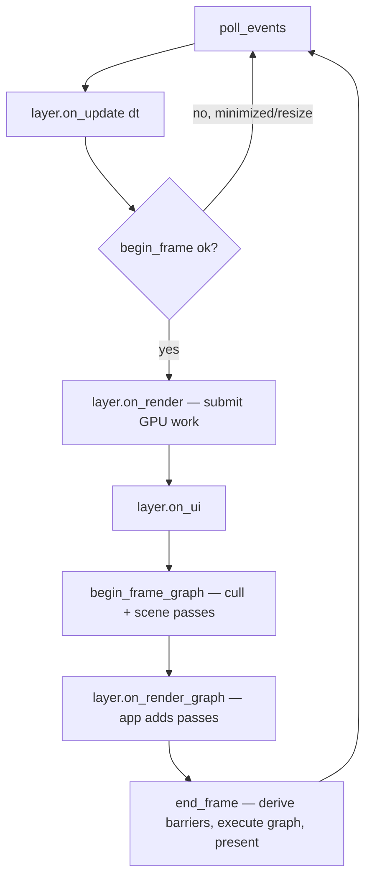
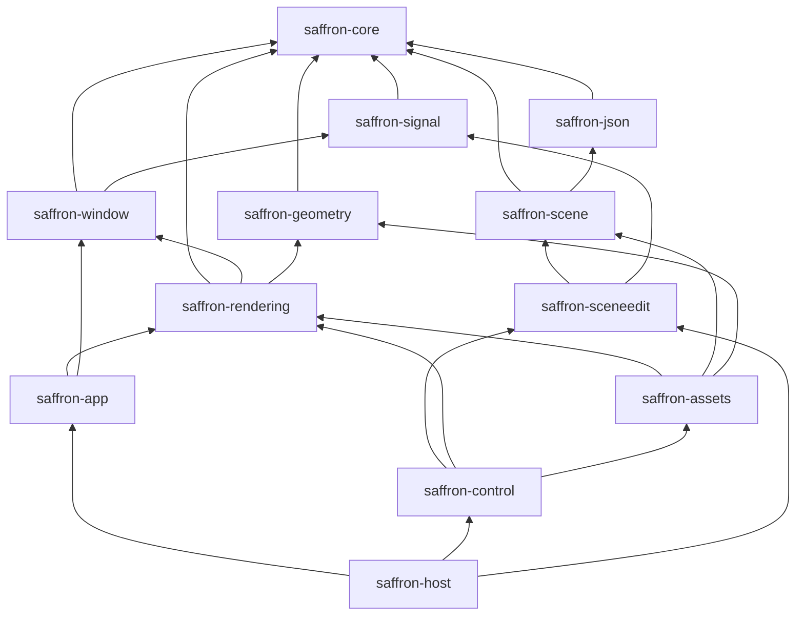

+++
title = 'Overview'
weight = 5
+++

# Overview

A one-read map of the whole engine. The [explanation pages](../explanations/) expand each
topic; follow the links for the full account.

## Shape of a program

A client — the editor or a standalone app — fills an `AppConfig` and calls `run`,
which owns the window, renderer, UI, and main loop. Clients extend it by attaching
**layers**. A `Layer` is a trait of optional callbacks: implement only the hooks you need.

```rust
let config = AppConfig { window, on_create, on_exit };
return run(config);
```

See [the main loop](../explanations/app-lifecycle-and-window/main-loop-and-run/).

## One frame

`run` drives this sequence every frame. The back half does the substantive work: layers
record GPU work and add render-graph passes, then the renderer derives the barriers and
executes the frame.



When the loop ends, `run` calls `wait_gpu_idle` before any teardown, so no in-flight
command buffer still references a resource about to be freed. That ordering anchors the
engine's [resource ownership model](../explanations/core-and-conventions/).

## Render graph

Each pass **declares** what it does with each resource (`ColorWrite`, `SampledRead`,
`StorageImageRwCompute`, …) rather than writing barriers by hand. The graph turns those
declarations into the right image and memory barriers and layout transitions, then
records each pass body inside its rendering scope.

Light culling, the scene pass, shadow passes, post-processing, and the present blit to the
swapchain are all declared passes over imported images. Start at the
[render graph overview](../explanations/frame-and-render-graph/render-graph-overview/).

## Crates

The engine is a Cargo workspace in `engine/`, a DAG of crates: leaves at the bottom,
the host at the top. Each `saffron-<area>` crate owns one subsystem.



`saffron-rendering` carries the render graph; the larger crates split their subsystem
across several modules behind one crate boundary. The
[architecture section](../explanations/architecture-and-conventions/) covers the crate
layout and the build.

## Subsystems

| Subsystem | What it does | Section |
|---|---|---|
| Core & conventions | shared aliases, the `Result` error model, reference-counted handles, signals, the coding style | [link](../explanations/core-and-conventions/) |
| App & window | `run` loop, layers, SDL3 window + typed events | [link](../explanations/app-lifecycle-and-window/) |
| Vulkan foundation | device/swapchain, VMA, sync2, dynamic rendering, `Drop`-based resource wrappers | [link](../explanations/vulkan-foundation/) |
| Frame & render graph | declared usage → automatic barriers, per-frame sync | [link](../explanations/frame-and-render-graph/) |
| Geometry & assets | mesh import, `.smesh`, GPU upload, the asset catalog | [link](../explanations/geometry-and-assets/) |
| Scene & ECS | the `hecs` scene, the component registry, JSON serialization | [link](../explanations/scene-and-ecs/) |
| Materials & pipelines | the übershader, the PSO cache, bindless textures | [link](../explanations/materials-and-pipelines/) |
| Lighting & BRDF | clustered forward, Cook-Torrance, HDR | [link](../explanations/lighting-and-brdf/) |
| Image-based lighting | sky, irradiance, prefilter, the split-sum BRDF LUT | [link](../explanations/image-based-lighting/) |
| Shadows & culling | directional/spot/point shadows, the light-cull compute pass | [link](../explanations/shadows-and-culling/) |
| Screen-space & post | thin G-buffer, GTAO, motion vectors, TAA, tonemap | [link](../explanations/screen-space-and-post/) |
| Global illumination & ray tracing | DDGI probes, voxel trace, BLAS/TLAS, ray-query shadows, ReSTIR | [link](../explanations/global-illumination-and-raytracing/) |
| Anti-aliasing | MSAA, FXAA, mode switching | [link](../explanations/anti-aliasing/) |
| UI & editor | the Tauri/React editor, the in-webview canvas + shm frame transport, the gizmo, the inspector, thumbnails | [link](../explanations/ui-and-editor/) |
| Tooling & control | the unix-socket control plane and the `sa` CLI | [link](../explanations/tooling-and-control/) |
| Scripting | the embedded Luau VM, sandboxing, script errors as values | [link](../explanations/scripting/) |
| Architecture | the crate DAG, the build, the coding conventions | [link](../explanations/architecture-and-conventions/) |
