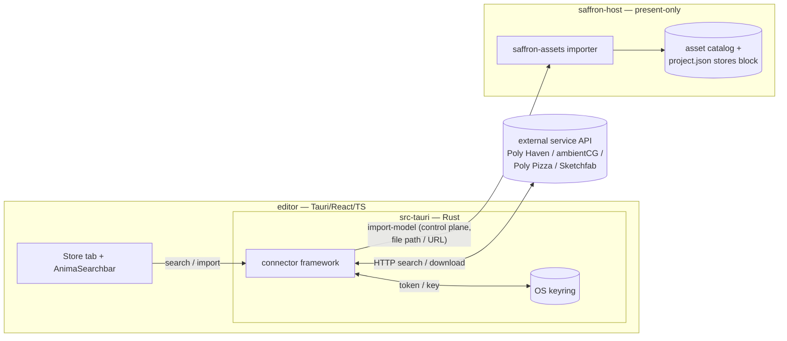

# Asset Connectors

**Status:** COMPLETED — all four phases implemented and gated (build + clippy + tsc + lint + unit/
integration tests green). Full e2e run to completion: **328 pass / 3 fail**; all connector tests pass,
and the 3 failures are unrelated GPU morph-deform validation errors from the in-flight
`better-animations` work. (e2e in this software-GPU sandbox requires `SAFFRON_EDITOR_NATIVE_VIEWPORT=1`
+ shm names to avoid a swapchain present stall — see phase-4 notes.) See each phase file for per-phase
deviations and deferred follow-ups.

## Overview

The editor grows a **Store** main tab that is not a hosted marketplace — it is a set of
**pluggable connectors** to existing online asset services that already publish CC0 / CC-licensed
content. A solo open-source project cannot run payments, hosting, payouts, or moderation, so we do
not build any of that. We build a *client*: search the services the user enables, browse normalized
results, and import an asset into the current project.

The import side is almost free because the engine already does the hard part. `saffron-assets`
imports glTF/OBJ to `.smodel` containers (`bake_model` in
`engine/crates/assets/src/import.rs`) and material/texture sets to `.smat`
(`import_material_folder` in `engine/crates/assets/src/manage.rs`). So an online import reduces to:
HTTP GET a `.glb`/`.gltf` (or a texture-map zip) → run the existing importer → catalog entry. The
new work is the connector framework, the Store UI, credential handling, and the OAuth loopback for
Sketchfab.

## Architecture

Connectors live on the **editor side**, in `editor/src-tauri` (Rust). That is deliberate:

- **No browser CORS.** Service APIs are called from native Rust, not the webview.
- **Credentials never reach the renderer.** Keys/tokens live in the OS keyring, read only in
  `src-tauri`.
- **Thumbnails are just URLs.** The webview renders provider thumbnail URLs directly in ``,
  no proxying.

A connector exposes a small interface (shape, not final signature):

```
search(query, perSourceCursor) -> { results: StoreResult[], nextCursor, exhausted }
download(importDescriptor)     -> local file path
```

The actual **import goes through the control plane to the host**. The editor downloads the file (or
hands the host a path/URL) and calls a new control command that runs the existing `saffron-assets`
importer to produce a catalog entry — `.smodel` for `kind: model`, `.smat` for
`kind: material | texture`. Host and editor share the filesystem, so a path handoff is cheap.

**Per-project enablement** persists in `project.json` as a new top-level **`stores`** block,
alongside the existing `renderSettings` / `editorCamera` / `debugOverlays` blocks in
`AssetServer::save_project` / `load_project` (`engine/crates/assets/src/project.rs`). It holds the
enabled connector ids plus any non-secret per-project config, saved/loaded via the existing
save-project / open-project commands. No separate per-project settings file (that would violate the
one-way-to-do-each-thing rule).

**Credentials are machine/user-global, not per-project.** They live in the OS keyring via the
`keyring` crate in `src-tauri`, keyed by connector id (e.g. `saffron-anima/sketchfab`). A teammate
opening a shared project sees the same enabled stores but supplies their own credentials.



## Connector model & auth kinds

A connector declares an **`auth_kind`** that fully determines its add-flow and credential handling.
This is the single switch the framework branches on; the `none` and `api_key` connectors never
touch the OAuth machinery.

| auth_kind | Add-flow | Credential | Connectors |
|-----------|----------|------------|------------|
| `none` | instant enable | none — a unique `User-Agent` header only | Poly Haven, ambientCG |
| `api_key` | paste-key field in settings | API key in keyring | Poly Pizza |
| `oauth_loopback` | system-browser login | implicit-flow token in keyring | Sketchfab |

### Provider matrix

| Provider | auth_kind | Content | License | Deliverable | Notes |
|----------|-----------|---------|---------|-------------|-------|
| **Poly Haven** | `none` | HDRIs, PBR textures, models | CC0 | models expose a glTF variant; textures as map sets | base `https://api.polyhaven.com`; requires a unique `User-Agent`; heavy commercial *API* use wants sponsorship (assets themselves unrestricted) |
| **ambientCG** | `none` | 2000+ PBR materials, HDRIs | CC0 | zips of PBR maps at multiple resolutions → `.smat` | `https://ambientcg.com/api/v2/full_json`, keyless GET |
| **Poly Pizza** | `api_key` | low-poly models (incl. all Quaternius) | CC0 / CC-BY | GLB on `static.poly.pizza` | free key needs an account; docs `https://poly.pizza/docs/api/v1.1` |
| **Sketchfab** | `oauth_loopback` | 700k+ downloadable CC models | per-model (CC variants) | Download API → glTF/GLB/USDZ | per-user login; must show license + creator attribution + Sketchfab logo. **Risk:** now an Epic/Fab property — flag standalone-API longevity |

**Bundled seed (no live connector):**

- **Kenney / Quaternius** — no API of their own (Quaternius is mirrored on Poly Pizza). Ship a small
  CC0 seed set as bundled fixtures/sample content rather than a connector.

**Excluded for now:**

- **Fab (Epic)** — no public API yet (promised "in the future").
- **OpenGameArt** — no official API; scraping risks an IP ban. Skip for live integration.

## Canonical normalized result schema

Every connector maps its provider response onto this one shape. **Every phase file conforms to
this.** The structured `license` and the `kind` discriminator are load-bearing — `kind` drives
import behaviour, and `license` must be captured at import and stored on the catalog asset so
attribution follows the asset everywhere (CC-BY / Sketchfab require it).

```ts
type StoreKind = "model" | "hdri" | "material" | "texture";

interface StoreLicense {
  id: "cc0" | "cc-by" | "cc-by-sa" | string; // canonical id
  requiresAttribution: boolean;              // CC-BY / Sketchfab => true
  url: string;                               // canonical license url
}

interface StoreRef {
  id: string;          // connector id, e.g. "polyhaven"
  displayName: string; // shown to the user as the source
}

// The handle the connector's download() needs, plus the deliverable format.
// Shape is connector-defined; kind drives the host-side importer choice.
interface StoreImportDescriptor {
  format: "glb" | "gltf" | "usdz" | "texture-zip" | string;
  ref: string; // download url / asset handle / api id
}

interface StoreResult {
  id: string;                 // provider-scoped stable id
  store: StoreRef;            // the source service
  kind: StoreKind;            // REQUIRED — model => .smodel; material/texture => .smat
  name: string;
  author: string;
  thumbnailUrl: string;
  sourceUrl: string;          // asset page — "view on site" AND attribution link
  license: StoreLicense;      // structured, never a free string
  importDescriptor: StoreImportDescriptor;

  publishedAt?: string;       // optional — not all APIs provide it
  updatedAt?: string;         // optional — no true model "creation date" exists

  triCount?: number;
  fileSize?: number;
  resolution?: string;        // HDRIs / textures
  tags?: string[];
}
```

## Cross-cutting decisions

- **Search fires on Enter only.** The Store reuses the existing `AnimaSearchbar`
  (`editor/src/components/anima/AnimaSearchbar.tsx`) with chips (`provider:`, `type:`). The
  searchbar value is local state; connector queries dispatch on **Enter** and on **chip commit** —
  never per keystroke, never a network call on `onChange`.
- **Infinite / virtual scroll, not pagination.** Unified page numbers across heterogeneous services
  are impossible. Each connector keeps its **own cursor/offset**; the aggregator pulls more from
  each source as the user scrolls and tracks **per-source exhaustion** (one store runs dry while
  others keep going). Virtualization follows the `ScriptLogsPanel`
  (`editor/src/panels/ScriptLogsPanel.tsx`) windowing pattern.
- **Round-robin merge, no fake global sort.** Relevance is not comparable across services, so
  interleave results round-robin (or group by store). Do **not** synthesize a global relevance
  ranking.
- **Filter-to-importable at the mapping step.** The connector knows its deliverable format, so it
  simply never emits an unimportable result at the result-mapping step — not a generic post-filter.
  Most connectors deliver glTF/GLB regardless of source format, so this rarely drops anything.
- **Attribution captured at import.** The structured `license` (and `sourceUrl` / `author`) is
  written onto the catalog asset's metadata at import time, so CC-BY / Sketchfab attribution travels
  with the asset (catalog rows in `engine/crates/scene/src/environment.rs`; `.smodel` META in
  `engine/crates/assets/src/model.rs`).

## Phases

| # | File | Title | Summary | Status |
|---|------|-------|---------|--------|
| 1 | `phase-1-connector-framework-and-store-tab.md` | Connector framework & Store tab | The `auth_kind`-keyed connector trait + aggregator (per-source cursor/exhaustion, round-robin), the `none` connectors (Poly Haven, ambientCG), the Store `ViewTab` + `AnimaSearchbar` UI, the host-side `import-model` control command, and an `sa` connector/search/import command. | NOT STARTED |
| 2 | `phase-2-credentials-and-per-project-enablement.md` | Credentials & per-project enablement | The `keyring` integration in `src-tauri` (with a headless/no-Secret-Service fallback), the `api_key` connector (Poly Pizza) + settings paste-key field, the `project.json` `stores` block in `save_project`/`load_project`, and first-open onboarding. | NOT STARTED |
| 3 | `phase-3-oauth-loopback-and-sketchfab.md` | OAuth loopback & Sketchfab | The reusable `oauth_loopback` capability: ephemeral 127.0.0.1 listener, system-browser open (Tauri opener plugin), implicit-flow fragment-bridge landing page, CSRF `state`, single-callback shutdown, keyring token store; the Sketchfab connector + Download API + required attribution/logo. | NOT STARTED |
| 4 | `phase-4-materials-and-textures.md` | Materials & textures | Map the `material` / `texture` / `hdri` kinds through to `.smat` via `import_material_folder` — ambientCG map-zip extraction, Poly Haven textures/HDRIs, resolution selection — and the matching docs page. | NOT STARTED |

## Conventions

This plan follows the repo rules in `AGENTS.md`; each phase file restates the relevant ones in its
*Done when* section.

- **`cargo clippy -- -D warnings` is law.** Idiomatic Rust only; per-crate `thiserror` error enums
  (no stringly `Result<T, String>`), `Arc<T>` for read-shared handles, propagate with `?`.
  `unsafe_code = deny` except FFI seams. Minimal `///` comments, no banner dividers, no
  change-journey notes.
- **No legacy / no compat shims.** Exactly one way to do each thing; replace and update all callers,
  never duplicate or defer a cutover. The `stores` block replaces any notion of a separate
  per-project settings file.
- **A new control command = one registration** in `saffron-control` (`register_typed::<P, R>` per
  the `engine/crates/control/src/registry.rs` pattern); DTOs go in
  `engine/crates/protocol/src/dto.rs` + the `COMMANDS` table in
  `engine/crates/protocol/src/command.rs` (with a fixture or skip), then regenerate with
  `cargo run -p xtask -- gen-protocol`. The editor gets typed access via `@saffron/protocol`
  (`CommandParamsMap` / `CommandResultMap`) through `editor/src/control/client.ts`.
- **`sa` CLI command.** Connector state worth driving/inspecting gets a matching `sa` command (list
  connectors / search / import), so the running editor stays scriptable from a shell.
- **Docs.** A change that adds/alters an engine concept updates the matching `docs/` explanation page
  and its hub `_index.md` row, in the same change. Each phase that touches a concept carries a docs
  task.
- **Per-phase milestone gate.** After each phase, run `just engine` then `just prepare-for-commit`
  (format + lint) and fix every warning the change raises.
- **Git stays read-only.** Do not commit, stage, or push. Leave the work unstaged for the user.
- **e2e tests** for new control commands live in `tests/e2e` (bun/TypeScript, driving a headless
  host over the control plane). The keyring headless fallback (Phase 2) must keep the `just e2e`
  host boot working with no Secret Service present.
