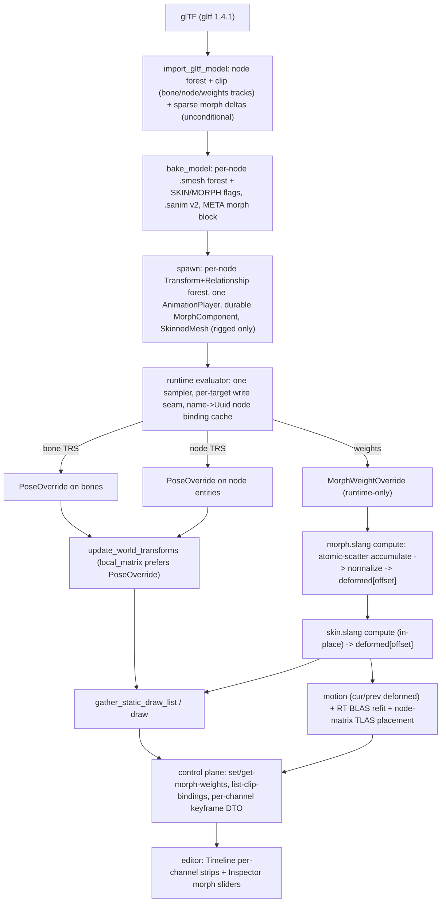

# Better animations — full morph targets + node-TRS animation

**Status:** COMPLETED (Phases 1–7). Engine + editor + docs gated green; the e2e drivers are authored
and the engine renders validation-clean, but the e2e *run* is blocked by a session-wide control-plane
timeout that also hits known-good tests — re-run `just e2e` on a non-contended toolbox (see phase 7).

This plan adds two capabilities on top of the existing skeletal pipeline and folds both onto **one**
track/clip/sampler model:

- **Node-TRS (non-skeletal) animation** — driving a plain entity's `Transform` from glTF node
  translate/rotate/scale channels. A glTF that animates nodes that are not skin joints (lamp swinging,
  doors, the canonical `BoxAnimated`) becomes a live, drivable entity forest.
- **Morph targets (blend shapes)** — per-vertex position+normal deltas driven by an N-wide weight
  curve (`AnimatedMorphCube`, facial blends), deformed on the GPU before skin, carried through motion
  vectors and ray-traced BLAS.

The governing principle is **NO LEGACY — one code path.** There is exactly one generalized
track/clip/sampler model that carries skeletal *bone* tracks, *node-TRS* tracks, and *morph-weight*
tracks; one deformed-vertex buffer that the morph compute pass and the skin compute pass both write;
one `.smesh` and one `.sanim` format with feature flags rather than parallel versions. Every old path
is **deleted in the same change that supersedes it** — the skin-gated import branch, the unskinned
world-transform vertex bake, the index-only `sample_clip`, the two-version `.smesh`, the v1 `.sanim`
record, and the top-level `ImportedModel.mesh` all go, with every caller and every affected test moving
together. A phase is not done while a superseded path survives.

## Pipeline (end to end)

## Architecture summary

**Node-TRS.** glTF import now *unconditionally* decodes a node forest and a heterogeneous clip — bone
tracks, node-TRS tracks, and morph-weight tracks side by side in one `AnimClip`. Mesh-bearing nodes
carry their mesh node-locally (`ImportedNode.mesh: Option<Mesh>`); the top-level `ImportedModel.mesh`
is removed so OBJ and single-skinned-mesh imports also route through a node — one mesh-ownership shape.
A single identity-transform root still collapses to one entity; any non-identity or animated node keeps
its container so it never loses a drivable local transform. Spawn instantiates a live
`Transform`+`Relationship` entity forest under a container root that holds **one** `AnimationPlayer`.
The runtime evaluator binds node tracks by durable glTF name → `Uuid` → `Entity` (cached, re-resolved
on a stale handle, first-match pre-order walk scoped to the player's forest) and routes each track to
its write seam: bone TRS → `PoseOverride` on bones, node TRS → `PoseOverride` on node entities, weights
→ a runtime-only `MorphWeightOverride`. `update_world_transforms` already prefers `PoseOverride` for any
entity, so node-TRS playback reuses the skeletal write seam. Node players get the **full**
transition/cross-fade state, the same path skeletal playback uses.

**Morph targets.** glTF import reads sparse POSITION+NORMAL deltas through the `gltf` crate's
`read_morph_targets` (sparse accessors resolved internally) and stores them as a flat per-mesh buffer of
`MorphDelta { u32 vertex_index; Vec3 d_position; Vec3 d_normal }` (28 B, `bytemuck::Pod`, const-asserted)
plus per-target ranges. The `.smesh` collapses to one version with SKIN/MORPH flags and an optional morph
section; spawn seeds a durable, import-managed `MorphComponent { weights, names }` (non-addable /
non-removable, like `SkinnedMesh`) on the mesh-bearing entity, rest-weights seeded node → mesh → zeros.
At runtime the morph compute pass deforms `base + Σ wᵢ·δposᵢ` into the **deformed buffer that is the skin
pass's input** — so morph-before-skin is enforced structurally by the buffer chain, not a hand-ordered
flag. An unskinned morph mesh draws the deformed buffer directly as a static stream. The deform carries
through prev-pose motion vectors and RT BLAS refit, with unskinned-morph geometry placed at its node
world matrix.

## Locked decisions

These are the cross-cutting calls the phase files implement. They are authoritative; where the original
blueprint hedged toward a smaller default, these supersede it (the four overrides are #4, #9, #12, #19).

- **MorphDelta = 28 B, normal kept, tangent re-derived.** `{u32 vertex_index, Vec3 d_position, Vec3
  d_normal}`. The engine `Vertex` (32 B) has no tangent stream, so a tangent delta would be dead weight —
  the deform shader re-derives the tangent by Gram-Schmidt against the morphed normal.
- **Morph-before-skin is structural via the buffer chain.** Both passes target the same
  `deformed[deformed_offset]` slice; skin reads what morph wrote at the same offsets, so the data
  dependency *is* the ordering — no explicit sequence flag.
- **GPU morph kernel is UE-exact: fixed-point integer atomic-scatter, two-pass.** Pass A is one thread
  per active `(target, delta)`: quantize `weight·d_position` / `weight·d_normal` to fixed-point integers
  and `atomicAdd` into per-vertex accumulators in a scratch buffer. Integer atomics **commute**, so the
  result is bit-deterministic — required for golden buffers and the llvmpipe CI GPU. CPU compacts active
  (above-threshold) weights each frame so the kernel skips zero-weight targets (UE
  `GMorphTargetWeightThreshold`). Pass B dequantizes, adds the base vertex, renormalizes the normal, and
  writes the deformed buffer. **No "simple gather first, scale later"** — this is the whole production
  kernel from the start.
- **Graph-derived `StorageReadCompute` barrier (correcting the inverted framing).** `apply_access`
  (`render_graph.rs:apply_access`) derives a barrier on `(read && last_was_write)`. The skin pass declares
  **`StorageReadCompute`** (COMPUTE / SHADER_STORAGE_READ) on the deformed buffer so the graph derives a
  COMPUTE→COMPUTE WRITE→READ barrier after the morph write. **`VertexInputRead` is wrong here** — it would
  derive a `VERTEX_ATTRIBUTE_INPUT` barrier the compute skin shader never reaches, leaving morph→skin
  unsynchronized. Downstream geometry passes keep `VertexInputRead` (they *are* vertex-fetch consumers).
- **Node binding by durable name → Uuid → Entity, cached, first-match pre-order.** Subtree name walk
  scoped to the player's forest; cache the `Entity`; re-resolve on a stale handle. Never
  `find_entity_by_uuid` (global O(n), crosses instances and mis-binds repeated forest names).
- **Sparse morph decode through the `gltf` 1.4.1 crate.** `Reader::read_morph_targets` resolves sparse
  accessors internally; the over-cautious sparse-sampler skip in `decode_clips` is deleted.
- **One generalized sampler with per-target write seams.** `sample_track` (Vec4 T/R/S) + `sample_weights`
  (N-wide) share the keyframe/Hermite math; the only difference is the write target. The index-only
  `sample_clip` is deleted.
- **Component registration split: backend registry + frontend TS Set.** `MorphComponent` registers once
  in `register_builtin_components` / `BUILTIN_COMPONENT_NAMES` (guarded by `registry_is_complete`); the
  editor mirrors addability in `componentOrder.ts` + `InspectorPanel` `NON_ADDABLE`/`NON_REMOVABLE`. Two
  sources of truth that move together.
- **Channel `kind` is a plain `String` on the wire** (`"node-translation"` | `"node-rotation"` |
  `"node-scale"` | `"morph-weights"` | `"bone"`) — serde/ts-rs handle it natively, no enum DTO row.
- **Weights are canonical 0..1 end to end** — never 0..100; no `/100` conversion in the slider.
- **`MorphWeightOverride` is runtime-only and unregistered**, removed on stop exactly like
  `PoseOverride`, so a stopped morph reverts to the durable `MorphComponent.weights`.
- **Unify mesh ownership onto nodes (override #4).** `ImportedModel.mesh` is removed; OBJ and
  single-skinned-mesh imports also produce a node carrying the mesh (`ImportedNode.mesh: Option<Mesh>`,
  no parallel-index `Vec`). One ownership shape, one code path.
- **Node-player transitions/cross-fade: FULL support (override #12).** The transition/blend state
  (currently bone-handle-shaped) is generalized to node targets, so node-TRS playback gets the same
  cross-fade/transition path as skeletal — not "skinned-only, nodes hard-sample."
- **Timeline: FULL real per-channel keyframe strips (override #19).** `AnimationChannelDto` exposes the
  per-channel keyframe data (keyframe times, plus values where the editor renders them); the editor draws
  real keyframe strips per channel nested under the one clip bar — no structural placeholders.
- **`.sanim` record widens to 24 B and `ANIM_FORMAT_VERSION` bumps 1→2** (`index`, `target:u8`,
  `morph_count:u32` added); v1 is rejected with `Err`, the golden fixture reseeded — explicit over
  repurposing the 20 B record.
- **`.smesh` collapses to one `version=3` with SKIN/MORPH flag bits**; `reserved:[u32;2]` becomes
  `morph_offset:u64`; `save_mesh_skinned*` and the two-version selection are deleted.
- **`AnimationClipDto.tracks` is replaced by `channels`** (count via `channels.len()`); no duplicate
  count field.
- **`AnimationStateResult.morph_weights` is an always-present `Vec<f32>`** (empty = none); no `Option` /
  `skip_serializing_if`.
- **`DrawBatch.skinned` → `deformed`** ("draws the deformed buffer", skin OR morph) and
  **`SkinnedRtInstance` → `DeformedRtInstance` + `world_transform: Mat4`** (identity for skinned, node
  world matrix for unskinned-morph) — every reader refactored in the same change.
- **Malformed morph input is warn + best-effort, never an import abort.** When a mesh's primitives
  disagree on morph-target count (a glTF spec violation), take the canonical count from the mesh-level
  `weights` length (else the first primitive's count) and zero-pad / drop the offending primitive's
  targets to match, with a mandatory `tracing::warn!`. The morph feature still works fully on the valid
  primitives — input tolerance, not a feature shortcut.
- **Per-target name source: glTF `mesh.extras.targetNames` when present, else synthesized `morph_{k}`;**
  names are durable on `MorphComponent` so editor labels work without a META re-read.
- **Channel label source: hybrid (UE/Unity).** Resolved entity name for node-TRS bindings (falling back
  to the raw glTF node name when unresolved — which doubles as a "binding broken" signal for
  `list-clip-bindings`); raw glTF target name for morph-weight channels.

## Canonical types & seams

| Type / artifact | Home (file:symbol) | What changes |
|---|---|---|
| `AnimPath` | `geometry/src/types.rs:AnimPath` (repr(u8) T=0/R=1/S=2) | Add `Weights = 3`; extend `from_u8`; pin discriminant in `lib.rs` |
| `AnimTarget` | **new** `geometry/src/types.rs:AnimTarget` | `enum { Bone=0, Node=1 }` (repr(u8), `from_u8`); pinned bytes |
| `AnimTrack` | `geometry/src/types.rs:AnimTrack` (`joint:i32`, `joint_name:String`, `path`, `interp`, `times`, `values`) | `joint`→`index:i32`; `joint_name`→`target_name`; add `target:AnimTarget`, `morph_count:u32` |
| `AnimClip` | `geometry/src/types.rs:AnimClip` | Unchanged shape; now holds heterogeneous tracks |
| `.sanim` format | `geometry/src/sanim.rs` (`ANIM_FORMAT_VERSION`, `SANimTrackRecord` 20B, version guard) | Bump to 2; record → 24B with `target:u8`+`morph_count:u32`; reject v1 |
| `.smesh` format | `geometry/src/smesh.rs` (`MESH_FORMAT_VERSION`/`_SKINNED`, `SMeshHeader` 64B `flags`/`reserved:[u32;2]`, `save_mesh*`, `load_mesh*`) | Collapse to one `version=3`; `reserved`→`morph_offset:u64`; flags SKIN/MORPH; one `save_mesh_to_buffer(mesh, skin, morph)`; add `load_mesh_morph_from_bytes` |
| `Vertex` | `geometry/src/types.rs:Vertex` (32B, position/normal/uv0, no tangent) | Unchanged; tangent re-derived at deform |
| `MorphDelta` | **new** `geometry/src/types.rs:MorphDelta` | `#[repr(C)] Pod { vertex_index:u32, d_position:Vec3, d_normal:Vec3 }` (28B), const-asserted |
| `MorphData` / `MorphTarget` | **new** `geometry/src/types.rs` | CPU aggregates on `ImportedModel.morph` |
| `MorphComponent` / `MorphWeightOverride` | **new** `scene/src/component.rs` (twin of `PoseOverride`) | Durable `{weights, names}` registered "Morph"; runtime-only override (unregistered) |
| `PoseOverride` / `Relationship` | `scene/src/component.rs:PoseOverride` / `:Relationship`; `local_matrix` prefers it | Node-TRS write seam; forest parenting key — unchanged |
| Skin/morph compute | `rendering/src/skinning.rs:Skinning` (`deformed`/`prev_deformed`, `swap_palette`, `SKIN_POOL_SET_CAPACITY`); skin pass `renderer.rs` | Extend to a `Deform` owner (morph half + skin half, shared buffers); add `swap_morph_weights`; add morph graph pass before skin |
| `RgUsage` / barriers | `render_graph.rs:RgUsage` (`StorageWriteCompute`, `StorageReadCompute`, `VertexInputRead`, `AccelStructBuildRead`); `apply_access` hazard `(write&&touched)\|\|(read&&last_was_write)` | Skin pass declares `StorageReadCompute` on deformed for morph→skin dep |
| `DrawBatch` / `DrawItem` / `SkinnedRtInstance` | `draw_list.rs:DrawBatch`/`DrawItem`/`SkinnedRtInstance` (`skinned:bool`, `deformed_vertex_offset`) | `skinned`→`deformed` meaning; add `morph_weight_offset/count` to `DrawItem`; rename to `DeformedRtInstance` + `world_transform:Mat4` |
| `bind_batch_vertices` | `scene_pass.rs:bind_batch_vertices` (`match (batch.skinned, deformed)`) | Key on deform flag; **read the exact match arms at implementation** |
| `record_motion` | `aa.rs:record_motion` (`match (batch.skinned, deformed, prev_deformed)`) | Key on deform flag so morph-only batches bind deformed buffers |
| `prepare_tlas_build` | `rt.rs:prepare_tlas_build` (`IDENTITY_ROWS` for skinned) | Use `transform_rows(&inst.world_transform)` (identity for skin → byte-identical) |
| DTOs | `protocol/src/dto.rs:AnimationClipDto`, `:AnimationStateResult` | Add `AnimationChannelDto` (per-channel keyframes), morph command DTOs; `channels`, `morph_weights` |
| Command table | `protocol/src/command.rs` (count asserts, `animation_domain`, `COMMAND_FIXTURES`, FIXTURES+SKIPS) | +3 commands; bump every count |
| `register_animation_commands` | `control/src/commands_animation.rs:register_animation_commands` (13 commands) | +3 morph/binding commands → 16 |
| `register_builtin_components` | `scene/src/registry.rs:register_builtin_components`, `BUILTIN_COMPONENT_NAMES`, `registry_is_complete` | Add `MorphComponent` ("Morph") to both |
| `upload_mesh` (~12 impls) | `rendering/upload.rs`, `assets/gpu.rs`, `render_material.rs`, `manage.rs`, `render_scene.rs`, `load.rs`, `thumbnail.rs`, `control/test_support.rs`, `host/control_renderer.rs`, `host/overlay.rs` | Signature widens for morph buffers — all move together |

## Phases (dependency-ordered)

| Phase | File | Scope | Depends on |
|---|---|---|---|
| 1 | [`phase-1-cpu-substrate.md`](phase-1-cpu-substrate.md) | Generalized track model (`AnimTarget`, `AnimPath::Weights`), node forest, import-gate lift, `.sanim` v1→v2, unify all mesh ownership onto nodes (`ImportedModel.mesh` removed). | nothing |
| 2 | [`phase-2-morph-storage.md`](phase-2-morph-storage.md) | `.smesh` two-version → v3 + SKIN/MORPH flags, `MorphDelta` (28B), `MorphComponent`/`MorphWeightOverride`, spawn seeding, the ~12-impl `upload_mesh` ripple. | Phase 1 |
| 3 | [`phase-3-runtime-evaluator.md`](phase-3-runtime-evaluator.md) | One sampler, node name→Uuid binding cache, per-target write seams, **FULL** node-player transitions/cross-fade. | Phases 1, 2 |
| 4 | [`phase-4-gpu-morph-deform.md`](phase-4-gpu-morph-deform.md) | `morph.slang` UE fixed-point atomic-scatter two-pass, render-graph `StorageReadCompute` morph→skin barrier, `Deform` owner. | Phases 2, 3 |
| 5 | [`phase-5-motion-rt.md`](phase-5-motion-rt.md) | Prev-pose morph dispatch for motion vectors, BLAS refit, `DeformedRtInstance.world_transform` TLAS placement. | Phase 4 |
| 6 | [`phase-6-control-plane.md`](phase-6-control-plane.md) | `set/get-morph-weights` + `list-clip-bindings` commands, `AnimationChannelDto` with **per-channel keyframe data**, Lua bridge. | Phases 2, 3 |
| 7 | [`phase-7-editor-docs-e2e.md`](phase-7-editor-docs-e2e.md) | Timeline **real per-channel strips** + Inspector morph sliders, docs pages, e2e fixtures, perf budget. | Phases 1–6 |

**Why Phase 1 folds the first three subsystems.** The import-gate lift, the node-forest spawn, and the
generalized track model are mutually entangled: the forest needs the track model to know which nodes are
animated, the track model needs the forest's node names as binding keys, and the gate-lift needs both.
Splitting them would strand temporary half-states (a forest with no clips, a skin-only clip path, a live
`SkinPayload.nodes` field) that violate NO LEGACY. They land as one phase. Phase 2 (morph CPU storage) is
otherwise independent of node-TRS but shares the `.sanim` / `AnimPath::Weights` substrate from Phase 1,
so it follows. Phase 3 (runtime) needs the full Phase-1 track model and Phase-2 `MorphWeightOverride`.
Phase 4 (GPU deform) needs Phase-2 deltas and Phase-3 per-frame weights; Phase 5 (motion + RT) builds on
4. Phase 6 (control) needs the Phase-2/3 components and the channel model; Phase 7 (editor + docs + e2e)
caps verification over all of it.

## Coordination with `assets-connectors`

The `plans/assets-connectors/` plan is in flight in the same tree (its Phase 1 has landed). The two
plans are one-directional and collide only at mechanical seams — but this plan is implemented **second**
relative to that plan's Phase 1, so two points need care during implementation:

- **Re-derive the Phase 6 protocol counts from the live tree, not the literals.** `assets-connectors`
  also adds control commands + DTOs and edits the same frozen-count asserts (`COMMANDS.len()` in
  `protocol/src/command.rs`, `ts_decls().len()` / `struct_fragments().len()` in `protocol/src/codegen.rs`,
  plus `DTO_TYPE_NAMES`, `COMMAND_FIXTURES`/`COMMAND_SKIPS`). The targets written in Phase 6 (155→158,
  257→263, 238→244) assume the pre-connectors baseline. When implementing Phase 6, read the current
  assert values and add this plan's delta on top of whatever connectors landed; then re-run
  `cargo run -p xtask -- gen-protocol` and commit the regenerated artifacts — never hand-merge the
  generated `sa-types.ts` / `openrpc.generated.json` / command-manifest / Luau defs.
- **Preserve the `attribution` META field when restructuring the container metadata.**
  `assets-connectors` added an `attribution` field to the container META chunk (`assets/src/model.rs`
  `ContainerMetadata`) and touched `assets/src/import.rs:bake_model`. Phases 1–2 here restructure that
  same META chunk (per-node `"mesh"` field, morph block, `animations`). Layer the new fields on top of
  the attribution field — do not drop it when reshaping the chunk.

Nothing else interacts: the importer struct surgery (`ImportedModel`/`spawn`/`.smesh`/`.sanim`) is
invisible to connectors (they integrate at the `import-model` command boundary), and the editor / docs /
e2e surfaces are disjoint.

## Keep current (part of "done")

Per AGENTS.md, each phase carries its own slice of the keep-current rules:

- **Milestone gate at every phase boundary** — run `just engine` then `just prepare-for-commit` (format +
  `cargo clippy -- -D warnings`) and fix every warning the change raises. The point is a clean,
  green-`cargo build` testing ground at intervals, not one reconciliation at the end. Where another
  agent's in-flight change is the only cause of a failure, gate your own slice in isolation via a private
  `CARGO_TARGET_DIR`.
- **`sa` CLI / control command per drivable-state phase** — Phase 6 adds `set-morph-weights`,
  `get-morph-weights`, and `list-clip-bindings` (one registration each in `saffron-control`) so the
  running editor stays scriptable and visually debuggable from a shell. Any phase that adds engine state
  worth driving gets its matching command in the same change.
- **`docs/` per concept phase** — Phase 7 adds `docs/content/explanations/animation/morph-targets.md` and
  `node-trs-animation.md`, updates the hub `_index.md` intro + rows, and revises `sanim-format.md` /
  `smesh-format.md` to cite the new symbols (`.sanim` v2 record, `.smesh` v3 flags + morph section). A
  change that alters a format updates its docs page in the same change.
