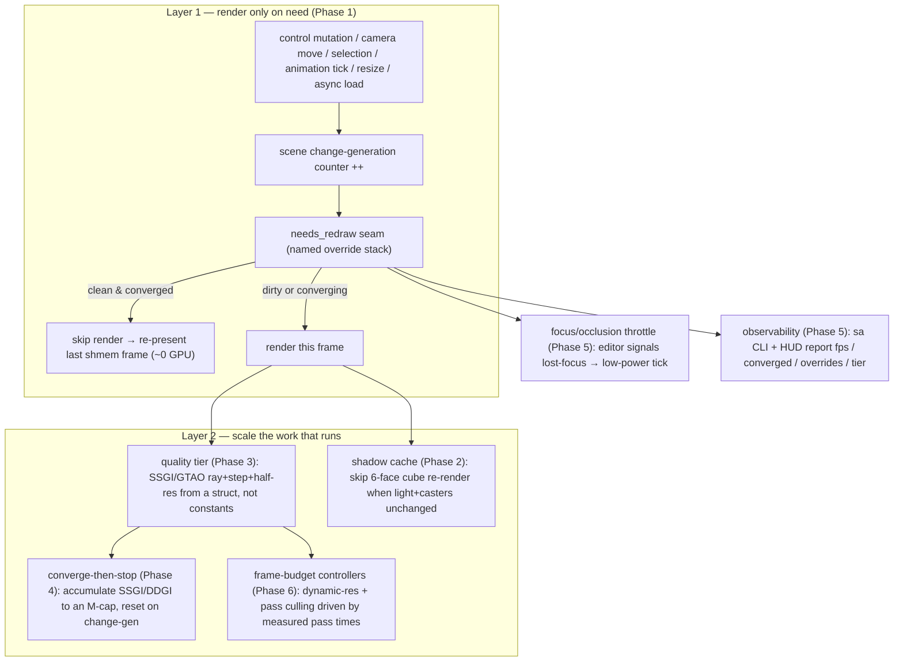

# Rendering performance — reactive idling, shadow caching, quality tiers, converge-then-stop

**Status:** Phase 1 COMPLETED; Phases 2–6 CORE COMPLETE. The headline problem (static scene pinning
the GPU) is fully solved by Phase 1; Phases 2–6 each landed their gate-able, high-value core with the
deeper/visually-unverifiable sub-steps documented as deferred per phase. See each `phase-N-*.md` for
the done/deferred split.

A trivial static scene (one boulder, a commode, ~8 cubes, one point light, 532k tris) pins an RTX
3070 Ti at **100% util, 80 °C, 281 W, ~232 fps**. The diagnosis: the per-frame cost is **~97%
scene-independent** (gbuffer — the actual geometry — is 0.13 ms of a 4.2 ms frame; the rest is the
full-resolution screen-space GI stack run unconditionally every frame), and **nothing throttles the
loop** (the editor host renders offscreen to shared memory with no swapchain, so there is no FIFO
backpressure; the `SAFFRON_MAX_FPS=500` launch cap is unreachable; the `target_fps` in `PerfConfig`
only feeds HUD grading and is wired to nothing in the pacer). The GPU finishes a 4.2 ms frame and
immediately renders the same still image again, forever, at near-max power.

Every mature editor (Unreal, Unity, Godot, Blender, Bevy) avoids this with the **same two-layer
strategy**, and none of it needs a render-graph rewrite:

1. **A dirty / needs-redraw seam** — re-render only when the camera, scene, selection, or an active
   animation actually changes; otherwise re-present the last frame for ~0 GPU.
2. **Scale and amortize the work that does run** — converge-then-stop temporal accumulation, named
   quality tiers instead of hardcoded constants, half-res screen-space GI/AO, per-light shadow caching
   keyed on a dirty flag, and focus/occlusion throttling.

This plan brings both layers to Anima.

## Editor vs exported game — scope, and why this is *not* viewport-only

The runaway **symptom** (uncapped 232 fps free-run) is editor-only: the editor host
(`saffron-host`) renders offscreen and publishes to shared memory with **no swapchain → no vsync**,
while the exported game (`saffron-player`, `engine/crates/player/src/main.rs`) opens a **real window
and presents FIFO** (`rendering/src/swapchain.rs` → `vk::PresentModeKHR::FIFO`), so the OS present
queue caps it at monitor refresh — the free-run literally cannot occur there.

But the per-frame **cost** ships in the game and matters *more* there: a vsync cap stops the runaway,
it does **not** lower per-frame watts, and on weaker target hardware the 4.2 ms GI floor balloons past
the frame budget and the game stutters. So most of this work is **general rendering performance**, not
viewport polish. Each phase below is tagged:

| Tag | Meaning |
|---|---|
| **Editor** | Only the editor host benefits (idle redraw, focus throttle, debug observability). |
| **Game** | Primarily benefits the exported `saffron-player` (graphics-settings tiers, hitting frame budget on weak HW). |
| **Both** | Pure waste removed from, or cost scaled in, every render path. |

## The two-layer strategy, end to end

## Confirmed code seams (verified against the live tree)

| What | File : symbol | Today |
|---|---|---|
| App loop trait | `app/src/lib.rs:FrameHost` (`begin_frame`/`begin_frame_graph`/`end_frame`) | swapchain vs publish split lives behind these |
| Frame step | `app/src/lib.rs:step_frame` | renders unconditionally every call |
| Headless loop | `app/src/lib.rs:drive` | bare `while app.running { step_frame }` |
| Windowed loop | `app/src/lib.rs:about_to_wait` (sets `ControlFlow::Poll`; unconditional `window.request_redraw()`) | no idle, no event-wait |
| Pacer | `app/src/lib.rs:pace_loop` + `max_fps_from_env` | the **only** cap; reads `SAFFRON_MAX_FPS` env, nothing else |
| Editor launch cap | `editor/src-tauri/src/lib.rs` (`SAFFRON_MAX_FPS="500"` when unset) | unreachable on real frame times |
| Perf config | `rendering/src/frame_history.rs:PerfConfig` (`target_fps` default 60, `budget_ms`, clamp 1..10000) | `target_fps` feeds **only** HUD grading |
| Perf commands | `control/src/commands_render.rs` (`get-perf-config`/`set-perf-config`) | set target but it throttles nothing |
| GI toggles | `control/src/commands_render.rs` (`set-ssgi`/`set-ssao`/`set-contact-shadows`/`set-ibl`/`set-clustered`) | binary `{0|1}` only |
| Point shadow | `rendering/src/scene_pass.rs:record_point_shadow` (+ `PointShadowTarget`); `lighting.rs:point_shadow_pending` | re-armed every frame whenever a casting point light exists; 6 faces re-rendered |
| Shadow re-arm | `assets/src/render_scene.rs` (sets `point_shadow_pending`) | unconditional |
| SSGI/GTAO params | `rendering/src/ssao.rs` (ray length / step-count vec4s; hardcoded contact-shadow `0.2 len, 12 steps`); `assets/shaders/ssgi.slang`, `ssgi_blur.slang` | full-res, hardcoded constants |
| SSGI targets | `rendering/src/view_target.rs` | full-resolution allocations |
| DDGI | `rendering/src/ddgi.rs` (rays buffer + trace set) | re-traced each frame |
| Profiler / pass times | `control/src/commands_render.rs` (`profiler.set-mode`); `frame_history.rs` | measured, used only for HUD grading |
| Exported game | `player/src/main.rs:main` (`run(config)`, FIFO present) | inherits all cost; FIFO-capped |

## Phases (dependency-ordered)

| Phase | File | Scope | Depends on |
|---|---|---|---|
| 1 | [`phase-1-reactive-loop.md`](phase-1-reactive-loop.md) | **Editor** (wired cap = Both) | — |
| 2 | [`phase-2-shadow-caching.md`](phase-2-shadow-caching.md) | **Both** | Phase 1 (change-gen signal) |
| 3 | [`phase-3-quality-tiers.md`](phase-3-quality-tiers.md) | **Both / Game-first** | — |
| 4 | [`phase-4-converge-then-stop.md`](phase-4-converge-then-stop.md) | **Editor-mostly / Both** | Phases 1, 3 |
| 5 | [`phase-5-throttle-and-observability.md`](phase-5-throttle-and-observability.md) | **Editor** | Phases 1, 2 |
| 6 | [`phase-6-frame-budget-and-graph.md`](phase-6-frame-budget-and-graph.md) | **Both / Game** | Phase 3 |

**Ordering rationale.** Phase 1 is the root-cause fix and establishes the **one** invalidation signal
(a scene change-generation counter + a named override stack) that Phases 4 and 5 consume — it must land
first or those phases have nothing to gate on. Phase 2 (shadow caching) is independent of the loop work
but uses Phase 1's caster-moved signal as its dirty key, so it follows. Phase 3 (tiers + half-res) is
self-contained and could land in parallel, but Phase 4 (converge-then-stop) consumes both the Phase-1
signal and the Phase-3 tier params, so 3 precedes 4. Phase 5 (throttle + observability) reports and
extends the Phase-1/2 state. Phase 6 (frame-budget controllers + graph culling) consumes Phase-3 tier
targets and is otherwise standalone.

## Locked decisions

- **One invalidation signal, shared by the redraw seam and accumulation.** A single scene
  change-generation counter (bumped by sceneedit mutations, control commands, camera changes, resize,
  and async-load completion) is the dirty source for *both* the Phase-1 redraw skip *and* the Phase-4
  accumulation reset. Two separate signals would desync (accumulation resetting while `needs_redraw`
  thinks it converged, or vice-versa). Build the counter in Phase 1; every later "converged" flag and
  every dirty trigger routes through it.
- **Never hard-stop the loop on idle.** Fully parking the render loop triggers GPU down-clock
  wake-stutter (documented: Godot #11030, Blender 2.8). Idle drops to a low **non-zero** heartbeat tick
  and keeps a ~0.5–1 s keep-warm window at full rate after the last interaction, so the first
  post-interaction frame is not janky. This is a success criterion for Phases 1, 4, 5.
- **NO LEGACY — replace, don't duplicate.** `SAFFRON_MAX_FPS` + `max_fps_from_env` are *deleted* when
  the pacer reads `target_fps` (Phase 1); the binary GI toggle commands are *replaced* by the tier
  command (Phase 3), not left beside it; the per-frame `point_shadow_pending = true` re-arm is *replaced*
  by the dirty-keyed arm (Phase 2). A phase is not done while a superseded path survives.
- **`target_fps` is the single source of truth for pacing.** It already exists in `PerfConfig` and is
  set over the control plane; Phase 1 makes the pacer read it. The HUD grading keeps reading the same
  field — one value, two consumers, not two values.
- **Tiers expand to a param struct; effects read the struct, not constants.** A named tier
  (`EditorIdle`/`EditorInteractive`/`High`/`Play`) plus a `Custom` escape hatch resolves to one
  `RenderQuality` struct of per-effect params (SSGI rays/steps/half-res, GTAO steps, contact-shadow
  steps, TAA on/off, DDGI/ReSTIR budgets). The editor viewport defaults to a cheaper tier than the play
  edge / exported game.
- **Transient aliasing + async compute are explicitly OUT of scope** (see below).

## Out of scope (and why)

**Transient render-graph resource aliasing + async compute** — deferred, *not* part of this plan. The
verified Granite/Maister Vulkan analysis is explicit: aliasing is a **VRAM** optimization that **adds
barriers and can reduce throughput**, fights async-compute overlap, and must never alias history
resources (TAA / temporal SSGI / motion vectors). A static scene is GPU-**time** bound, not VRAM
bound, so aliasing does not touch the heat problem. Async compute (overlapping GI with gbuffer raster)
is also low-value while the frame is serial-bottlenecked (gbuffer 0.13 ms vs ~4 ms GI). These remain
the roadmap's "transient/aliased graph resources + async compute" item; revisit only when VRAM
pressure becomes the real constraint, after Phases 1–6 land.

## Watch-outs (carried from the cross-engine research)

- **GPU down-clock wake-stutter** is real — keep a non-zero idle heartbeat + keep-warm window (locked
  decision above).
- The per-pass timing numbers (SSGI 1.28 ms, GTAO 0.48 ms, point-shadow 0.55 ms, gbuffer 0.13 ms) are
  this session's diagnosis on one GPU — treat them as the **baseline to re-profile after each phase**,
  not fixed constants. `profiler.set-mode timestamps` + `pass-timings` is the measurement path.
- Editor-vs-game tier downgrade (Phase 3) assumes the **play edge can push a higher tier** so
  editing-quality GI does not leak into play, and vice-versa — wire that through the Phase-1 named
  override stack.
- Precedent cvar/API names are illustrative only (we copy mechanisms, not names). Two were caught as
  wrong during research and must not be cited as fact: Unity has no `ClearUnusedGraphResources` (the real
  mechanism is declaring fewer pass inputs so the graph culls), and "UE new scenes default to
  non-realtime" is false (perspective viewports default Realtime ON).

## Keep current (part of "done")

Per AGENTS.md, each phase carries its slice of the keep-current rules:

- **Milestone gate at every phase boundary** — `just engine` then `just prepare-for-commit` (format +
  `cargo clippy -- -D warnings`); fix every warning the change raises. Gate your own slice in isolation
  via a private `CARGO_TARGET_DIR` when another agent's in-flight change is the only cause of a failure.
- **`sa` CLI / control command per drivable-state phase** — Phase 1 extends `set-perf-config` and adds
  an invalidate/redraw-state command; Phase 3 replaces the binary toggles with a tier command; Phase 5
  adds the idle/converged/override readouts. Each lands its command in the same change so the running
  editor stays scriptable and shell-debuggable. The e2e suite asserts the viewport goes GPU-quiet when
  static and re-arms on edit.
- **`docs/` per concept phase** — the idle/reactive loop, the quality-tier model, and shadow caching are
  new engine concepts; each adds/updates its explanation page under `docs/content/explanations/` and the
  hub `_index.md` row in the same change.
