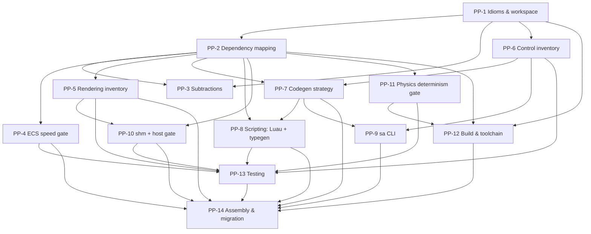

# Rust rewrite — pre-planning

**Status:** IN PROGRESS (pre-planning)

This is the **plan for the plan**. It does not design the port itself; it lays out the sequence of
investigation/design phases ("pre-plans", `PP-N`) that, executed in order, produce the real,
decision-locked implementation plan as a folder of numbered phase files under
[`plans/rust-rewrite/`](./rust-rewrite/). It is grounded in the
[feasibility study](./rust-rewrite-feasibility.md) (a 32-agent analysis of the current C++26 tree),
whose verdict the project has accepted: a faithful idiomatic-Rust rewrite is feasible, neither hard
constraint (ECS iteration speed, cross-platform-deterministic physics) is a blocker, and the real
payoff is **toolchain simplicity + memory safety + a unified Rust/Tauri stack**, not new capability.

Two scopes, do not conflate them:

- **Pre-planning (this document).** Research + decide + write. Produces design artifacts and the
  `plans/rust-rewrite/` phase files. Touches **no engine source**.
- **The final plan (`plans/rust-rewrite/`).** The phase files this pre-planning emits. Each carries
  its own `**Status:**` and the concrete, file-grounded edits — the thing an implementer executes.

Nothing here writes Rust yet. The first line of actual Rust is written when a `plans/rust-rewrite/`
phase file says so.

---

## 0. Locked decisions (the ground rules every pre-plan inherits)

These are settled by the feasibility study and the project's standing conventions. A pre-plan may
refine *how*, never re-litigate *whether*.

- **Purely idiomatic Rust. The Go-flavored `CONVENTIONS.md` is retired wholesale.** No carrying the
  free-function-over-method or `Result<T,String>`-everywhere habits across just because they exist
  today. We follow Rust norms: methods where they read well, `thiserror`/typed errors where a string
  is too lossy, iterators/closures, trait objects, `enum` sum types, RAII via `Drop`. The output reads
  like Rust written by a Rust author, not C++ transliterated.
- **Borrow-checker-clean, low coupling, no `unsafe` outside the FFI/ABI seams.** `unsafe` is confined
  to the three places it is unavoidable — `ash` handle calls, the Jolt `cxx` bridge, and the shm
  ring — each wrapped in a safe, tested boundary. The two C++ aggregates that fight ownership (the
  ~80-field `Renderer`, the `host.cppm` shared-closure soup) are **re-architected**, not transcribed.
- **NO LEGACY. NO COMPAT SHIMS.** The project rule applies to the rewrite recursively: one way to do
  each thing, one code path, no "additive for now." The C++ tree is the reference, not a thing to keep
  alive. There is no in-process C-ABI bridge to the old engine (rejected in the feasibility study).
- **Equal-or-better runtime speed is a requirement, proven by benchmark, not assumed.** The ECS
  iteration path and the physics step are the two that must be measured against the current build
  before their phases are declared done.
- **The wire contracts are frozen and the editor is not rewritten.** The Rust engine must byte-match
  the JSON-over-unix-socket control envelope and the POSIX-shm BGRA8 frame ring so the existing
  Tauri/React editor (frontend **and** the already-Rust `editor/src-tauri/`) runs unchanged. The only
  editor-adjacent change is re-pointing the protocol generator at Rust DTOs.
- **Two-process architecture is kept** (engine binary + editor process, glued by the shm ring and the
  control socket). Not collapsed into the Tauri process.
- **Cargo replaces the entire CMake + C++26-modules + `import std` + BMI-matching + two-ninja-`.pcm`
  apparatus.** This deletion is the headline motivation. What stays container-bound: the
  `saffron-build` toolbox (Vulkan SDK, `slangc`, SDL3 substrate, headless weston), `slangc` shader
  compilation (driven from `build.rs`/`xtask`), the Jolt determinism build flags, and the
  no-GitHub-hosted-CI / self-hosted-runner constraint.
- **No in-engine `self-test` functions survive.** Every current self-test (e.g. the ~430-line
  animation self-test) is replaced by real Rust `#[test]` units and/or wire-driven e2e — never a
  function the engine runs against itself at startup.
- **Greenfield parallel binary, executed as one linear sequence.** The Rust engine is built in its own
  crates alongside the still-shipping C++ `SaffronAnima`; nothing flips until the final cutover. So at
  the end of *every* implementation phase the Cargo workspace compiles and the test gate for everything
  built so far passes — even while the engine is functionally incomplete. The final plan is therefore a
  **single, totally-ordered sequence** of phases (each with an explicit `Depends on` + an acceptance
  gate), executed top-to-bottom, **not** a set of independently-scheduled per-area tracks.
- **The tree already states the intent: `engine-old/` (C++) beside `engine/` (Rust).** As initial
  setup, the C++26 tree was relocated to `engine-old/` and a placeholder Cargo workspace initialized at
  `engine/`, so the directory layout itself signals the rewrite. `engine-old/` is **reference-only** —
  deleted after cutover (NO LEGACY) — and nothing in `engine/` depends on it; PP-1 scaffolds the real
  crate graph into `engine/`, superseding the placeholder. Consequence to handle: the move breaks the
  C++ build/tooling references that point at `engine/` (`add_subdirectory(engine)` in the root
  `CMakeLists.txt`; the `gen.ts`, `check-script-defs`, `tools/ci/check.sh`, `check-projects`, and
  `Makefile` clang-tidy paths). Keeping the C++ engine buildable until cutover (the migration strategy)
  means repointing those to `engine-old/`; if instead the C++ build is parked in this worktree, that is
  stated explicitly. Either way it is decided before PP-14 assembly, not left silently broken.
- **Scripting moves to typed Luau, and the Lua-facing type surface is a generated artifact.** The
  rewrite adopts **Luau** (via `mlua`'s `luau` feature) for its gradual type system — settling the
  existing `todo.md` intent. The typed API surface (`sa.*` definitions / stubs) is **generated from the
  Rust binding definitions**, the same single-source-of-truth pattern as `@saffron/protocol` from the
  DTOs: one Rust source both registers the bindings with the VM and emits the Luau type definitions.
  This **deletes** the hand-written `library/sa.lua` overlay and its drift tripwire entirely (NO
  LEGACY — one source, no hand-synced second copy). All Lua-facing *type* artifacts are build outputs,
  never hand-edited; only gameplay scripts are author-written, and they type-check against the
  generated defs.

---

## 1. How pre-planning works

Each `PP-N` below is a self-contained investigation with a fixed template:

- **Goal** — the decision(s) it locks.
- **Key questions** — what must be answered to lock them.
- **Deliverables → final plan** — the concrete artifacts it writes, including *which* phase files /
  area folders under `plans/rust-rewrite/` it seeds.
- **Depends on** — which pre-plans must finish first.
- **Done when** — the binary completion test.

**Execution.** The heavy inventory and research pre-plans (`PP-2`, `PP-4`, `PP-5`, `PP-6`) will be run
as multi-agent workflows — parallel readers over the C++ tree producing structured catalogs, then a
synthesis pass — because they are exhaustive enumeration tasks where fan-out pays. The design/decision
pre-plans (`PP-1`, `PP-3`, `PP-7`, `PP-8`, `PP-14`) are authored directly. The spike pre-plans (`PP-4`
bench, `PP-10` shm, `PP-11` determinism) end in **runnable code that proves a number**, not prose.

**Gates.** Three pre-plans are go/no-go gates that must pass before the bulk of the implementation plan
is committed to (they mirror the feasibility study's spike sequence):

1. **`PP-11` physics determinism** — bit-exact Jolt traces across x86/ARM through the new FFI bridge.
   If this fails, the lockstep-netcode premise collapses and the whole effort is reconsidered.
2. **`PP-4` ECS speed** — per-frame iteration within ~10% of the current entt build.
3. **`PP-10` renderer/shm bring-up** — a validation-clean offscreen frame shown live in the *unchanged*
   editor via the byte-compatible shm ring.

**Two different graphs — do not confuse them.** The pre-plans above form a *research DAG* run in waves
(§4): several proceed in parallel because investigation has no build constraint. The **implementation**
phases they emit are a different shape — a *single linear sequence* where each phase compiles and
passes its tests on top of only its predecessors. PP-5 and PP-6 each emit many implementation phases,
and in the real build order those **interleave** with phases from other areas (you cannot build
rendering before scene/host exist, nor the render passes before the render graph). Linearizing all
per-area phases into that one ordered, dependency-correct sequence — and proving no phase depends on a
later one — is precisely the job of **PP-14** (see §2 and PP-14). Executing the pre-plans in their own
order does **not** yield the implementation order.

---

## 2. Target structure of the final plan

`plans/rust-rewrite/` is grouped into numbered **area folders** (the rewrite is far too large for the
repo's usual flat layout). Each area folder has its own `README.md` (the locked design for that area)
plus `phase-N-name.md` files following the existing repo convention (descriptive names, per-file
`**Status:**`, a "Why this shape (NO LEGACY)" section, and a "Grounding (real files/symbols)" section)
— and, new for this plan, an explicit `**Depends on:**` line plus an `**Acceptance gate:**` block (the
workspace compiles + the named tests pass + any feature-specific check). The gate is what makes the
global sequence *verifiably* linear: a phase is done only when its gate is green on top of its
predecessors alone.

Proposed layout — **confirmable; this is the default I will build toward**:

```
plans/rust-rewrite/
  README.md                      master index + migration strategy + go/no-go gates + crate graph
  00-foundations/                workspace, conventions, idiom rules, core/signal/json crates (scaffolds engine/, supersedes the placeholder)
  01-build-and-toolchain/        Cargo workspace, slangc via build.rs/xtask, justfile, toolbox role, cxx build
  02-math-and-geometry/          glam adoption, .smesh/.sanim/.smodel byte formats, gltf/obj/image import
  03-ecs-and-scene/              ECS crate, scene world, component registry, JSON project serde
  04-animation/                  pose/clip/sampler, player runtime, IK, skinning prepass interface
  05-physics-jolt-bridge/        cxx/JoltC bridge, determinism build, missing-coverage shim, gameplay layer
  06-rendering/                  ash bring-up, render graph, every render feature (subdivided)
  07-assets-and-materials/       catalog, .smat, node-graph→slang codegen, thumbnails, renderScene
  08-host-and-viewport/          run loop, Layer model, offscreen/headless, shm publisher, native overlay
  09-control-plane/              DTOs, serde/codegen, socket server, every command (subdivided)
  10-protocol-codegen/           schemars + ts-rs + OpenRPC/manifest emitter → @saffron/protocol
  11-sa-cli/                     native Rust clap CLI over the socket
  12-scripting/                  Luau via mlua, declarative binding layer, generated .luau type defs, session guard, sandbox
  13-testing-and-verification/   unit + e2e + validation/contract/determinism gates, self-test removal
  14-migration-and-cutover/      leaf-up order, binary-boundary flip, parity sign-off
```

Note the divergence from the engine's 15-module DAG: rendering and control are large enough to
sub-divide into multiple phase files inside their area folder; protocol-codegen and testing are pulled
out as first-class cross-cutting areas because they touch everything.

**The area folders are navigation, not execution order.** The thing you execute is the **master
ordered index** in `plans/rust-rewrite/README.md`: a single numbered list that linearizes every phase
across all folders in dependency order, each annotated with its `Depends on` and its acceptance gate.
The real execution order is *leaf-up*, not folder-by-folder, and three things shape it:

- **Foundations + build are one block, first** (`00`+`01`): nothing compiles until the workspace and
  the `slangc`/`cxx` build scripts exist, so they precede all subsystem work.
- **A "walking skeleton" milestone lands early** — right after ECS/scene (`03`): the engine boots
  headless, publishes a blank shm frame the *real* editor displays, and answers a control `ping`. Every
  later phase fleshes out this runnable spine while keeping it runnable end-to-end.
- **Testing is woven in, not trailing.** `13-testing-and-verification/` holds the test *harness +
  strategy*, built early in the foundations block; each feature phase then carries its own unit/e2e
  tests as part of its acceptance gate. That folder's high number is topical, not temporal.

---

## 3. The pre-planning phases

### PP-1 — Idioms, conventions & workspace architecture

**Goal.** Lock the Rust house style and the physical shape of the codebase, so every later phase ports
into a known structure with known idioms. Replaces the Go-flavored `CONVENTIONS.md` entirely.

**Key questions.**
- Workspace crate graph: one crate per current module, or coarser? (Cargo build-unit granularity vs the
  15-module DAG; what becomes a `lib` crate, what becomes the engine `bin`, where the FFI shims live.)
  Map the existing `Saffron.<Area>` DAG (leaves: Core, Signal, Json; apex: Host) onto a Cargo
  workspace and decide the crate boundaries that give low coupling + fast incremental builds. (The
  placeholder `engine/Cargo.toml` + empty `engine/crates/` created during setup are rewritten by this
  design — the C++ reference is in `engine-old/`.)
- The idiom translation table, decided once and applied everywhere:
  `Result<T,std::string>`+`Err()` → typed errors (`thiserror`) vs `anyhow` vs `Result<T,String>`, and
  the `?` policy; `Ref<T>=shared_ptr` → `Arc<T>` vs `Arc<Mutex/RwLock>` vs `Rc<RefCell>` (the
  shared-mutable decision policy — this cascades through ~20 modules); move-only RAII → `Drop`; the
  `std::function` itables (`ComponentTraits`, `CommandTraits`, the `Layer` closure struct) → trait
  objects vs fn-pointer tables vs enums; `std::variant` → `enum`; `SubscriberList<Args...>` → an events
  crate vs a ~50-line hand-roll preserving stop-propagation + re-entrant snapshot.
- File-system conventions: module file naming, where tests live (`#[cfg(test)]` inline vs `tests/`),
  where build scripts and generated code go, naming (`snake_case` files, idiomatic Rust type/fn case —
  the engine's `camelCase` functions become `snake_case`).
- The borrow-checker strategy for the two known-hard aggregates (Renderer, host) stated as a principle
  here, detailed in their own areas.

**Deliverables → final plan.** `00-foundations/README.md` (the new conventions doc + workspace design)
and `00-foundations/phase-*.md` for the `core`/`signal`/`json` crate ports. The idiom table is
referenced by every other area.

**Depends on.** — (root).

**Done when.** The workspace skeleton (crate graph, empty crates that compile) is designed on paper and
the idiom/ownership rules are written such that a reviewer can predict how any C++ construct ports.

---

### PP-2 — Dependency adoption & mapping

**Goal.** For every chosen crate, pin a version, prototype the integration shape, and map the current
C++ constructs onto its API — surfacing every gap that needs hand-rolling.

**Key questions.**
- Per dependency from the [replacement matrix](./rust-rewrite-feasibility.md#5-dependency-replacement-matrix),
  confirm the pick and prototype its smallest real use: `ash` (+ Vulkan 1.4 / 0.38→0.39 risk),
  allocator (`vk-mem-rs` real-VMA vs `gpu-allocator` pure-Rust — decide on the budget/telemetry/defrag
  surface), `winit` + `raw-window-handle` (vs `sdl3` crate), the ECS crate (deferred to `PP-4`),
  `mlua` (+ the Lua 5.5 vs **Luau** question — see Open Decisions; the editor todo already wants Luau,
  and mlua supports it), `glam` (xyzw quaternion, no global `DEPTH_ZERO_TO_ONE`), `serde`/`serde_json`/
  `serde_with`/`schemars`/`ts-rs`, `cxx` + vendored Jolt (deferred to `PP-11`), `gltf`/`tobj`/`image`/
  `resvg`, `clap`, `nix`/`rustix`, `bytemuck`.
- Where each crate is a behavioral 1:1 vs where it diverges and the divergence must be hand-bridged
  (e.g. the `gltf` crate's index-only API vs `cgltf_node_transform_world`; `image` pure-Rust decode vs
  stb bit-parity for existing texture hashes; no Rust `vk-bootstrap` → hand-roll the feature-probe
  chain).
- Version-churn risk register (ash 0.38→0.39 mid-port, `vk-mem` lag, `mlua` `lua55` recency).

**Deliverables → final plan.** A `dependency-adoption.md` annex in `00-foundations/`, plus the
crate-pin list that `01-build-and-toolchain/` consumes. Per-crate mapping notes seed the relevant area
READMEs.

**Depends on.** PP-1 (workspace shape).

**Done when.** Every dependency has a pinned version, a one-paragraph integration verdict, and an
explicit list of "what this crate does NOT cover, which we hand-roll."

---

### PP-3 — Subtractions: what disappears or collapses

**Goal.** Enumerate everything the Rust port *deletes* or *simplifies*, so the plan's scope is honestly
smaller than a naive 1:1 and reviewers know what NOT to look for.

**Key questions.**
- Build/toolchain liabilities that vanish: the experimental CMake `import std` UUID gate,
  `CXX_MODULE_STD`, gnu++26 BMI matching, the `-pthread`/`-mavx2` isolation on `physics.cpp`, the
  two-ninja `.pcm` Bus-error race, `CMakePresets`, `FetchContent`.
- Generated/hand-rolled code that collapses to derives: the two `*.generated.cpp` serde files
  (~5.7k LOC), the `gen.ts` regex parser (3.5k LOC), the per-enum three-table hand-sync, the
  four-place scene-component registration.
- Idiom ceremony that evaporates: `JSON_NOEXCEPTION` abort firewall (serde returns `Result`), the
  check-`Result`-immediately discipline (`?`), the physics `pimpl` (module privacy is free), the manual
  move-only boilerplate, the hand-written vtable structs.
- Rust-specific non-needs: no manual `waitGpuIdle`-before-teardown ordering hacks once `Drop` order is
  designed; no `Ref`-drop-in-`onExit` choreography.
- The flip side — what Rust *forces us to add*: `Arc<Mutex>` at shared-mutable sites, scoped session
  guards for borrowed pointers (script `currentScene`), explicit `Drop` ordering for GPU resources.

**Deliverables → final plan.** A "subtractions ledger" section in `plans/rust-rewrite/README.md` and
inputs to `01-build-and-toolchain/` and `10-protocol-codegen/`.

**Depends on.** PP-1, PP-2.

**Done when.** The ledger lists every removed/collapsed artifact with its LOC and its Rust replacement
(or "deleted, no replacement").

---

### PP-4 — ECS selection & speed gate **(go/no-go)**

**Goal.** Pick the ECS crate and *prove* it matches entt on this engine's real access patterns.

**Key questions.**
- `bevy_ecs` (standalone, archetype + per-component `SparseSet` storage knob) vs `hecs` (minimal,
  closest 1:1 to the `forEach` idiom). Decide on fit, not folklore. Reject `flecs_ecs` (alpha,
  soundness hole) and `legion` (unmaintained); writing our own stays off the table unless the
  benchmark forces it.
- Map the *actual, tiny* entt surface the engine uses (one `registry.view<C...>` site in `forEach`,
  one `registry.storage()` walk in `serializeEntity`, generational handles, `emplace_or_replace`/
  `all_of`/`try_get`, `type_hash` joins — **no** groups/signals/observer/snapshot) onto the chosen
  crate, including the play-mode JSON-roundtrip duplicate (not a `World::clone`) and the component
  registry that drives serde.
- **The benchmark (this is the gate).** Port `forEach<C...>` + a representative few-thousand-entity
  scene and measure: per-frame iteration (transform sync, draw enumeration, light gather) **and** the
  structural paths (`enterPlay`, `relinkHierarchy`, per-frame `PoseOverrideComponent` churn) against
  the current entt build.

**Deliverables → final plan.** `03-ecs-and-scene/README.md` (ECS decision + the scene/registry design)
and a `bench/` harness spec. The benchmark itself is runnable code committed under the spike.

**Depends on.** PP-1, PP-2.

**Done when.** A crate is chosen *with* benchmark numbers showing per-frame iteration within ~10% of
entt (and structural paths acceptable). If not, escalate per the gate.

---

### PP-5 — Rendering feature inventory & port specs

**Goal.** Produce an exhaustive, file-grounded catalog of every rendering feature and render-graph pass,
each with a port spec, so `06-rendering/` can be sub-divided into well-bounded phases.

**Key questions.**
- Enumerate every feature in the ~16.5k-LOC renderer: forward+ clustered lighting, IBL, all shadow
  types (directional/spot/point/contact/ray-traced), DDGI + voxel GI + SSGI + ReSTIR, GTAO, TAA,
  motion vectors, tonemap, MSAA/FXAA, bindless, instancing, the übershader/PSO cache, RT pipelines +
  skinned-BLAS rebuild. For each: inputs, GPU resources, the render-graph passes + their declared
  `RgUsage`, the Slang shaders, and an acceptance test (golden image / validation-clean / known
  metric).
- The render-graph barrier-derivation engine (`RgUsage` → barriers/layout transitions) — spec it as a
  standalone portable unit, since it is the silent-failure heart.
- The std430 GPU-layout contracts (hashed by raw bytes for material dedup) and the `#[repr(C)]` +
  `bytemuck` + size-assert strategy; the `glam::Vec3` (12B) vs `Vec3A` (16B) pin.
- The Renderer-aggregate re-architecture: how the ~80-field by-reference god-struct splits into
  borrow-checker-legal sub-state (the design that lets per-frame code hold `&mut` to a sub-target while
  siblings mutate).

**Deliverables → final plan.** `06-rendering/README.md` (the locked render design + the aggregate
split) and the per-feature `phase-*.md` skeletons. A rendering feature matrix (feature → passes →
shaders → acceptance test).

**Depends on.** PP-2 (ash/allocator), PP-1.

**Done when.** Every render feature present in the C++ tree appears in the matrix with a port spec and
an acceptance test; no feature is unaccounted for.

---

### PP-6 — Control-plane & command inventory

**Goal.** Catalog every control command and DTO, so `09-control-plane/` is sub-dividable and nothing in
the wire surface is dropped.

**Key questions.**
- Enumerate all ~142 command handlers across the `control_commands_*.cpp` files (animation, asset,
  scene, render, physics) with their params/results, and the full DTO set in `control_dto.cppm`.
- The `EngineContext` coupling (live refs into six subsystems) — document exactly what each handler
  reaches into, since control ports **last** over already-Rust subsystems.
- The socket server model: synchronous, single-threaded, drain-once-per-frame, newline-framed, 5s
  reply budget, `MSG_NOSIGNAL` — confirm it ports 1:1 over `nix` with **no tokio**.
- The load-bearing wire details that fail silently: decimal-string-u64 ids (`assertRawU64`), the
  lenient `*Or` readers, the envelope shape.

**Deliverables → final plan.** `09-control-plane/README.md` + per-domain `phase-*.md` skeletons, plus
the command/DTO catalog that feeds `PP-7` (codegen) and `PP-9` (sa-cli) and `PP-13` (e2e fixtures).

**Depends on.** PP-1.

**Done when.** Every command and DTO is catalogued with params/results, EngineContext reach, and the
wire-encoding notes; the catalog cross-checks against `schemas/control/` and the e2e fixtures.

---

### PP-7 — Reflection & codegen strategy

**Goal.** Decide how Rust's derive ecosystem replaces the hand-rolled C++ codegen (`gen.ts` + the two
`*.generated.cpp`), and what — if anything — still needs a generator.

**Key questions.**
- Clarify the premise: Rust has **no runtime reflection**, but `derive` macros + `serde` + `schemars`
  + `ts-rs` give compile-time generation that subsumes everything `gen.ts` did. Frame the strategy
  around that, not around a reflection API that doesn't exist.
- DTOs as the single source of truth: Rust structs deriving `serde` + `schemars` (JSON Schema draft
  2020-12, with `preserve_order` for arg order) + `ts-rs` (the `@saffron/protocol` TS types). The
  `Uuid(u64)` newtype with `serde_with::PickFirst<(DisplayFromStr, _)>` to reproduce decimal-string
  emit / string-or-number accept exactly.
- The thin emitters that have no good crate: OpenRPC (`typed-openrpc` is too early — hand-roll ~100
  lines over schemars fragments) and the command manifest.
- The scene **component registry** codegen (currently `scene_component_serde.generated.cpp`): replace
  with a derive + a registration macro/inventory so adding a component touches one place.
- Where generation runs: `build.rs` vs a `proc-macro` crate vs an `xtask` invoked by the protocol
  build — and how the editor's `bun run check` re-points to it.
- The **same "Rust types → generated typed external surface" discipline** is reused by `PP-8` to emit
  the Luau type definitions from the script-binding source; settle here whether the codegen
  infrastructure (the export-tool/xtask skeleton) is shared between the two emitters or kept separate.

**Deliverables → final plan.** `10-protocol-codegen/README.md` + phases for the DTO crate, the
schemars/ts-rs export tool, the OpenRPC/manifest emitter, and the component-registry macro.

**Depends on.** PP-2 (serde/schemars/ts-rs), PP-6 (the DTO/command catalog).

**Done when.** A design exists that regenerates `@saffron/protocol`, the OpenRPC doc, and the manifest
byte-equivalently to today's output from Rust DTOs, with the editor needing zero frontend changes.

---

### PP-8 — Scripting: typed Luau bindings & generated type artifacts

**Goal.** Lock the scripting VM as **Luau via `mlua`** and design the binding surface so the Lua-facing
*type* surface is a **generated artifact** from the Rust binding definitions — eliminating the
hand-written `library/sa.lua` overlay and its drift tripwire. Design the runtime port of
`Saffron.Script` (~1.95k LOC).

**Key questions.**
- **Luau confirmation.** `mlua`'s `luau` feature gives the gradual type system the `todo.md` wants.
  Confirm parity with what stock Lua 5.5 provided and the upgrades: Luau's built-in sandboxing
  (`Lua::sandbox`), determinism (Luau is deterministic — relevant to the lockstep premise), the
  instruction-budget/interrupt hook, and perf. Note any binding-DSL differences from the current
  LuaBridge3 surface.
- **The single-source binding + typegen layer (the core of "Lua as artifacts").** Design one Rust
  source of truth that BOTH registers the `sa.*` API with the VM AND emits the Luau type definitions
  (`.d.luau` / LuaLS-compatible defs). Decide the mechanism: a `proc-macro`/`derive` over the binding
  impls, or a declarative registry of typed descriptors. **Re-evaluate the declarative-table approach
  the C++ plan rejected** — that rejection was LuaBridge3-specific (functions registered by *deduced
  C++ type* forced raw `lua_CFunction` thunks); `mlua`'s trait-based `IntoLua`/`FromLua` changes the
  calculus, so the single-source generator that was "strictly worse" in C++ may be the right shape in
  Rust. This decides whether the drift tripwire disappears (replaced by a "generated defs are
  up-to-date" check) entirely.
- **Runtime port.** `ScriptComponent` slots, script-declared fields + overrides + the Inspector UI
  contract, the `sa.raycast` host-callback POD bridge, the contact-event ring to scripts, the
  `SchedulerPrelude` (verbatim Luau, installed onto a read-only `sa` table), the sandbox, and the
  **scoped session guard** that re-encodes the borrowed-pointer invariant (`currentScene` non-null only
  inside a callback) — the part Rust *adds*.
- **Module-boundary constraint preserved.** `Saffron.Script` must not depend on physics/animation
  directly; the host-callback POD bridge stays the seam (maps to a Rust trait the host implements).
- **`check-script-defs` fate.** The drift tripwire is obsolete once defs are generated from the single
  source; repurpose it as a regen-freshness check or delete it.

**Deliverables → final plan.** `12-scripting/README.md` + phases (Luau/mlua VM bring-up + sandbox; the
declarative binding + Luau-typegen layer; the runtime/component/scheduler port; the session guard +
host-callback bridge). Plus the typegen tool, sharing `PP-7`'s codegen skeleton if PP-7 decides so.

**Depends on.** PP-1 (idioms), PP-2 (mlua/Luau pick), PP-7 (the shared typegen discipline).

**Done when.** Luau is locked; the binding layer is designed such that one Rust source emits both the
VM registration and the Luau type defs; the hand-written overlay + tripwire are slated for deletion;
and the runtime/component port is specified against real `Saffron.Script` symbols.

---

### PP-9 — `sa` CLI native rewrite

**Goal.** Design the `sa` control CLI as a native Rust binary with proper command parsing, replacing
the C++ `tools/sa`.

**Key questions.**
- `clap` (derive) command tree mirroring the control commands, sharing the DTO/protocol crate from
  `PP-7` so the CLI and engine never drift; help/usage/completions for free.
- The socket client (connect, send envelope, await reply, render result), reusing the same framing as
  the server; pretty vs raw JSON output; exit codes.
- Keep it host-runnable (the toolbox lore: `sa` runs on the host, not only in the toolbox) and
  engine-dependency-free (it links only the protocol crate, not the engine).

**Deliverables → final plan.** `11-sa-cli/README.md` + phases for the CLI crate.

**Depends on.** PP-7 (protocol crate), PP-6 (command catalog).

**Done when.** The CLI's command tree is fully specified against the command catalog, with the shared
protocol crate as its only engine-side coupling.

---

### PP-10 — Viewport shm transport & host bring-up **(go/no-go)**

**Goal.** Design (and spike) the Rust frame transport and the engine lifecycle, byte-compatible with
the existing editor.

**Key questions.**
- The shm publisher: reproduce the POSIX-shm seqlock ring exactly (`rustix`/`memfd` for
  `shm_open`/`mmap`, `std::sync::atomic::fence(Release)` ordering, the header/ring byte layout, BGRA8
  byte order). The already-Rust `editor/src-tauri/src/wayland_viewport.rs` reader is the **byte-exact
  oracle** — validate frame-by-frame against it.
- Offscreen/headless rendering: in editor mode create a **headless** Vulkan instance (select device by
  feature, not surface) — the window is never presented; a real `winit` window only exists for the
  standalone present-only host.
- The lifecycle: port `run(config)` (poll → onUpdate → beginFrame → onRender → beginFrameGraph →
  onRenderGraph → endFrame → present) and the `Layer` = struct-of-closures model into idiomatic Rust
  (trait objects vs an enum of layer kinds — resolve against PP-1).
- The control-socket framing wiring (the host serves the control plane); teardown order (device before
  allocator; the `Drop` graph).
- The native gizmo overlay (`OverlayVertex`/`buildNativeGizmo`, ~900 lines of CPU geometry) — port plan.

**Deliverables → final plan.** `08-host-and-viewport/README.md` + phases (transport, headless instance,
run loop/Layer, overlay, teardown). A shm ABI document. A runnable producer that the existing reader
accepts.

**Depends on.** PP-2 (ash/winit), PP-5 (renderer interface), PP-1.

**Done when.** A Rust producer publishes frames the unchanged `wayland_viewport.rs` reader displays
correctly (the spike), and the host lifecycle is fully specified.

---

### PP-11 — Physics determinism & Jolt FFI bridge **(go/no-go)**

**Goal.** Design (and spike) the Jolt `cxx` bridge and *prove* cross-machine bit-exactness survives the
rebind. This is the highest-risk gate.

**Key questions.**
- The `cxx`/JoltC bridge to **vendored Jolt 5.3.0** (not the published crates, which pin 5.0.0 and lack
  CharacterVirtual/Ragdoll/Skeleton/SwingTwist+motors/RotatedTranslatedShape/ExtendedUpdate). Build it
  from `cxx-build`/`build.rs` with `JPH_CROSS_PLATFORM_DETERMINISTIC` + single precision +
  `-ffp-model=precise` + confined `-mavx2` re-applied to the Jolt + shim TUs.
- The C++-side shim classes `cxx` can't synthesize (virtual subclasses): `ContactListener`, the
  object-layer/broadphase filter interfaces — with Rust callbacks routed through them.
- Port the orchestration 1:1 in Rust: fixed-step, the rigidbody/collider split + 5 shapes + auto-fit,
  sensors/triggers, the contact-event ring, kinematic bone-following, the `CharacterVirtual`
  controller, the motor-driven SwingTwist ragdoll with the `PoseBuffer` override/weight blend
  (passive/active/partial). `glam`'s xyzw quaternion deletes the GLM-wxyz swizzle.
- **The determinism gate:** run a fixed stacking + ragdoll scenario through both the C++ engine and the
  Rust bridge and diff sim traces for bit-exactness across x86 **and** ARM, *before* any gameplay
  ports onto it. Wire it as a blocking CI test.

**Deliverables → final plan.** `05-physics-jolt-bridge/README.md` + phases (build/bridge, the filter
shims, the gameplay/orchestration layer, the ragdoll/character layer, the determinism gate). A
determinism test plan.

**Depends on.** PP-2, PP-1.

**Done when.** Bit-identical traces across x86/ARM through the bridge, with CharacterVirtual + a
motor-driven ragdoll working. Failure escalates per the gate.

---

### PP-12 — Build, toolchain & shader pipeline

**Goal.** Design the Cargo workspace build and everything the toolbox must still provide.

**Key questions.**
- The Cargo workspace structure (from PP-1's crate graph), profiles (debug/release), and how it
  subsumes CMake/FetchContent/presets.
- Shader compilation: `slangc` has no Cargo home — drive it from `build.rs`/`xtask`, hand-porting the
  40-shader fan-out **and** the `lighting.slang` module-precompile trick, with staleness tracking.
  (Reject the immature `shader-slang`/`shaderc` crates.)
- The Jolt/`cxx` build integration with its determinism flags (from PP-11) living in `build.rs`.
- The toolbox's continued role (Vulkan SDK, SDL3, weston) and the `make check` gate → a `justfile`
  carrying the Makefile lore verbatim (NVIDIA ICD `VK_ADD_DRIVER_FILES`, `WEBVIEW_HW`, host-runnable
  `sa`, headless run env). No GitHub-hosted CI; the self-hosted runner stays.

**Deliverables → final plan.** `01-build-and-toolchain/README.md` + phases (workspace + profiles,
shader build, FFI build integration, justfile + toolbox, the reproducible gate).

**Depends on.** PP-1, PP-2, PP-11 (Jolt build flags).

**Done when.** A build design exists where `cargo build` + the shader/`cxx` build scripts produce the
engine binary inside the toolbox, and the `make check`-equivalent gate is specified end to end.

---

### PP-13 — Verification strategy: unit + e2e, no self-tests

**Goal.** Define the test architecture that proves the port is complete and correct — built on real
test harnesses, never in-engine self-test functions.

**Key questions.**
- **Unit tests:** what goes inline `#[cfg(test)]` vs `tests/` integration; coverage targets for the
  pure-CPU subsystems (math, geometry, animation sampling/IK, scene serde, DTO round-trips).
- **The self-test removal:** map every existing in-engine self-test (the ~430-line animation self-test
  is the oracle to port *into* `#[test]`s; any others found in PP-5/PP-6) to its Rust unit/e2e
  replacement. The animation self-test becomes the IK/sampling test oracle, not a runtime function.
- **E2e:** the current `tests/e2e` (bun, drives a headless engine over the wire via `@saffron/protocol`)
  — keep it as-is (it is language-agnostic by design and validates the frozen wire) or re-home it; it
  becomes the cross-engine parity harness. Plus a Rust-side e2e option.
- **The standing gates, reproduced as first-class deliverables:** validation-layer-clean log,
  the `check-control-schema` contract test (decimal-string-u64), the determinism gate (PP-11), golden/
  snapshot tests for the byte-exact formats (`.smesh`/`.smat`/`.sanim`, std430 layouts, the shm ABI).
- **Parity testing:** how we assert the Rust engine matches the C++ engine where it must (golden
  images, sim traces, serde byte-equality) during the cutover.

**Deliverables → final plan.** `13-testing-and-verification/README.md` + phases (unit coverage per
area, e2e harness, the gates, parity/golden infrastructure, self-test removal ledger).

**Depends on.** PP-4, PP-5, PP-6, PP-8, PP-10, PP-11 (each contributes the acceptance tests its
features need).

**Done when.** Every subsystem has a named test strategy, every current self-test has a mapped
replacement, and the four gates (validation, contract, determinism, parity) are specified.

---

### PP-14 — Migration sequencing & final-plan assembly

**Goal.** Tie the pre-plans together into the executable plan: the implementation order, the cutover
mechanism, and the assembly of `plans/rust-rewrite/`.

**Key questions.**
- **Linearize the per-area phase DAG into one master ordered sequence.** Collect every phase every
  pre-plan emitted, resolve their `Depends on` edges, topologically sort into a single numbered list,
  and **verify** no phase depends on a later one and that each phase's acceptance gate is satisfiable
  from its predecessors alone. This is the step that makes "implement one after the other" true rather
  than assumed.
- The leaf-up execution order this produces (foundations+build → math/geometry → ECS/scene → **walking
  skeleton** → render graph → render passes → assets → animation → physics → full control → scripting →
  sa-cli → protocol-repoint → cutover), with each phase leaving the workspace green.
- The green-gate definition every emitted phase must carry: the Cargo workspace compiles + the test
  gate for everything built so far passes + any feature-specific check; and the **walking-skeleton
  milestone** (headless boot, blank shm frame the real editor shows, control `ping`) that gives an
  end-to-end runnable spine early so later phases extend a living engine.
- Stamp every emitted phase file with a `**Depends on:**` line and an `**Acceptance gate:**` block.
- The binary-boundary cutover: the editor stays on the C++ `SaffronAnima` (via `SAFFRON_ANIMA_BIN`)
  until the Rust binary passes the full e2e/contract/parity gate; then the binary is flipped. No
  in-process FFI bridge to the old engine.
- The go/no-go gate placement (PP-11, PP-4, PP-10) relative to the implementation phases — what is
  allowed to start before each gate clears.

**Deliverables → final plan.** The **master ordered index** in `plans/rust-rewrite/README.md` (the
canonical top-to-bottom execution list + locked design, crate graph, migration strategy, gates,
subtractions ledger) and `14-migration-and-cutover/README.md` + phases (cutover mechanism, parity
sign-off, the flip). This pre-plan is what turns the other 13 into a coherent, linearly-executable plan.

**Depends on.** All of PP-1 … PP-13.

**Done when.** `plans/rust-rewrite/` exists with every area README and every phase-file skeleton (each
with `Depends on` + acceptance gate), the master ordered index linearizes them with a validated DAG,
and an implementer can walk the index one phase at a time, each leaving the workspace green.

---

## 4. Ordering & dependency graph



Practical waves:

1. **Wave 1 (foundation):** PP-1, then PP-2 + PP-3.
2. **Wave 2 (parallel investigation + gates):** PP-4, PP-5, PP-6, PP-11 run concurrently (PP-4/PP-11 are
   gates that produce runnable spikes; PP-5/PP-6 are inventory workflows).
3. **Wave 3 (downstream design):** PP-7 → PP-8 (scripting) + PP-9 (sa-cli); PP-10 (shm/host gate, after
   PP-5); PP-12 (build, after PP-11).
4. **Wave 4 (synthesis):** PP-13 (testing), then PP-14 assembles `plans/rust-rewrite/`.

---

## 5. Open decisions to resolve during pre-planning

These are deferred *into* the pre-plans, not pre-judged here:

- **ECS crate:** `bevy_ecs` standalone vs `hecs` — decided by PP-4's benchmark, not taste.
- **Vulkan allocator:** `vk-mem-rs` (real VMA, behavioral 1:1, C++ dep) vs `gpu-allocator` (pure Rust,
  no defrag, different budget API) — PP-2/PP-5.
- **Scripting VM:** *decided* — **Luau via `mlua`**, with the typed `sa.*` surface generated from the
  Rust binding source (§0). The residual question for PP-8 is the *mechanism* (proc-macro vs
  declarative registry) and whether the drift tripwire is repurposed or deleted — not whether to adopt
  Luau.
- **Error model granularity:** `thiserror` typed errors vs `anyhow` vs a project `Error` enum — PP-1.
- **Layer model:** trait objects vs an enum of layer kinds — PP-1/PP-10.
- **OpenRPC emitter:** hand-rolled over schemars fragments (likely) vs a crate — PP-7.
- **Window crate:** `winit` (recommended) vs `sdl3` crate — PP-2/PP-10.
- **Final-plan folder layout:** the §2 grouping is the default; confirm before PP-14 assembles it.

---

## 6. What executing this pre-planning produces

The end state is the `plans/rust-rewrite/` tree from §2 — every area `README.md` carrying a locked,
file-grounded design and every `phase-N-name.md` carrying its `**Status:** NOT STARTED`, its
dependencies, its "Why this shape (NO LEGACY)", its grounding in real C++ symbols, and its acceptance
test. At that point the feasibility study, this pre-planning document, and the feature inventories have
all been folded into one executable plan, and the first `00-foundations/phase-1` edit can begin —
behind the three go/no-go gates.
